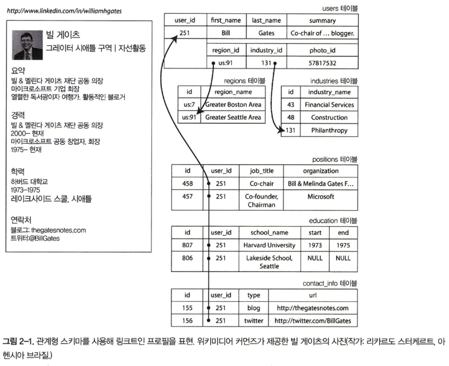
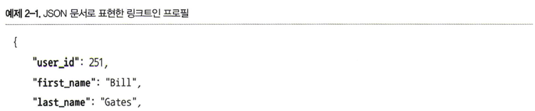
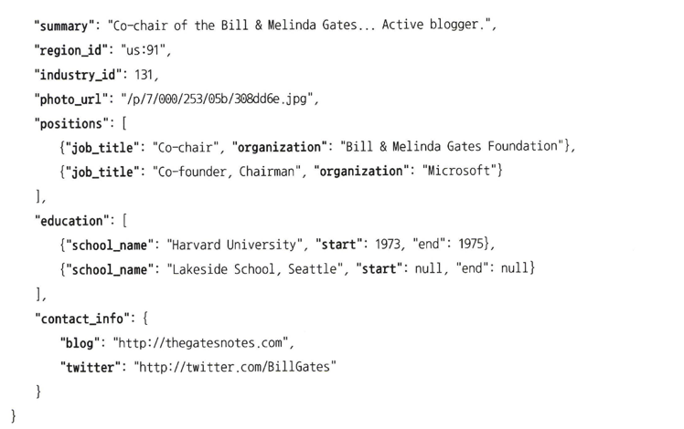
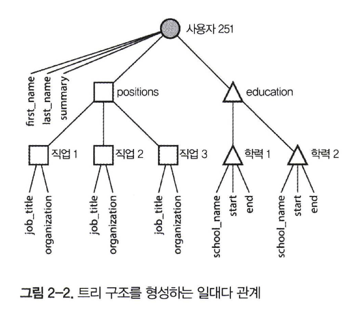
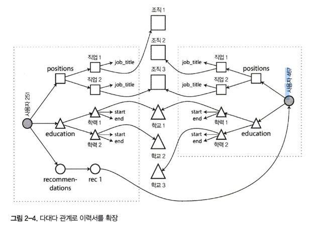
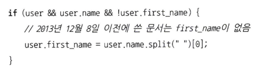
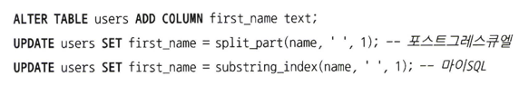

# 02 데이터 모델과 질의 언어

- 데이터 모델은 아마도 소프트웨어 개발에서 제일 중요한 부분
- 소프트웨어가 어떻게 작성됐는지 뿐만 아니라 해결하려는 **문제를 어떻게 생각해야 하는지에** 대해서도 지대한 영향
- 대부분의 애플리케이션은 하나의 데이터 모델을 다른 데이터 모델 위에 계층을 둬서 만든다
- 복잡한 애플리케이션에서는 여러 API를 기반으로 만든 API처럼 중간 단계를 더 둘 수 있지만 기본 개념은 여전히 동일
- 각 계층은 명확한 데이터 모델을 제공해 하위 계층의 복잡성. 이 추상화는 다른 그룹의 사람들이 효율적으로 함께 일할 수 있게끔 한다.
- 하나의 데이터 모델만을 완전히 익히는 데도 많은 노력이 필요

## 관계형 모델과 문서 모델

- 가장 잘 알려진 데이터 모델은 관계형 모델을 기반으로 한 SQL. 데이터는 (SQL에서 테이블이라 불리는) **관계(relation)** 로 구성되고 각 관계는 순서 없는 **튜플(tuple)** (SQL에서 **로우(row)**) 모음
- 관계형 데이터베이스의 근원은 1960년대와 1970년대에 메인프레임 컴퓨터에서 수행된 **비즈니스 데이터 처리** 에 있다
- 이 사용 사례는 보통 **트랜잭션 처리** (영업이나 은행 거래, 항공 예약, 창고에 재고 보관) 와 **일괄 처리** (고객 송장 작성, 급여 지불, 보고)로 오늘날의 관점에서는 일상적으로 수행되는 일

## NoSQL의 탄생

- NoSQL 데이터베이스 채택한 데는 다음과 같은 다양한 원동력   
    - 대규모 데이터셋이나 매우 높은 쓰기 처리량 달성을 관계형 데이터베이스보다 쉽게 할 수 있는 뛰어난 확장성의 필요
    - 상용 데이터베이스 제품보다 무료 오픈 소스 소프트웨어에 대한 선호도 확산
    - 관계형 모델에서 지원하지 않는 특수 질의 동작
    - 관계형 스키마의 제한에 대한 불만과 더욱 동적이고 표현력이 풍부한 데이터 모델에 대한 바람
- 가까운 미래에는 관계형 데이터베이스가 폭넓은 다양함을 가진 비관계형 데이터스토어와 함께 사용될 것. **다중 저장소 지속성 (polyglot persistence)**

## 객체 관계형 불일치
- 데이터를 관계형 테이블에 저장하려면 애플리케이션 코드와 데이터베이스 모델 객체(테이블, 로우, 칼럼) 사이에 거추장스러운 전환 계층이 필요. **임피던스 불일치(impedance mismatch)**

- 사용자와 이들 항목은 일대다(one- to- many) 관계다. 이 관계는 다양한 방법으로 표현 가능
1. 전통적인 SQL 모델에서 가장 일반적인 정규화 표현은 직위, 학력, 연락처 정보를 개별 테이블에 넣고 외래 키로 그림 2-1과 같이 users 테이블을 참조하는 방법
2. SQL 표준의 마지막 버전에서 구조화된 데이터타입(datatype)과 XML 데이터에 대한 지원을 추가했다. 이 지원으로 단일 로우에 다중 값을 저장할 수 있고 문서 내 질의와 색인이 가능
3. 직업, 학력, 연락처 정보를 JSON이나 XML 문서로 부호화해 데이터베이스의 텍스트 칼럼에 저장한 다음 애플리케이션이 구조와 내용을 해석하게 하는 방식
- 이력서 같은 데이터 구조는 모든 내용을 갖추고 있는 문서라서 JSON 표현에 매우 적합

- JSON 표현은 그림 2 -1 의 다중 테이블(multi-table) 스키마보다 더 나은 지역성(locality)을 갖는다
- JSON 표현에서는 모든 관련 정보가 한 곳에 있어 질의 하나로 충분
- 사용자 프로필에서 사용자에서 직위, 학력 기록, 연락처 정보로 대응되는 일대다 관계는 의미상 데이터 트리 구조와 동일

### 다대일과 다대다 관계

- 자유 텍스트 필드가 아닌 지리적 지역과 업계의 표준 목록으로 드롭다운 리스트나 자동 완성 기능을 만들어 사용자가 선택하게 하는 데는 다음과 같은 장점이 있다
1. 프로필 간 일관된 스타일과 철자
2. 모호함 회피(예를 들어 이름이 같은 여러 도시가 있는 경위)
3. 갱신의 편의성. 이름이 한 곳에만 저장되므로 이름을 변경해야 하는 경우 전반적으로 갱신하기 쉽다(예를 들어 정치적 사건으로 도시 이름이 변경되는 경우)
4. 현지화 지원. 사이트를 다른 언어로 번역할 때 표준 목록을 현지화해 지역과 업계를 사이트를 보는 사람의 언어로 표시할 수 있다.
5. 더 나은 검색. 예를 들어 워싱턴 주에 있는 자선가를 검색하려 할 때 지역 목록에 시애틀이 워싱턴에 있다는 사실을 부호화(“그레이터 시애틀 구역” 문자열로는 “워싱턴”을 식별하지 못함)할 수 있기 때문에 원하는 프로필을 찾을 수 있다.
- 중복된 데이터를 정규화하려면 다대일(many-to-one) 관계가 필요한데 안타깝게도 다대일 관계는 문서 모델에 적합하지 않다
- 관계형 데이터베이스에서는 조인이 쉽기 때문에 ID로 다른 테이블의 로우를 참조하는 방식은 일반적
- 문서 데이터베이스에서는 일대다 트리 구조를 위해 조인이 필요하지 않지만 조인에 대한 지원이 보통 약하다
- 더욱이 애플리케이션의 초기 버전이 조인 없는(join-free) 문서 모델에 적합하더라도 애플리케이션에 기능을 추가하면서 데이터는 점차 상호 연결되는 경향

- 추천서와 같은 새로운 기능이 다대다(many- to— many) 관계를 어떻게 필요로 하는지 보여준다
- 각 점선 내 데이터는 하나의 문서로 묶을 수 있지만 조직, 학교, 기타 사용자는 참조로 표현해야 하고 질의할 때는 조인이 필요

### 문서 데이터베이스는 역사를 반복하고 있나?

- 계층 모델의 한계를 해결하기 위해 다앙한 해결책이 제안됐다. 
- 가장 두드러지는 해결책 두 가지는 **관계형 모델** 과 **네트워크 모델**
- 두 모델이 해결하려는 문제가 오늘날에도 여전히 관련이 많기 때문에 이 논쟁을 현재 관점으로 간략히 다시 살펴볼 가치가 있다

**네트워크 모델**
- 네트워크 모델은 코다실이라 불리는 위원회에서 표준화
- 네트워크 모델에서 레코드 간 연결은 외래 키보다는 프로그래밍 언어의 포인터와 더 비슷
- 레코드에 접근하는 유일한 방법은 최상위 레코드(root record)에서 부터 연속된 연결 경로를 따르는 방법. 이를 **접근 경로**
- 코다실에서 질의는 레코드 목록을 반복해 접근 경로를 따라 데이터베이스의 끝에서 끝까지 커서를 움직여 수행
- 레코드가 다중 부모(즉, 다른 레코드에서 다중으로 유입된 포인터)를 가진다면 애플리케이션 코드는 다양한 관계를 모두 추적해야 한다

**관계형 모델**

- 대조적으로 관계형 모델이 하는 일은 알려진 모든 데이터를 배치하는 것
- 얽히고 설킨 중첩 구조와 데이터를 보고 싶을 때 따라가아야할 복잡한 접근 경로가 없다
- 관계형 데이터베이스에서 질의 최적화기(query optimizer)는 질의의 어느 부분을 어떤 순서로 실행할지를 결정하고 사용할 색인을 자동으로 결정   
  -> 이 선택이 실제로 **접근 경로**
- 차이점은 접근 경로를 애플리케이션 개발자가 아니라 질의 최적화기가 자동으로 만든다는 점

**문서 데이터베이스와의 비교**

- 문서 데이터베이스는 한 가지 측면에서 계층 모델로 되돌아갔다
- 문서 데이터베이스는 별도 테이블이 아닌 상위 레코드 내에 중첩된 레코드(그림 2—1의 positions, education, contact_info 같은 일대다 관계)를 저장

**관계형 데이터베이스와 오늘날의 문서 데이터베이스**

- 문서 데이터 모델을 선호하는 주요 이유는 스키마 유연성，지역성에 기인한 더 나은 성능
- 관계형 모델은 조인，다대일，다대다 관계를 더 잘 지원함으로써 문서 데이터 모델에 대항

**어떤 데이터 모델이 애플리케이션 코드를 더 간단하게 할까?**

- 애플리케이션에서 데이터가 문서와 비슷한 구조(일대다 관계 트리로 보통 한 번에 전체 트리를 적재)라면 문서 모델을 사용하는 것이 좋다
- 문서와 비슷한 구조를 여러 테이블(그림 2-1의 positions, education, contact_info)로 나누어 **찢는(shredding)** 관계형 기법은 다루기 힘든 스키마와 불필요하게 복잡한 애플리케이션 코드를 발생
- 문서 모델에는 제한이 있다. 예를 들어 문서 내 중첩 항목을 바로 참조할 수는 없어서 “사용자 251의 직위 목록의 두 번째 항목”과 같이 표현
- 애플리케이션에서 다대다 관계를 사용한다면 문서 모델은 매력이 떨어진다
- 상호 연결이 많은 데이터의 경우 문서 모델은 곤란하지만 관계형 모델은 무난하며 그래프 모델은 매우 자연스럽다

**문서 모델에서의 스키마 유연성**

- 문서 데이터베이스는 종종 **스키마리스(schemaless)** 로 불리지만 이는 오해의 소지
- 읽기 스키마는 프로그래밍 언어에서 동적(런타임) 타입 확인과 유사하고 쓰기 스키마는 정적(컴파일 타임) 타입 확인과 비슷
- 접근 방식 간 차이는 애플리케이션이 데이터 타입을 변경하고자 할 때 특히 뚜렷이 나타난다
- 만약 성과 이름을 분리한다면 문서 데이터베이스에서는 새로운 필드를 가진 새로운 문서를 작성하기 시작하고 애플리케이션에서는 예전 문서를 읽은 경우를 처리하는 코드만 있으면 된다

- "정적 타입"의 데이터베이스 스키마에서는 보통 다음 행과 같이 마이그레이션(migration)을 수행

- 스키마 변경은 느리고 중단시간을 요구하기 때문에 평판이 나쁘다
- 대부분의 관계형 데이터베이스 시스템은 ALTER TABLE 문을 수 밀리초 안에 수행하지만 MySQL은 예외
- MySQL은 ALTER TABLE 시에 전체 테이블을 복사
- 큰 테이블에 UPDATE 문을 실행하면 모든 로우가 재작성될 수 있기 때문에 어떤 데이터베이스는 오래 걸릴 수 있다
- 이 방식을 수용할 수 없다면 애플리케이션은 first_name이 기본값인 널(NULL)로 설정되게 남겨두고 문서 데이터베이스처럼 읽는 시점에 채울 수 있다
- 읽기 스키마 접근 방식은 컬렉션 안의 항목이 어떤 이유로 모두 동일한 구조가 아닐 때(즉 데이터가 여러 다른유형으로 구성돼 있음) 유리
1. 다른 여러 유형의 오브젝트가 있고 각 유형의 오브젝트별로 자체 테이블에 넣는 방법은 실용적이지 않다.
2. 사용자가 제어할 수 없고 언제나 변경 가능한 외부 시스템에 의해 데이터 구조가 결정된다.
- 모든 레코드가 동일한 구조라서 예상 가능하다면 스키마가 문서화와 구조를 강제하기 위한 유용한 메커니즘
