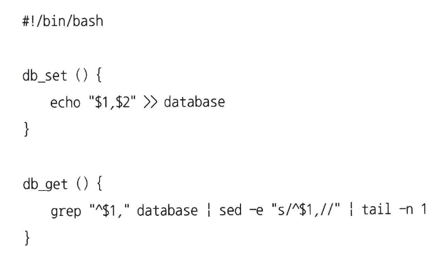

# 03 저장소와 검색

- 애플리케이션 개발자가 처음부터 자신의 저장소 엔진을 구현하기보다는 사용 가능한 여러 저장소 엔진 중에 애플리케이션에 적합한 엔진을 선택하는 작업이 필요
- 특정 작업부하(workload) 유형에서 좋은 성능을 내게끔 저장소 엔진을 조정하려면 저장소 엔진이 내부에서 수행되는 작업에 대해 대략적인 개념을 이해할 필요

## 데이터베이스를 강력하게 만드는 데이터 구조

- 데이터베이스는 두 개의 bash 함수로 구현



- "db_set key value"를 호출하면 데이터베이스에 key와 value를 저장 가능
- "db_get key"를 호출하면 해당 키와 연관된 가장 최근 값을 찾아 반환


- 매 라인마다 쉼표로 구분된 키-값 쌍을 포함한 텍스트 파일


-  db_set과 마찬가지로 많은 데이터베이스는 내부적으로 추가 전용(append-only) 데이터 파일인 **로그(log)** 를 사용

```shell
'로그'라는 단어는 애플리케이션 로그를 언급할 때 종종 사용되기도 한다. 이때 로그는 애플리케이션에서 무슨 일이 일어났는지 기술한 텍스트를 출력한 것
책에서 '로그'는 조금 더 일반적인 의미로 연속된 추가 전용 레코드
```

- 그런데 매번 키를 찾을 때마다 db_get은 키가 있는지 찾기 위해 전체 데이터베이스 파일을 처음부터 끝까지 스캔
- 데이터베이스에서 특정 키의 값을 효율적으로 찾기 위해서는 다른 데이터 구조가 필요, **색인**
- 색인의 일반적인 개념은 어떤 부가적인 메타데이터를 유지하는 것
- 색인은 기본 데이터(primary data) 에서 파생된 **추가적인** 구조
- 추가적인 구조의 유지보수는 특히 쓰기 과정에서 오버헤드가 발생
- 어떤 종류의 색인이라도 대개 쓰기 속도를 느리게 만든다. 이는 데이터를 쓸 때마다 매번 색인도 갱신해야 하기 때문

### 해시 색인

- 키-값 데이터가 색인할 수 있는 유일한 종류의 데이터는 아니지만 매우 일반적이고 더욱 복잡한 색인을 위한 구성 요소로 유용
- 키를 데이터 파일의 바이트 오프셋에 매핑해 인메모리 해시 맵을 유지하는 전략 사용
- 키-값 쌍을 추가할 때마다 방금 기록한 데이터의 오프셋을 반영하기 위해 해시 맵도 갱신


- 이 방식은 비트캐스크(Bitcask)(리악(Riak)의 기본 저장소 엔진)가 근본적으로 사용하는 방식
- 비트캐스크는 해시 맵을 전부 메모리에 유지하기 때문에 사용 가능한 램(RAM) 에 모든 키가 저장된다는 조건을 전제로 고성능으로 읽기，쓰기를 보장
- 비트캐스크 같은 저장소 엔진은 각 키의 값이 자주 갱신되는 상황에 매우 적합   
ex) 키-고양이 동영상의 URL, 값-비디오가 재생된 횟수(재생 버튼을 누를 때마다 증가함)인 경우. 쓰기는 아주 많지만 고유 키는 많지 않다
- 파일에 항상 추가만 한다면 결국 디스크 공간이 부족   
-> 특정 크기의 세그먼트(segment)로 로그를 나누는 방식이 좋은 해결책
- 특정 크기에 도달하면 세그먼트 파일을 닫고 새로운 세그먼트 파일에 이후 쓰기를 수행
- 세그먼트 파일들에 대해 컴팩션(compaction)을 수행 가능
- 컴팩션은 로그에서 중복된 키를 버리고 각 키의 최신 갱신 값만 유지하는 것을 의미


- 컴팩션은 보통 세그먼트를 더 작게 만들기 때문에 그림 3-3 에서 보는 것처럼 컴팩션을 수행할 때 동시에 여러 세그먼트들을 병합
- 세그먼트가 쓰여진 후에는 절대 변경할 수 없기 때문에 병합할 세그먼트는 새로운 파일로 생성


- 간단한 생각을 실제로 구현하려면 세부적으로 많은 사항을 고려
1. 파일 형식
- CSV는 로그에 가장 적합한 형식이 아니다
- 바이트 단위의 문자열 길이를 부호화한 다음 원시 문자열(이스케이핑할 필요 없이)을 부호화하는 바이너리 형식을 사용하는 편이 더 빠르고 간단
2. 레코드 삭제
- 키와 관련된 값을 삭제하려면 데이터 파일에 특수한 삭제 레코드(툼스톤(tombstone)) 추가
- 로그 세그먼트가 병합될 때 툼스톤은 병합과정에서 삭제된 키의 이전 값을 무시
3. 고장(Crash) 복구
- 데이터베이스가 재시작되면 인메모리 해시 맵은 손실
- 원칙적으로는 전체 세그먼트 파일을 처음부터 끝까지 읽고 각 키에 대한 최신 값의 오프셋을 확인해서 각 세그먼트 해시 맵을 복원
- 하지만 세그먼트 파일이 크면 해시 맵 복원은 오랜 시간이 걸릴 수 있고 이는 서버 재시작을 고통스럽게 만든다
- 비트캐스크는 각 세그먼트 해시 맵을 메모리로 조금 더 빠르게 로딩할 수 있게 스냅숏을 디스크에 저장해 복구 속도를 높인다
4. 부분적으로 레코드 쓰기
- 데이터베이스는 로그에 레코드를 추가하는 도중에도 죽을 수 있다
- 비트캐스크 파일은 체크섬을 포힘하고 있어 로그의 손상된 부분을 탐지해 무시 가능
5. 동시성 제어
- 쓰기를 엄격하게 순차적으로 로그에 추가할 때 일반적인 구현 방법은 하나의 쓰기 스레드만 사용하는 것
- 데이터 파일 세그먼트는 추가 전용이거나 불변(immutable)이므로 다중 스레드로 동시에 읽기 가능

- 추가 전용 설계는 여러 측면에서 좋은 설계
1. 추가와 세그먼트 병합은 순차적인 쓰기 작업이기 때문에 보통 무작위 쓰기보다 훨씬 빠르다
2. 세그먼트 파일이 추가 전용이나 불변이면 동시성과 고장 복구는 훨씬 간단하다
3. 오래된 세그먼트 병합은 시간이 지남에 따라 조각화되는 데이터 파일 문제를 피할 수 있다

- 해시 테이블 색인 또한 제한 사항 존재
1. 해시 테이블은 메모리에 저장해야 하므로 키가 너무 많으면 문제가 된다
2. 해시 테이블은 범위 질의(range query)에 비효율적

### SS테이블과 LSM 트리
- 세그먼트 파일의 형식에 간단한 변경 사항 한 가지를 적용
- 변경 요구사항은 일련의 키-값 쌍을 **키로 정렬**
- 키로 정렬된 형식을 **정렬된 문자열 테이블(Sorted String Table)** 또는 짧게 **SS테이블**
- SS테이블은 해시 색인을 가진 로그 세그먼트보다 몇 가지 큰 장점
1. 세그먼트 병합은 파일이 사용 가능한 메모리보다 크더라도 간단하고 효율적, **병합정렬(mergesort)** 방식과 유사
-  다중 세그먼트가 동일한 키를 포함하는 경우 가장 최근 세그먼트의 값은 유지하고 오래된 세그먼트의 값은 버린다


2. 파일에서 특정 키를 찾기 위해 더는 메모리에 모든 키의 색인을 유지할 필요가 없다
- handiwork 키를 찾으려 하지만 세그먼트 파일에서 키의 정확한 오프셋을 알지 못한다고 가정
- handbag과 handsome 키의 오프셋을 알고 있고 정렬돼 있으므로 handiwork는 두 키 사이에 있다는 사실을 알 수 있다.
- 일부 키에 대한 오프셋을 알려주는 인메모리 색인이 여전히 필요
- 수 킬로바이트 정도는 매우 빠르게 스캔할 수 있기 때문에 세그먼트 파일 내 수 킬로바이트당 키 하나로 충분


3. 읽기 요청은 요청 범위 내에서 여러 키-값 쌍을 스캔해야 하기 때문에 해당 레코드들을 블록으로 그룹화하고 디스크에 쓰기 전에 압축
- 희소 인메모리 색인의 각 항목은 압축된 블록의 시작을 가리키게 된다
- 디스크 공간을 절약한다는 점 외에도 압축은 I/O 대역폭 사용도 줄인다

### SS테이블 생성과 유지
- 디스크 상에 정렬된 구조를 유지하는 일은 가능하지만(82쪽의 "B 트리" 참고) 메모리에 유지하는 편이 훨씬 쉽다
- 레드 블랙 트리(red-black tree)나 AVL 트리와 같이 잘 알려졌고 사용 기능한 트리 데이터 구조는 많이 있다

1. 쓰기가 들어오면 인메모리 균형 트리(balanced tree) 데이터 구조(에를 들어 레드 블랙 트리)에 추가한다. 
- 이 인메모리 트리는 **멤테이블(memtable)** 이라고도 한다.
2. 멤테이블이 보통 수 메가바이트 정도의 임곗값보다 커지면 SS테이블 파일로 디스크에 기록한다. 
- 트리가 이미 키로 정렬된 키-값 쌍을 유지하고 있기 때문에 효율적으로 수행할 수 있다. 
- 새로운 SS테이블 파일은 데이터베이스의 가장 최신 세그먼트가 된다. 
- SS테이블을 디스크에 기록하는 동안 쓰기는 새로운 멤테이블 인스턴스에 기록한다.
3. 읽기 요청을 제공하려면 먼저 멤테이블에서 키를 찾아야 한다. 
- 그 다음 디스크 상의 가장 최신 세그먼트에서 찾는다. 그 다음으로 두번째 오래된 세그먼트, 세번째 오래된 세그먼트 등에서 찾는다.
4. 가끔 세그먼트 파일을 합치고 덮어 쓰여지거나 삭제된 값을 버리는 병합과 컴팩션 과정을 수행한다. 이 과정은 백그라운드에서 수행된다.

- 만약 데이터베이스가 고장나면 아직 디스크로 기록되지 않고 멤테이블에 있는 가장 최신 쓰기는 손실되는 문제점
- 이전 절과 같이 매번 쓰기를 즉시 추가할 수 있게 분리된 로그를 디스크 상에 유지
- 이 로그는 손상 후 멤테이블을 복원할 때만 필요하기 때문에 순서가 정렬되지 않아도 문제 X

### SS테이블에서 LSM 트리 만들기
- 여기에 기술된 알고리즘은 기본적으로 레벨DB(LevelDB)와 록스DB(RocksDB), 그리고 다른 애플리케이션에 내장하기 위해 설계된 키-값 저장소 엔진 라이브러리에서 사용
- 리악에서는 비트캐스크의 대안으로 레벨DB를 사용할 수 있고 구글의 빅테이블(Bigtable) 논문 (SS테이블과 멤테이블이라는 용어가 소개됐다)에서 영감을 얻은 카산드라와 HBase에서도 유사한 저장소 엔진을 사용
- 이 색인 구조는 로그 구조화 파일 시스템의 초기 작업의 기반
- 정렬된 파일 병합과 컴팩션 원리를 기반으로 하는 저장소 엔진을 LSM 저장소 엔진이라 부른다
- 루씬은 **용어 사전(term dictionary)** 을 저장하기 위해 유사한 방법을 사용

### 성능 최적화
- LSM 트리 알고리즘은 데이터베이스에 존재하지 않는 키를 찾는 경우 느릴 수 있다
- 이런 종류의 접근을 최적화하기 위해 저장소 엔진은 보통 **블룸 필터(Bloom filter)** 를 추가적으로 사용   
블룸 필터는 집합 내용을 근사한(approximating) 메모리 효율적 데이터 구조   
블룸 필터는 키가 데이터베이스에 존재하지 않음을 알려주므로 존재하지 않는 키를 위한 불필요한 디스크 읽기를 많이 절약 가능
- SS테이블을 압축하고 병합하는 순서와 시기를 결정하는 다양한 전략
- 가장 일반적으로 선택하는 전략은 **크기 계층(size-tiered)** 과 **레벨 컴팩션(leveled compaction)**
- 레벨DB와 록스DB는 레벨 컴팩션(레벨DB의 이름이 여기서 유래했다)을 사용하고 HBase는 사이즈 계층을, 카산드라는 둘 다 지원
- 사이즈 계층 컴팩션: 상대적으로 좀 더 새롭고 작은 SS테이블을 상대적으로 오래됐고 큰 SS테이블에 연이어 병합
- 레벨 컴패션: 키 범위를 더 작은 SS테이블로 나누고 오래된 데이터는 개별 “레벨”로 이동하기 때문에 컴팩션을 점진적으로 진행해 디스크 공간을 덜 사용
- LSM 트리의 기본 개념은 백그라운드에서 연쇄적으로 SS테이블을 지속적으로 병합하는 것
- 데이터가 정렬된 순서로 저장돼 있다면 범위 질의를 효율적으로 실행 가능
- 이 접근법의 디스크 쓰기는 순차적이기 때문에 LSM 트리가 매우 높은 쓰기 처리링을 보장 가능

### B 트리
- 가장 널리 사용되는 색인 구조는 B 트리(B-tree)로 구조가 로그 구조화 색인과는 상당히 다르다
- 로그 구조화 색인은 데이터베이스를 일반적으로 수 메가바이트 이상의 가변 크기를 가진 세그먼트로 나누고 항상 순차적으로 세그먼트를 기록
- B 트리는 전통적으로 4KB 크기(때로는 더 큰)의 고정 크기 블록이나 페이지로 나누고 한 번에 하나의 페이지에 읽기 또는 쓰기
- 디스크가 고정 크기 블록으로 배열되기 때문에 이런 설계는 근본적으로 하드웨어와 조금 더 밀접한 관련
- 각 페이지는 주소나 위치를 이용해 식별


- 한 페이지는 B 트리의 **루트(root)** 로 지정
- 최종적으로는 개별 키(**리프 페이지(leaf page)**) 를 포함하는 페이지에 도달
-  각 키의 값을 포함하거나 값을 찾을 수 있는 페이지의 참조를 포함
- B 트리의 한 페이지에서 하위 페이지를 참조하는 수를 **분기 계수(branching factor)**
- B 트리에 존재하는 키의 값을 갱신하려면 키를 포함하고 있는 리프 페이지를 검색하고 페이지의 값을 바꾼 다음 페이지를 디스크에 다시 기록
- 새로운 키를 추가하려면 새로운 키를 포함하는 범위의 페이지를 찾아 해당 페이지에 키와 값을 추가
- 새로운 키를 수용한 페이지에 충분한 여유 공간이 없다면 페이지 하나를 반쯤 채워진 페이지 둘로 나누고 상위 페이지가 새로운 키 범위의 하위 부분들을 알 수 있게 갱신


- 이 알고리즘은 트리가 계속 **균형** 을 유지하는 것을 보장

### 신뢰할 수 있는 B 트리 만들기

- B 트리의 기본적인 쓰기 동작은 새로운 데이터를 디스크 상의 페이지에 덮어쓴다
- 로그 구조화 색인은 파일에 추가만 할 뿐(결국 더 이상 쓸모 없는 파일은 삭제됨) 같은 위치의 파일은 변경 X
- 일부 동작은 여러 다양한 페이지의 덮어쓰기를 필요로 한다
- 삽입 때문에 페이지가 너무 많아져 페이지를 나눠야 한다면 분할된 두 페이지를 기록하고 두 하위 페이지의 참조를 갱신하게끔 상위 페이지를 덮어쓰기
- 일부 페이지만 기록하고 데이터베이스가 고장 난다면 결국 색인이 훼손되기 때문에 이것은 매우 위험한 동작, **고아 페이지(orphan page)** 발생
- 고장 상황에서 스스로 복구할 수 있게 만들려면 일반적으로 디스크 상에 **쓰기 전 로그(write-ahead log, WAL)** (**재실행 로그(redo log)** 라고도 함)라고 하는 데이터 구조를 주가
- 다중 스레드가 동시에 B 트리에 접근한다면 주의 깊게 동시성 제어를 해야함
- 동시성 제어는 보통 **래치(latch)** (가벼운 잠금(lock))로 트리의 데이터 구조를 보호

### B 트리 최적화

- 최적화 기법 몇 가지
1. 페이지 덮어 쓰기와 고장 복구를 위한 WAL 유지 대신 (LMDB 같은) 일부 데이터베이스는 쓰기 시 복사 방식(copy-on-write scheme)을 사용
- 변경된 페이지는 다른 위치에 기록하고 트리에 상위 페이지의 새로운 버전을 만들어 새로운 위치를 가리키게 한다
2. 페이지에 전체 키를 저장하는 게 아니라 키를 축약해 쓰면 공간을 절약
- 트리 내부 페이지에서 키가 키 범위 사이의 경계 역할을 하는 데 충분한 정보만 제공
- 페이지 하나에 키를 더 많이 채우면 트리는 더 높은 분기 계수를 얻는다
3. 많은 B 트리 구현에서 리프(leaf) 페이지를 디스크 상에 연속된 순서로 나타나게끔 트리를 배치하려 시도
- 일반적으로 페이지는 디스크 상 어디에나 위치. 키 범위가 가까운 페이지들이 디스크 상에 가까이 있어야 할 필요가 없기 때문
- 질의가 정렬된 순서로 키 범위의 상당 부분을 스캔해야 한다면 모든 페이지에 대해 디스크 찾기가 필요하기 때문에 페이지 단위 배치는 비효율적
4. 트리에 포인터를 추가
- 각 리프 페이지가 양쪽 형제 페이지에 대한 참조를 가지면 상위 페이지로 다시 이동하지 않아도 순서대로 키를 스캔 가능
5. 프랙탈 트리《fractal tree)
- B 트리 변형은 디스크 찾기룰 줄이기 위해 로그 구조화 개념을 일부 빌렸다

### B 트리와 LSM 트리 비교
- 경험적으로 LSM 트리는 보통 쓰기에서 더 빠른 반면 B 트리는 읽기에서 더 빠르다
- 읽기가 보통 LSM 트리에서 더 느린 이유는 각 컴팩션 단계에 있는 여러 가지 데이터 구조와 SS테이블을 확인해야 하기 때문

### LSM 트리의 장점
1. B 트리 색인은 모든 데이터 조각을 최소한 두 번 기록
    1. 쓰기 전 로그 한 번
    2. 트리 페이지에 한 번(페이지가 분리될 때 다시 기록)
- 해당 페이지 내 몇 바이트만 바뀌어도 한번에 전체 페이지를 기록해야 하는 오버헤드
- 로그 구조화 색인 또한 SS테이블의 반복된 컴팩션과 병합으로 인해 여러 번 데이터를 다시 쓴다
- 데이터베이스에 쓰기 한 번이 데이터베이스 수명 동안 디스크에 여러 번의 쓰기를 야기하는 이런 효과, **쓰기 증폭(write amplification)**
- 쓰기가 많은 애플리케이션에서 성능 병목은 데이터베이스가 디스크에 쓰는 속도일 수 있다
- 저장소 엔진이 디스크에 기록할수록 디스크 대역폭 내 처리할 수 있는 초당 쓰기는 점점 줄어든다
2. LSM 트리는 보통 B 트리보다 쓰기 처리량을 높게 유지 가능
3. LSM 트리는 압축률이 더 좋다
  - 보통 B 트리보다 디스크에 더 적은 파일을 생성
  - LSM 트리는 페이지 지향적이지 않고 주기적으로 파편화를 없애기 위해 SS테이블을 다시 기록하기 때문에 저장소 오버헤드가 더 낮다
  - 데이터를 더 밀집해 표현하면 가능한 I/O 대역폭 내에서 더 많은 읽기와 쓰기 요청이 가능

### LSM 트리의 단점
1. 컴팩션 과정이 때로는 진행 중인 읽기와 쓰기의 성능에 영향을 준다는 점 
  1. 디스크에서 비싼 컴팩션 연산이 끝날 때까지 요청이 대기해야 하는 상황이 발생하기 쉽다
  2. 컴팩션 문제는 높은 쓰기 처리량에서 발생   
     - 디스크의 쓰기 대역폭은 유한. 빈 데이터베이스에 쓰는 경우 전체 디스크 대역폭은 초기 쓰기만을 위해 사용할 수 있지만 데이터베이스가 점점 커질수록 컴팩션을 위해 더 많은 디스크 대역폭이 필요
     - 쓰기 처리량이 높음에도 컴팩션 설정을 주의 깊게 하지 않으면 컴팩션이 유입 쓰기 속도를 따라갈 수 없다
     - 디스크 상에 병합되지 않은 세그먼트 수는 디스크 공간이 부족할 때까지 증가
     - 더 많은 세그먼트 파일을 확인해야 하기 때문에 읽기 또한 느려진다
2. 로그 구조화 저장소 엔진은 다른 세그먼트에 같은 키의 다중 복사본이 존재
  - B 트리의 장점은 각 키가 색인의 한 곳에만 정확하게 존재한다는 점
  - 강력한 트랜잭션 시맨틱(semantic)를 제공하는 데이터베이스에는 B 트리가 훨씬 매력적

### 기타 색인 구조
- 키-값 색인의 대표적인 예는 관계형 모델의 **기본키(primary key)**
- **보조 색인(secondary index)** 을 사용하는 방식도 매우 일반적
- 보조 색인은 보통 효율적으로 조인을 수행하는 데 결정적인 역할
- 기본키 색인과의 주요 차이점은 키가 고유하지 않다는 점. 이를 해결할 방법
1. 색인의 각 값에 일치하는 로우 식별자 목록(전문 색인에서 포스팅 목록과 같음)을 만드는 방법
2. 로우 식별자를 추가해 각 키를 고유하게 만드는 방법

### 색인 안에 값 저장하기
- 색인에서 키는 질의가 검색하는 대상이지만 값은 다음의 두 가지 중 하나에 해당
1. 값은 질문의 실제 로우(문서，정점)
2. 다른 곳에 저장된 로우를 가리키는 참조
- 후자의 경우 로우가 저장된 곳을 **힙 파일(heap file)** 이라 하고 특정 순서 없이 데이터를 저장
- 힙 파일 접근은 여러 보조 색인이 존재할 때 데이터 중복을 피할 수 있다
- 새로운 값이 많은 공간을 필요하다면 힙에서 충분한 공간이 있는 새로운 곳으로 위치를 이동
- 이런 경우 모든 색인이 레코드의 새로운 힙 위치를 가리키게끔 갱신하거나 이전 힙 위치에 전방향 포인터를 남겨야한다
- 어떤 상황에서는 색인 안에 바로 색인된 로우를 저장하는 편이 바람직, **클러스터드 색인(clustered index)**
- 클러스터드 색인(색인 안에 모든 로우 데이터를 저장)과 비클러스터드 색인(색인 안에 데이터의 참조만 저장) 사이의 절중안을 **커버링 색인**, **포괄열이 있는 색인** 
  - 이 색인은 색인 안에 테이블의 칼럼 일부를 저장
  - 색인만 사용해 일부 질의에 응답이 가능
  - 읽기 성능을 높일 수 있지만 추가적인 저장소가 필요하고 쓰기 과정에 오버헤드가 발생
  - 애플리케이션 단에서 복제로 인한 불일치를 파악할 수 없기 때문에 데이터베이스는 트랜잭션 보장을 강화하기 위해 별도의 노력이 필요

### 다중 칼럼 색인
- 다중 칼럼 색인의 가장 일반적 인 유형은 **결합 색인(concatenated index)** 
- 다차원 색인은 한 번에 여러 칼럼에 질의하는 조금 더 일반적인 방법
  - 특히 지리 공간 데이터에 중요하게 사용
  - 표준 B 트리나 LSM 트리 색인은 이런 유형의 질의에 효율적으로 응답 X


### 전문 검색과 퍼지 색인

- **애매모호한(fuzzy)** 질의에는 다른 기술이 필요
- 루씬에서 인메모리 색인은 여러 키 내 문자에 대한 유한 상태 오토마톤 **트라이(trie)** 와 유사. 이는 **레벤슈타인 오토마톤**으로 변환 가능

### 모든 것을 메모리에 보관
- 지금까지 설명한 데이터 구조는 모두 디스크 한계에 대한 해결책
- **인메모리 데이터베이스** 개발된 이유
  1. 램이 점점 저렴해져서 기가바이트당 가격 논쟁은 약해졌다
  2. 데이터셋 대부분은 그다지 크지 않기 때문에 메모리에 전체를 보관하는 방식도 꽤 현실적
  3. 여러 장비 간 분산해서 보관도 가능
- 인메모리 데이터베이스는 지속성을 목표
  - 특수 하드웨어를 사용하거나 디스크에 변경 사항의 로그를 기록
  - 디스크에 주기적인 스냅샷을 기록하거나 다른 장비에 인메모리 상태를 복제하는 방법
  - 인메모리 데이터베이스가 재시작되는 경우 특수 하드웨어를 사용하지 않는다면 디스크나 네트워크를 통해 복제본에서 상태를 다시 적재
- 디스크 기반 색인으로 구현하기 어려운 데이터 모델을 제공
  - 레디스는 우선순위 큐와 셋(set) 같은 다양한 데이터 구조를 데이터베이스 같은 인터페이스로 제공
  - 메모리에 모든 데이터를 유지하기 때문에 구현이 비교적 간단
- **안티 캐싱**: 메모리가 중분하지 않을 때 가장 최근에 사용하지 않은 데이터를 메모리에서 디스크로 내보내고 나중에 다시 접근할 때 메모리에 적재하는 방식으로 동작
- 데이터베이스는 전체 메모리 페이지보다 개별 레코드 단위로 작업할 수 있기 때문에 OS 보다 더 효율적으로 메모리를 관리 가능
- **비휘발성 메모리(non-volatile memory, NVM)** 기술이 더 널리 채택되면 저장소 엔진 설계의 변경이 필요할 것

### 트랜잭션 처리나 분석?

- 금전 거래가 아닌 영역으로 데이터베이스가 확장됐어도 **트랜잭션** 이란 용어는 변하지 않고 논리 단위 형태로서 읽기와 쓰기 그룹을 나타냄

```bash
트랜잭션이 ACID 속성을 가질 필요는 X
트랜잭션 처리는 주기적으로 수행되는(예를 들어 하루에 한번) 일괄 처리 작업과 달리 클라이언트가 지연 시간(low-latency)이 낮은 읽기와 쓰기를 가능하게 한다는 의미
```

- 레코드는 사용자 입력을 기반으로 삽입되거나 갱신된다. 이런 애플리케이션은 대화식이기 때문에 이 접근 패턴을 **온라인 트랜잭션 처리(OLTP)** 라고 한다
- 그러나 데이터베이스를 비즈니스 트랜잭션 처리 말고 **데이터 분석(data analytic)** 에도 점점 더 많이 사용하기 시작
- 데이터 분석 질의는 보통 비즈니스 분석가가 작성하며 회사 경영진이 더 나은 의사결정을 하게끔 돕는 보고서를 제공, **비즈니스 인텔리전스**


### 데이터 웨어하우징

- 1980년대 후반과 1990년대 초반 회사들은 OLTP 시스템을 분석 목적으로 사용하지 않고 개별 데이터베이스에서 분석을 수행하는 경향, **데이터 웨어하우스**

### 데이터 웨어하우징

- OLTP 시스템은 대개 사업 운영에 대단히 중요하기 때문에 일반적으로 높은 가용성과 낮은 지연 시간의 트랜잭션 처리를 기대
- 비즈니스 분석가가 OLTP 데이터베이스에 즉석 분석 질의(ad hoc analytic query)를 실행하는 것을 꺼려한다. 즉석 분석 질의는 대개 비용이 비싸기 때문
- **데이터 웨어하우스** 는 분석가들이 OLTP 작업에 영향을 주지 않고 마음껏 질의할 수 있는 개별 데이터베이스
- 데이터 웨어하우스는 회사 내의 모든 다양한 OLTP 시스템에 있는 데이터의 읽기 전용 복사본
- 데이터 웨어하우스로 데이터를 가져오는 과정, **ETL(Extract-Transform-Load)**


- 분석을 위해 OLTP 시스템에 직접 질의하지 않고 개별 데이터 웨어하우스를 사용하는 큰 장점은 분석 접근 패턴에 맞게 최적화할 수 있다는 점

### OLTP 데이터베이스와 데이터 웨어하우스의 차이점

- SQL 질의를 생성하고 결과를 시각화하고 분석가가 다음과 같은 작업을 통해 데이터를 탐색할 수 있게 해주는 여러 그래픽 데이터 분석 도구
    1. 드릴 다운(drilldown)   
        요약된 정보에서 상세 정보까지 계층을 나눠 점점 구체적으로 분석하는 작업을 의미
    2. 슬라이싱(slicing), 다이싱(dicing)   
        슬라이싱과 다이싱은 상세한 분석을 위해 주어진 큰 규모의 데이터를 작은 단위로 나누고 원하는 세부 분석 결과를 얻을 때까지 반복한다는 뜻
- 다수의 데이터베이스 벤더는 트랜잭션 처리와 분석 작업부하 양쪽 모두 지원하기보다는 둘 중 하나를 지원하는 데 중점

### 분석용 스키마: 별 모양 스키마와 눈꽃송이 모양 스키마

- 분석에서는 데이터 모델의 다양성이 트랜잭션 처리 영역에서 애플리케이션의 필요에 따라 사용되는 것에 비해 훨씬 적다
- 많은 데이터 웨어하우스는 **별 모양 스키마(star schema)(차원 모델링)** 로 알려진 상당히 정형화된 방식을 사용


