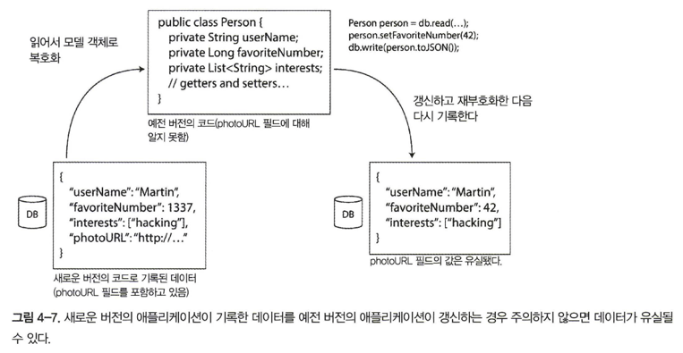

# 04 부호화와 발전
- 대규모 애플리케이션에서 코드 변경은 대개 즉시 반영할 수 없다
- 예전 버전의 코드와 새로운 버전의 코드, 이전의 데이터 타입과 새로운 데이터 타입이 어쩌면 모든 시스템에 동시에 공존할 수 있다
- 하위 호환성: 새로운 코드는 예전 코드가 기록한 데이터를 읽을 수 있어야 한다
- 상위 호환성: 예전 코드는 새로운 코드가 기록한 데이터를 읽을 수 있어야 한다
- 상위 호환성은 예전 버전의 코드가 새 버전의 코드에 의해 추가된 것을 무시할 수 있어야 하므로 다루기 더 어렵다

## 데이터 부호화 형식
- 프로그램은 보통 (최소한) 두 가지 형태로 표현된 데이터를 사용해 동작
- 메모리에 객체(object), 구조체(struct), 목록(list), 배열(array), 해시 테이블(hash table) , 트리(tree) 등으로 데이터가 유지
- 데이터를 파일에 쓰거나 네트워크를 통해 전송하려면 스스로를 포함한 일련의 바이트열(예를 들어 JSON 문서)의 형태로 부호화
- 인메모리 표현에서 바이트열로의 전환을 **부호화** (**직렬화** 나 **마살링** 이라고도 함)라고 하며, 그 반대를 **복호화** (**파싱**，**역직렬화**，**언마살링**이라고도 함)

## 언어별 형식
- 많은 프로그래밍 언어는 인메모리 객체를 바이트열로 부호화하는 기능을 내장   
ex) 자바(java.io.Serializable), 루비(Marsha), 파이썬(pickle)

- 기존 내장 부호화 기능들의 단점
  1. 부호화는 보통 특정 프로그래밍 언어와 묶여 있어 다른 언어에서 데이터를 읽기는 매우 어렵다. 이런 부호화로 데이터를 저장하고 전송하는 경우 매우 오랜 시간이 될지도 모를 기간 동안 현재 프로그래밍 언어로만 코드를 작성해야 할 뿐 아니라 다른 시스템(다른 언어를 사용할 수도 있음)과 통합하는데 방해가 된다.
  2. 동일한 객체 유형의 데이터를 복원하려면 복호화 과정이 임의의 클래스를 인스턴스화할 수 있어야 한다. 이것은 종종 보안 문제의 원인이 된다. 공격자가 임의의 바이트열을 복호화할 수 있는 애플리케이션을 얻을 수 있으면 임의의 클래스를 인스턴스화할 수 있고 공격자가 원격으로 임의 코드를 실행하는 것과 같은 끔찍한 일이 발생할 수 있다
  3. 데이터 버전 관리는 보통 부호화 라이브러리에서는 나중에 생각하게 된다. 데이터를 빠르고 쉽게 부호화하기 위해 상위, 하위 호환성의 불편한 문제가 등한시되곤 한다.
  4. 효율성(부호화나 복호화에 소요되는 CPU 시간과 부호화된 구조체의 크기)도 종종 나중에 생각하게 된다. 예를 들어 자바의 내장 직렬화 성능이 좋지 않고 비대해지는 부호화로 유명하다

## JSON과 XML, 이진 변형
- JSON, XML, CSV는 텍스트 형식이라서 사람이 있을 수 있지만 피상적인 문법적 문제 외에도 여러가지 존재
  1. 수(number)의 부호화에는 많은 애매함
  2. 큰 수를 다룰 때 문제
  3. 이진 문자열(문자 부호화가 없는 바이트열)을 지원 X
  4. 스키마 언어는 상당히 강력하지만 익히고 구현하기가 상당히 난해. XML/JSON 스키마를 사용하지 않는 애플리케이션은 필요한 부호화/복호화 로직을 하드코딩해야 할 가능성
  5. CSV는 스키마가 없으므로 각 로우와 칼럼의 의미를 정의하는 작업은 애플리케이션이 해야한다

## 이진 부호화
- 조직 내에서만 사용하는 데이터라면 최소공통분모 부호화 형식을 사용해야 하는 부담감이 덜하다
- JSON은 XML보다 덜 장황하지만 이진 형식과 비교하면 둘 다 훨씬 많은 공간을 사용

- 메시지팩은 JSON용 이진 부호화 형식

- 이진 부호화는 길이가 66바이트로 텍스트 JSON 부호화로 얻은 81바이트(공백은 제거)보다 약간 작다
- 이같은 작은 공간의 절약(과 어쩌면 파싱 속도의 향상)이 사람의 가독성을 해칠 만큼 가치가 있는지는 확실치 X

### 스리프트와 프로토콜 버퍼

- 아파치 스리프트와 프로토콜 버퍼는 같은 원리를 기반으로 한 이진 부호화 라이브러리
- 스리프트와 프로토콜 버퍼 모두 부호화할 데이터를 위한 스키마가 필요
- 스리프트 인터페이스 정의 언어로 스키마 기술

- 프로토콜 버퍼로 정의한 동등한 스키마는 스리프트 스키마와 매우 비슷

- 스리프트는 바이너리 프로토콜과 컴팩트 프로토콜이라는 두가지 다른 이진 부호화 형식 존재

- 마찬가지로 각 필드에는 (타입이 문자열，정수，목록 등인지 나타내기 위해) 타입 주석이 있고 필요한 경우 길이(문자열의 길이，목록의 항목 개수) 표시가 있다
- 큰 차이점으로 필드 이름 X. 대신 부호화된 데이터는 숫자(1, 2, 3)과 같은 **필드 태그(field tag)** 를 포함
  - 이 숫자는 스키마 정의에 나타난 숫자
- 컴팩트 프로토콜 부호화는 의미상으로는 바이너리 프로토콜과 같지만 동일한 정보를 단지 34바이트로 줄여 부호화
  - 필드 타입과 태그 숫자를 단일 바이트로 줄이고 가변 길이 정수를 사용해서 부호화
  - 각 바이트의 상위 비트는 앞으로 더 많은 바이트가 있는지를 나타내는 데 사용
  - 더 큰 숫자는 더 많은 바이트를 사용

- 프로토콜 버퍼는 그림 4-4 처럼 동일한 데이터를 부호화
- 비트를 줄여 저장하는 처리 방식이 약간 다르지만 스리프트의 컴팩트프로토콜과 매우 비슷
- 프로토콜 버퍼는 같은 데이터를 33바이트로 만든다

- required를 사용하면 필드가 설정되지 않은 경우를 실행 시에 확인 가능. 이 기능은 버그 잡을 때 유용

### 필드 태그와 스키마 발전

- 부호화된 레코드는 부호화된 필드의 연결일 뿐
- 각 필드는 태그 숫자(예제 스키마의 숫자 1,2,3)로 식별하고 데이터타입(예를 들어 문자열, 정수)을 주석으로 단다
- 필드값을 설정하지 않은 경우는 단순히 부호화 레코드에서 생략
- 부호화된 데이터는 필드 이름을 전혀 참조하지 않기 때문에 스키마에서 필드 이름은 변경 가능
- 필드 태그는 기존의 모든 부호화된 데이터를 인식 불가능하게 만들 수 있기 때문에 변경 X
- 필드에 새로운 태그 번호를 부여하는 방식으로 스키마에 새로운 필드를 추가 가능
- 예전 코드에서 새로운 코드로 기록한 데이터를 읽으려는 경우에는 해당 필드 간단히 무시 가능
- 데이터타입 주석은 파서가 몇 바이트를 건너될 수 있는지 알려준다
  - 상위 호환성 유지 가능
- 각 필드에 고유한 태그 번호가 있는 동안에는 태그 번호가 계속 같은 의미를 가지고 있기 때문에 새로운 코드가 예전 데이터를 항상 읽기 가능
- 사소한 문제 하나로 새로운 필드를 추가한 경우 이 필드를 required 선언 X
- 하위 호환성을 유지하려면 스키마의 초기 배포 후에 추가되는 모든 필드는 optional로 하거나 기본값
- 필드를 삭제하는 방법은 필드를 추가할 때 하위 호환성과 상위 호환성 문제를 해결하는 방식과 반대로
- 즉 optional 필드만 삭제할 수 있고, 같은 태그 번호는 절대 다시 사용 X

### 데이터타입과 스키마 발전

- 필드의 데이터타입을 변경하는 건 가능하지만 값이 정확하지 않거나 잘릴 위험이 있다
- 프로토콜 버퍼가 가진 흥미로운 기능 하나로 프로토콜 버퍼에는 목록이나 배열 데이터타입이 없지만 repeated 표시자 존재
- repeated 필드의 부호화는 레코드에 단순히 동일한 필드 태그가 여러번 나타난다
- 스리프트에는 전용 목록 데이터타입
- 목록 데이터타입은 프로토콜 버퍼와는 다르게 단일 값에서 다중 값으로의 변경을 허용하지 않지만 중첩된 목록을 지원한다는 장점

### 아브로

- 스리프트가 하둡의 사용 사례에 적합하지 않아 2009년 하둡의 하위 프로젝트로 시작
- 부호화할 데이터 구조를 지정하기 위해 스키마를 사용
- 두 개의 스키마 언어 존재
  1. 사람이 편집할 수 있는 아브로 IDL(Avro IDL)
  2. 기계가 더 쉽게 읽을 수 있는 JSON 기반 언어

- 스키마에 태그 번호가 없다

- 바이트열을 살펴보면 필드나 데이터타입을 식별하기 위한 정보가 없음
- 문자열은 길이 다음에 UTF-8 바이트가 이어지지만 문자열임을 알려주는 정보가 부호화된 데이터에는 없다
- 정수는 가변 길이 부호화를 사용해서 부호화
- 아브로를 이용해 이진 데이터를 파싱하려면 스키마에 나타난 순서대로 필드를 살펴보고 스키마를 이용해 각 필드의 데이터타입을 미리 파악해야 한다
- 데이터를 읽는 코드가 데이터를 기록한 코드와 **정확히 같은 스키마** 를 사용하는 경우에만 이진 데이터를 올바르게 복호화

** 쓰기 스키마와 읽기 스키마 **

- 어떤 데이터를 아브로로 부호화하길 원한다면 알고 있는 스키마 버전을 사용해 데이터를 부호화, **쓰기 스키마(writer’s schema)**
- 어떤 데이터를 복호화하길 원한다면 데이터가 특정 스키마로 복호화하길 기대, **읽기 스키마(reader's schema)**
- 복호화 코드는 애플리케이션을 빌드하는 동안 스키마로부터 생성
- 아브로의 핵심 아이디어는 쓰기 스키마와 읽기 스키마가 동일하지 않아도 되며 단지 호환 가능하면 된다는 것
- 복호화(읽기)할 때 아브로 라이브러리는 쓰기 스키마와 읽기 스키마를 함께 살펴본 다음 쓰기 스키마에서 읽기 스키마로 데이터를 변환해 그 차이를 해소
- 쓰기 스키마와 읽기 스키마는 필드 순서가 달라도 문제 X
  - 스키마 해석(schema resolution) 에서는 이름으로 필드를 일치시키기 때문
- 데이터를 읽는 코드가 읽기 스키마에는 없고 쓰기 스키마에 존재하는 필드를 만나면 이 필드는 무시
- 데이터를 읽는 코드가 기대하는 어떤 필드가 쓰기 스키마에는 포함돼 있지 않은 경우에는 읽기 스키마에 선언된 기본값

**스키마 발전 규칙**

- 아브로에서 상위 호환성은 새로운 버전의 쓰기 스키마와 예전 버전의 읽기 스키마를 가질 수 있음을 의미
- 하위 호환성은 새로운 버전의 읽기 스키마와 예전 버전의 쓰기 스키마를 가질 수 있음을 의미
- 호환성을 유지하기 위해서는 기본값이 있는 필드만 추가 or 삭제 가능
- 기본값이 없는 필드를 추가하면 새로운 읽기는 예전 쓰기가 기록한 데이터를 읽을 수 없기 때문에 하위 호환성이 깨진다
- 기본값이 없는 필드를 삭제하면 예전 읽기는 새로운 쓰기가 기록한 데이터를 읽을 수 없기 때문에 상위 호환성이 깨진다
- 필드에 널을 허용하려면 **유니온 타입(union type)** 을 사용
  - union { null, long, string } field;   
    field가 수나 문자열 또는 널일 수 있다는 의미 
  - 필드가 유니온 엘리먼트 중 하나인 경우에만 기본값으로 널을 사용 가능
- 아브로는 프로토콜 버퍼，스리프트와 동일한 방식의 optional과 required 표시자를 가지지 않는다
- 아브로는 타입을 변환할 수 있으므로 필드의 데이터타입 변경이 가능
- 필드 이름 변경도 가능하지만 까다롭다
  - 읽기 스키마는 필드 이름의 별칭을 포함 가능
  - 별칭에 예전 쓰기 스키마 필드 이름을 매치 가능
  - 필드 이름 변경은 하위 호환성이 있지만 상위 호환성은 없다는 의미
  - 비슷하게 유니온 타입에 엘리먼트를 추가하는 것은 하위 호환성은 있지만 상위 호환성은 X

**그러면 쓰기 스키마는 무엇인가?**

- 읽기기 특정 데이터를 부호화한 쓰기 스키마를 알 수 있는 방법은 아브로를 사용하는 상황에 따라 다르다.
  1. 많은 레코드가 있는 대용량 파일
  2. 개별적으로 기록된 레코드를 가진 데이터베이스
    - 모든 부호화된 레코드의 시작 부분에 버전 번호를 포함하고 데이터베이스에는 스키마 버전 목록을 유지
    - 가져온 쓰기 스키마를 사용해 남은 레코드를 복호화
  3. 네트워크 연결을 통해 레코드 보내기
- 스키마 버전을 사용하는 데이터베이스는 어떤 경우라도 유용

**동적 생성 스키마**

- 프로토콜 버퍼와 스리프트에 비해 아브로 방식은 스키마에 태그 번호가 포함돼 있지 않다는 장점
- 아브로가 **동적 생성** 스키마에 더 친숙하다는 점
- 데이터베이스 스키마가 변경되면 갱신된 데이터베이스 스키마로부터 새로운 아브로 스키마를 생성하고 새로운 아브로 스키마로 데이터를 내보낸다
- 새로운 데이터 파일을 읽는 사람은 레코드 필드가 변경된 사실을 알게 되지만 필드는 이름으로 식별되기 때문에 갱신된 쓰기 스키마는 여전히 이전 읽기 스키마와 매치 가능
- 스리프트나 프로토콜 버퍼를 이런 용도로 사용한다면 필드 태그를 수동으로 할당해야 한다
- 데이터베이스 스키마가 변경될 때마다 관리자는 데이터베이스 칼럼 이름과 필드 태그의 매핑을 수동으로 갱신

**코드 생성과 동적 타입 언어**

- 스리프트와 프로토콜 버퍼는 코드 생성에 의존. 스키마를 정의한 후 선택한 프로그래밍 언어로 스키마를 구현한 코드를 생성 가능
- JS, Ruby, Python 같은 동적 타입 프로그래밍 언어에서는 만족시킬 컴파일 시점의 타입검사기가 없기 때문에 코드를 생성하는 것이 중요 X
- 동적 생성 스키마의 경우 코드 생성은 데이터 가져오는데 불필요한 장애물
- 아브로는 정적 타입 프로그래밍 언어를 위해 코드 생성을 선택적으로 제공. 하지만 코드 생성없이도 사용 가능
- 객체 컨테이너 파일이 있다면 아브로 라이브러리를 사용해 간단히 열어 JSON 파일을 보는 것과 같이 데이터를 볼 수 있다, **자기 기술(self-describing)** 
- 아파치 피그 같은 경우 아브로 파일만 있으면 즉시 열어 분석 가능하고, 스키마를 생각하지 않고도 아브로 형식으로 출력 파일에 파생 데이터를 기록

**스키마의 장점**

- 이진 부호화에는 좋은 속성이 많이 있다
1. 부호화된 데이터에서 필드 이름을 생략할 수 있기 때문에 다양한 "이진 JSON" 변형보다 크기가 훨씬 작을 수 있다.
2. 스키마는 유용한 문서화 형식. 복호화를 할 때 스키마가 필요하기 때문에 스키마가 최신 상태인지를 확신 가능(반면 수동으로 관리하는 문서는 실제와 달라지기 쉽다)
3. 스키마 데이터베이스를 유지하면 스키마 변경이 적용되기 전에 상위 호환성과 하위 호환성을 확인 가능
4. 정적 타입 프로그래밍 언어 사용자에게 스키마로부터 코드를 생성하는 기능은 유용. 컴파일 시점에 타입 체크를 할 수 있기 때문

### 데이터플로 모드

- 발전성은 한번에 모든 것을 변경할 필요 없이 시스템의 다양한 부분을 독립적으로 업그레이드해 변경 사항을 쉽게 반영하는 능력
- 호환성은 데이터를 부호화하는 하나의 프로세스와 그것을 복호화하는 다른 프로세스 간의 관계
- 데이터플로는 매우 추상적인 개념으로서 하나의 프로세스에서 다른 프로세스로 데이터를 전달하는 방법은 아주 많다
  1. 데이터베이스를 통해
  2. 서비스 호출을 통해
  3. 비동기 메시지 전달을 통해

### 데이터베이스를 통한 데이터플로

- 하위 호환성은 분명히 필요. 그렇지 않으면 이전에 기록한 내용을 미래의 자신이 복호화 할 수 없다
- 데이터베이스 내 값이 **새로운** 버전의 코드로 기록된 다음 현재 수행 중인 **예전 버전** 의 코드로 그 값을 읽을 가능성이 있다. 데이터베이스에서 상위 호환성도 대개 필요
- 추가적인 문제도 존재
  - 레코드 스키마에 필드를 추가하고 새로운 코드는 새로운 필드를 위한 값을 데이터베이스에 기록
  - 예전 버전의 코드가 레코드를 읽고 갱신한 후 갱신한 값을 다시 기록
  - 이런 상황에서 바람직한 동작은 보통 예전 코드가 해석할 수 없더라도 새로운 필드를 그대로 유지하는 것
- 여러 부호화 형식은 이런 방식의 알지 못하는(unknown) 필드 보존은 지원하지만 때로는 애플리케이션 차원에서 신경 써야 하는 사례도 존재
- DB ->(복호화) VO ->(재부호화) DB 이 과정에서 알지 못하는 필드의 유실 가능성 존재

**다양한 시점에 기록된 다양한 값**

- 애플리케이션(최소한 서버 측 애플리케이션)의 새로운 버전을 배포할 때 몇분 내에 예전 버전을 새로운 버전으로 완전히 대체할 수 있지만 데이터베이스 내용은 X
- 명시적으로 기록하지 않는 한 원래의 부호화 상태 유지, **데이터가 코드보다 더 오래 산다(data outlives code)** 
- 데이터를 새로운 스키마로 다시 기록 하는 **마이그레이션** 하는 작업도 가능하지만, 비용이 너무 비싸 X
- 대부분의 관계형 데이터베이스는 기존 데이터를 다시 기록하지 않고 널을 기본값으로 갖는 새로운 칼럼을 추가하는 간단한 스키마 변경을 허용
- 스키마 발전은 기본 저장소가 여러 가지 버전의 스키마로 부호화된 레코드를 포함해도 전체 데이터베이스가 단일 스키마로 부호화된 것처럼 보이게 한다

**보관 저장소**

- 데이터를 복사하기 때문에 데이터의 복사본을 일관되게 최신 스키마를 사용하여 부호화하는 편이 낫다
- 데이터 덤프는 한번에 기록하고 이후에는 변하지 않으므로 아브로 객체 컨테이너 파일과 같은 형식이 적합

### 서비스를 통한 데이터플로: REST와 RPC

- 네트워크를 통해 통신해야 하는 프로세스가 있을 때 해당 통신을 배치하는 가장 일반적인 방법은 **클라이언트**와 **서버** 의 두 역할로 배치. 서버가 공개한 API를 **서비스** 라 한다
- 웹 브라우저가 아닌 다른 기본 앱도 서버에 네트워크 요청이 가능한데, 이 때 클라이언트 측이 받는 응답은 처리를 편리하게 할 수 있게 부호화한(JSON과 같은) 데이터
- HTTP를 전송 프로토콜로 사용할 수 있지만 그 위에서 구현된 API는 애플리케이션마다 특화돼 있다. 그래서 클라이언트와 서버가 해당 API의 세부 사항에 동의해야 한다
- 하나의 서비스가 다른 서비스의 일부 기능이나 데이터가 필요하다면 해당 서비스에 요청,  **서비스 지향 설계(service-oriented architecture, SOA)**
- 여기서 더 개선해 **마이크로서비스 설계(microservices architecture)** 로 재탄생 
- 데이터베이스와 다른 점은 서비스는 서비스의 비즈니스 로직(애플리케이션 코드)으로 미리 정해진 입력과 출력만 허용한 애플리케이션 특화 API를 공개
- 서비스는 클라이언트가 할 수 있는 일과 할 수 없는 일에 대한 제약을 세분화해 적용 가능
- 해당 아키텍처의 핵심 설계 목표는 서비스를 배포와 변경에 독립적으로 만들어 애플리케이션 변경과 유지보수를 더 쉽게 할 수 있게 만드는 것 
- 예전 버전과 새로운 버전의 서버와 클라이언트가 동시에 실행되기를 기대
- 서버와 클라이언트가 사용하는 데이터 부호화는 서비스 API의 버전 간 호환이 가능해야 한다는 점이 핵심

**웹 서비스**

- 서비스와 통신하기 위한 기본 프로토콜로 HTTP를 사용할 때 이를 **웹 서비스**
- 웹 서비스가 웹뿐만 아니라 다양한 다른 상황에서도 사용되기 때문에 아마도 약간 잘못된 표현
  1. 사용자 디바이스에서 실행하며 HTTP를 통해 서비스에 요청하는 클라이언트 애플리케이션. 이 요청은 공공 인터넷을 통해 전달
  2. 서비스 지향/마이크로서비스 아키텍처의 일부로서 대개 같은 데이터센터에 위치한 같은 조직의 다른 서비스에 요청하는 서비스 (이런 종류의 사용 사례를 지원하는 소프트웨어, **미들웨어**)
  3. 보통 인터넷을 통해 다른 조직의 서비스에 요청하는 서비스. 이것은 다른 조직의 백엔드 시스템 간 데이터 교환을 위해 사용
- 웹 서비스에는 대중적인 두 가지 방법 존재
  1. REST
     - REST는 프로토콜이 아니라 HTTP의 원칙을 토대로 한 설계 철학
     - 간단한 데이터 타입을 강조하며 URL을 사용해 리소스를 식별하고 캐시 제어，인증，콘덴츠 유형 협상에 HTTP 기능을 사용
     - 간단한 접근 방식 선호
  2. SOAP
     - 네트워크 API 요청을 위한 XML 기반 프로토콜
     - SOAP은 HTTP 상에서 가장 일반적으로 사용되지만 HTTP와 독립적이며 대부분의 HTTP 기능을 사용 X
     - 여러 관련 표준(WS-*라고 알려진 **웹 서비스 프레임워크**)을 제공 
     - API는 웹 서비스 기술 언어(Web Services Description Language) 또는 WSDL이라고 부르는 XML 기반 언어를 사용해 기술
     - WSDL은 클라이언트가 (XML 메시지로 부호화하고 프레임워크가 다시 복호화하는) 로컬 클래스와 메서드 호출을 사용해 원격 서비스에 접근하는 코드 생성이 가능
     - WSDL은 사람이 읽을 수 없고, SOAP 메시지는 수동으로 구성하기에 너무 어려워 SOAP 사용자는 도구 지원과 코드 생성과 IDE에 크게 의존
     - SOAP과 다양한 확장이 표면상으로는 표준이 됐지만 다른 벤더의 구현 간 상호운용성은 종종 문제 

### 원격 프로시저 호출(RPC) 문제

- 웹 서비스는 네트워크 상에서 API 요청을 하기 위한 여러 기술 중 가장 최신 형상일 뿐
- 웹 서비스의 많은 부분이 과장됐고 여러 심각한 문제
- RPC 모델은 원격 네트워크 서비스 요청을 같은 프로세스 안에서 특정 프로그래밍 언어의 함수나 메서드를 호출하는 것과 동일하게 사용 가능하게 해준다, 이런 추상화를 **위치 투명성(location transparency)**
- RPC가 처음에는 편리한 것 같지만 RPC 접근 방식은 근본적으로 결함
- 로컬 함수 호출은 예측 가능. 그래서 제어 가능한 매개변수에 따라 성공하거나 실패
- 네트워크 요청은 예측이 어렵다. 네트워크 문제로 요청과 응답이 유실되거나 원격 장비가 느려지거나 요청에 응답하지 않을 수도
- 네트워크 문제는 일상적이다. 따라서 네트워크 문제를 함께 고려
  1. 네트워크 요청은 타임아웃(timeout)으로 결과 없이 반환될 수 있다. 이 경우 무슨 일이 있었는지 쉽게 알 수 있는 방법이 없다
  2. 실패한 네트워크 요청을 다시 시도할 때 요청이 실제로는 처리되고 응답만 유실 가능. 프로토콜에 중복 제거 기법(멱등성(idempotence))을 적용하지 않으면 재시도는 작업이 여러 번 수행되는 원인
  3. 네트워크 요청은 함수 호출보다 훨씬 느리고 지연 시간은 매우 다양.
  4. 네트워크로 요청하는 경우에는 모든 매개변수는 네트워크를 통해 전송할 수 있게끔 바이트열로 부호화. 매개변수가 숫자나 문자열처럼 원시형이면 괜찮지만 큰 객체라면 즉시 문제
  5. 클라이언트와 서비스는 다른 프로그래밍 언어로 구현가능. 따라서 RPC 프레임워크는 하나의 언어에서 다른 언어로 데이터타입을 변환 필요

**RPC의 현재 방향**

- 차세대 RPC 프레임워크는 원격 요청이 로컬 함수 호출과 다르다는 사실을 더욱 분명히
- 피네글과 Rest.li는 실패할지도 모를 비동기 작업을 캡슐화하기 위해 **퓨처(future)(프라미스(promise))** 를 사용
- gRPC는 하나의 요청과 하나의 응답뿐만 아니라 시간에 따른 일련의 요청과 응답으로 구성된 스트림을 지원
- 프레임워크 중 일부는 **서비스 찾기(service discovery)** 를 제공
- RESTful API는 다른 중요한 이점
  1. 실험과 디버깅에 적합(코드 생성이나 소프트웨어 설치없이 웹 브라우저나 커맨드 라인 도구인 curl을 사용해 간단히 요청을 보낼 수 있다)
  2. 모든 주요 프로그래밍 언어와 플랫폼이 지원하고 사용 가능한 다양한 도구 생태계

**데이터 부호화와 RPC의 발전**

- 발전성이 있으려면 RPC 클라이언트와 서버를 독립적으로 변경하고 배포할 수 있어야한다
- 서비스를 통한 데이터플로의 발전성은 가정을 단순화 가능
- 모든 서버를 먼저 갱신하고 나서 모든 클라이언트를 갱신해도 문제가 없다 가정. 요청은 하위 호환성만 필요하고 응답은 상위 호환성만 필요
- RPC 스키마의 상하위 호환 속성은 사용된 모든 부호화로부터 상속
  1. 스리프트, gRPC(프로토콜 버퍼), 아브로 RPC는 각 부호화 형식의 호환성 규칙에 따라 발전
  2. SOAP에서 요청과 응답은 XML 스키마로 지정된다. 이 방식은 발전 가능하지만 일부 미묘한 함정
  3. RESTful API는 응답에 JS0 N(공식적으로 지정된 스키마는 없음)을 가장 일반적으로 사용
     - 요청에는 JS0N이나 URI 부호화/폼 부호화(form-encoded) 요청 매개변수를 사용
     - 선택적 요청 매개변수 추가나 응답 객체의 새로운 필드 추가는 대개 호환성을 유지하는 변경으로 간주
- RPC가 종종 조직 경계를 넘나드는 통신에 사용된다는 사실은 서비스 호환성 유지를 더욱 어렵게 한다
- 호환성을 깨는 변경이 필요하면 서비스 제공자는 보통 여러 버전의 서비스 API를 함께 유지

### 메시지 전달 데이터플로

- RPC와 데이터베이스 간 **비동기 메시지 전달 시스템(asynchronous message-passing system)**
- 클라이언트 요청(보통 **메시지** 라고 함)을 낮은 지연 시간으로 다른 프로세스에 전달한다는 점에서는 RPC와 비슷
- 임시로 메시지를 저장하는 **메시지 브로커(message broker)** (**또는 메시지 큐(message queue)** 나 **메시지 지향 미들웨어(message^oriented middleware)**) 라는 중간 단계를 거쳐 전송한다는 점은 데이터베이스와 유사
- 메시지 브로커를 사용하는 방식은 직접 RPC를 사용하는 방식과 비교했을 때 여러 장점
  1. 수신자(recipient)가 사용 불가능하거나 과부하 상태라면 메시지 브로커가 버퍼처럼 동작할 수 있기 때문에 시스템 안정성 향상
  2. 죽었던 프로세스에 메시지를 다시 전달할 수 있기 때문에 메시지 유실을 방지
  3. 송신자(sender)가 수신자의 IP 주소나 포트 번호를 알 필요가 없다
  4. 하나의 메시자를 여러 수신자로 전송 가능
  5. 논리적으로 송신자는 수신자와 분리(송신자는 메시지를 게시(publish)할 뿐이고 누가 소비(consume)하는지 상관하지 않는다)
- 송신 프로세스는 대개 메시지에 대한 응답을 기대 X. 프로세스가 응답을 전송하는 것은 가능하지만 이것은 보통 별도 채널에서 수행, **비동기**

**메시지 브로커**
- 세부적인 전달 시맨턱은 구현과 설정에 따라 다양
- 프로세스 하나가 메시지를 이름이 지정된 **큐**나 **토픽**으로 전송
- 브로커는 해당 큐나 토픽 하나 이상의 **소비자(consumer)** 또는 **구독자(subscriber)** 에게 메시지를 전달
- 메시지 브로커는 보통 특정 데이터 모델을 강요
  - 메시지는 일부 메타데이터를 가진 바이트열이므로 모든 부호화 형식을 사용
  - 부호화가 상하위 호환성을 모두 가진다면 메시지 브로커에서 게시자(publisher)와 소비자를 독립적으로 변경해 임의 순서로 배포할 수 있는 유연성

### 분산 액터 프레임워크
- **액터 모델(actor model)** 은 단일 프로세스 안에서 동시성을 위한 프로그래밍 모델
- 스레드(경쟁 조건，잠금(locking), 교착 상태(deadlock)와 연관된 문제들)를 직접 처리하는 대신 로직이 **액터**에 캡술화
- 보통 각 액터는 하나의 클라이언트나 엔티티
- 액터는 (다른 액터와 공유되지 않는) 로컬 상태를 가질 수 있고 비동기 메시지의 송수신으로 다른 액터와 통신
- **분산 액터 프레임워크**에서 이 프로그래밍 모델은 여러 노드 간의 애플리케이션 확장에 사용
- 액터 모델은 단일 프로세스 안에서도 메시지가 유실될 수 있다고 이미 가정하기 때문에 위치 투명성은 RPC보다 액터 모델에서 더 잘 동작
- 분산 액터 프레임워크는 기본적으로 메시지 브로커와 액터 프로그래밍 모델을 단일 프레임워크에 통합
- 인기 있는 분산 액터 프레임워크 세 가지는 다음과 같이 메시지 부호화를 처리
  1. 아카(Akka)
      - 기본적으로 자바의 내장 직렬화 사용
      - 상위 호환성이나 하위 호환성을 제공X
      - 프로토콜 버퍼와 같은 부호화 형식으로 대체할 수 있으므로 순회식 업그레이드를 수행
  2. 올리언스(Orleans)
      - 사용자 정의 데이터 부호화 형식 사용
      - 순회식 업그레이드 배포 지원 X
      - 애플리케이션의 새로운 버전을 배포하려면 새로운 클러스터를 설정하고 나서 이전 클러스터의 트래픽을 새로운 클러스터로 이전한 뒤 이전 클러스터를 종료
  3. 얼랭(erlang)
      - OTP에서는 (시스템이 고가용성을 위해 설계된 많은 기능이 있음에도) 레코드 스키마를 변경하는 일은 의외로 어렵다
      - 순회식 업그레이드는 가능하지만 신중하게 계획
