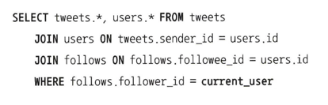
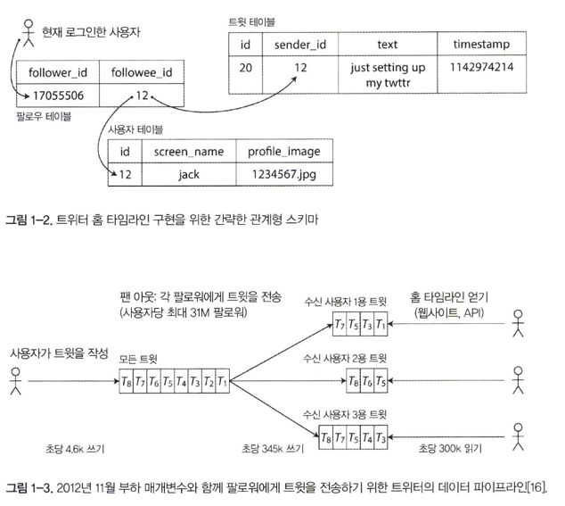
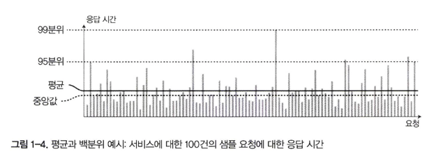
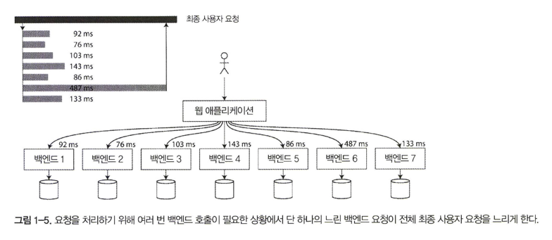

# 01 신뢰할 수 있고 확장 가능하며 유지보수하기 쉬운 애플리케이션

- 오늘날 많은 애플리케이션은 계산 중심과는 다르게 데이터 중심적
- 애플리케이션의 경우 CPU 성능은 애플리케이션을 제한하는 요소가 아니며，더 큰 문제는 보통 데이터의 양, 데이터의 복잡도, 데이터의 변화속도
- 데이터 중심 애플리케이션은 공통으로 필요로 하는 기능을 제공하는 표준 구성 요소로 만든다
    - 구동 애플리케이션이나 다른 애플리케이션에서 나중에 다시 데이터를 찾을 수 있게 데이터를 저장(데이터베이스)
    - 읽기 속도 향상을 위해 값비싼 수행 결과를 기억(캐시)
    - 사용자가 키워드로 데이터를 검색하거나 다양한 방법으로 필터링할 수 있게 제공(검색 색인(search index))
    - 비동기 처리를 위해 다른 프로세스로 메시지 보내기(스트림 처리(stream processing))
    - 주기적으로 대량의 누적된 데이터를 분석(일괄 처리(batch processing))
- 애플리케이션마다 요구사항이 다르기 때문에 데이터베이스 시스템 또한 저마다 다양한 특성
- 애플리케이션을 만들 때 어떤 도구와 어떤 접근 방식이 수행 중인 작업에 가장 적합한지 생각해야 한다
- 신뢰성, 확장성, 유지보수성의 의미를 명확히 하고 이를 고려하는 몇 가지 방법을 개략적으로 설명하고 이후 장에서 필요한 기본 사항을 거듭 검토

## 데이터 시스템에 대한 생각

- [그림 1-1] 다양한 구성 요소를 결합한 데이터 시스템 아키텍처의 예


- 대부분의 소프트웨어 시스템에서 중요하게 여기는 세 가지 관심사
  - 신뢰성 (Reliability)   
    하드웨어나 소프트웨어 결함, 심지어 인적 오류(human error) 같은 역경에 직면하더라도 시스템은 지속적으로 올바르게 동작(원하는 성능 수준에서 정확한 기능을 수행)해야 한다
  - 확장성 (Scalability)   
    시스템의 데이터 양, 트래픽 양, 복잡도가 증가하면서 이를 처리할 수 있는 적절한 방법이 있어야 한다
  - 유지보수성 (Maintainability)   
    시간이 지남에 따라 여러 다양한 사람들이 시스템 상에서 작업(현재 작업을 유지보수하고 새로운 사용 사례를 시스템에 적용하는 엔지니어링과 운영)할 것이기 때문에 모든 사용자가 시스템 상에서 생산적으로 작업할 수 있게 해야 한다

## 신뢰성

- 소프트웨어의 경우 일반적인 기대치
  - 애플리케이션은 사용자가 기대한 기능을 수행한다
  - 시스템은 사용자가 범한 실수나 예상치 못한 소프트웨어 사용법을 허용할 수 있다
  - 시스템 성능은 예상된 부하와 데이터 양에서 필수적인 사용 사례를 충분히 만족한다
  - 시스템은 허가되지 않은 접근과 오남용을 방지한다
- 대략 "무언가 잘못되더라도 지속적으로 올바르게 동작함"을 신뢰성의 의미로 이해할 수 있다
- 잘 못 될 수 있는 일을 **결함(fault)** 이라 부른다. 그리고 결함을 예측하고 대처할 수 있는 시스템을 **내결함성(fault-tolerant)** 또는 **탄력성(resilient)** 을 지녔다고 말한다
- 모든 종류의 결함을 견딜 수는 없으므로 **특정 유형**의 결함 내성에 대해서만 이야기하는 것이 타당
- 결함은 장애(failure) 와 동일 X. 일반적으로 결함은 사양에서 벗어난 시스템의 한 구성 요소
- **장애**는 사용자에게 필요한 서비스를 제공하지 못하고 시스템 전체가 멈춘 경우
- 반직관적이지만 이러한 내결함성 시스템에서 경고 없이 개별 프로세스를 무작위로 죽이는 것과 같이 고의적으로 결함을 일으켜 결함률을 증가시키는 방법은 납득 가능   
  ex) 넷플릭스의 **카오스몽키(Chaos Monkey)**
- 예방책이 해결책보다 더 좋은 경우는 보안 문제

### 하드웨어 결함

- 시스템 장애의 원인을 생각할 때 하드웨어 결함   
  ex) 하드디스크 고장, 램 결함 등등
- 시스템 장애율을 줄이기 위한 첫 번째 대응으로 각 하드웨어 구성 요소에 중복(redundancy) 을 추가하는 방법이 일반적
- 최근까지 단일 장비의 전체 장애는 매우 드물기 때문에 대부분의 애플리케이션은 하드웨어 구성 요소의 중복으로 충분
- 새 장비에 백업을 매우 빠르게 복원할 수 있는 한, 장에 발생 시 중단시간(downtime)은 대부분의 애플리케이션에 치명적 X
- 다중 장비 중복은 고가용성(high availability) 이 절대적으로 필수적인 소수의 애플리케이션에서만 필요
- 데이터 양과 애플리케이션의 계산 요구가 늘어나면서 더 많은 애플리케이션이 많은 수의 장비를 사용하게 됐고 이와 비례해 하드웨어 결함율도 증가

### 소프트웨어 오류

- 시스템 내 체계적 오류(systematic error)   
  - 잘못된 특정 입력이 있을 때 모든 애플리케이션 서버 인스턴스가 죽는 소프트웨어 버그
  - CPU 시간, 메모리, 디스크 공간, 네트워크 대역폭처럼 공유 자원을 과도하게 사용하는 일부 프로세스.
  - 시스템의 속도가 느려져 반응이 없거나 잘못된 응답을 반환하는 서비스.
  - 한 구성 요소의 작은 결함이 다른 구성 요소의 결함을 야기하고 차례차례 더 많은 결함이 발생하는 연쇄 장애(cascading failure)
- 소프트웨어의 체계적 오류 문제는 신속한 해결책이 없다

### 인적 오류
- 사람은 소프트웨어 시스템을 설계하고 구축하며，운영자로서 시스템을 계속 운영
- 사람이 미덥지 않음에도 시스템을 신뢰성있게 하는 것은 다양한 접근 방식을 결합하는 것
  - 오류의 가능성을 최소화하는 방향으로 시스템을 설계하라. 예를 들어 잘 설계된 추상화, API, 관리 인터페이스를 사용하면 “옳은 일”은 쉽게 하고 “잘못된 일”은 막을 수 있다. 하지만 인터페이스가 지나치게 제한적이면 사람들은 좋은 점을 잊은 채 제한된 인터페이스를 피해 작업한다. 따라서 이런 시스템 설계는 올바르게 작동하게끔 균형을 맞추기가 어렵다.
  - 사람이 가장 많이 실수하는 장소(부분)에서 사람의 실수로 장애가 발생할 수 있는 부분을 분리하라. 특히 실제 데이터를 사용해 안전하게 살펴보고 실험할 수 있지만 실제 사용자에게는 영향이 없는 비 프로덕션 샌드박스(sandbox)를 제공하라.
  - 단위 테스트부터 전체 시스템 통합 테스트와 수동 테스트까지 모든 수준에서 철저하게 테스트하라. 자동 테스트는 널리 사용되며 잘 알려져 있다. 특히 정상적인 동작에서는 거의 발생하지 않는 코너 케이스(comer case)를 다루는 데 유용
  - 장애 발생의 영향을 최소화하기 위해 인적 오류를 빠르고 쉽게 복구할 수 있게 하라. 예를 들어 설정 변경 내역을 빠르게 롤백(roll back)하고 새로운 코드를 서서히 롤아웃(roll out)하게 만들고(예상치 못한 버그가 일부 사용자에게만 영향이 미치게 함) 이전 계산이 잘못된 경우를 대비해 데이터 재계산 도구를 제공하라
  - 성능 지표와 오류율 같은 상세하고 명확한 모니터링 대책을 마련하라. 모니터링을 다른 엔지니어링 분야에서는 **원격 측정(telemetry)** 이라고 부른다. 모니터링은 조기에 경고 신호를 보내줄 수 있고 특정 가정이나 제한을 벗어나는지 확인할 수 있게 한다.
  - 조작 교육과 실습을 시행하라. 까다롭지만 매우 중요한 측면

### 신뢰성은 얼마나 중요할까?

- “중요하지 않은” 애플리케이션도 사용자에 대한 책임(responsibility)이 있다

## 확장성

- 시스템이 현재 안정적으로 동작한다고 해서 미래에도 안정적으로 동작한다는 보장은 없고 전에 처리했던 양보다 더 많은 데이터를 처리하고 있을지도 모른다.
- “시스템이 특정 방식으로 커지면 이에 대처하기 위한 선택은 무엇인가?”와 “추가 부하를 다루기 위해 계산 자원을 어떻게 투입할까?” 같은 질문을 고려해야한다

### 부하 기술하기

- 무엇보다 시스템의 현재 부하를 간결하게 기술해야 한다
- 부하는 **부하 매개변수(load parameter)** 라 부르는 몇 개의 숫자로 나타낼 수 있다 
- 부하 매개변수로 웹 서버의 초당 요청 수, 데이터베이스의 읽기 대 쓰기 비율, 대화방의 동시 활성 사용자(active user), 캐시 적중률 등이 있다

```angular2html
트랜잭션 처리 사스템에서 하나의 수신 요청을 처리하는 데 필요한 다른 서비스의 요청 수를 설명하기 위해 팬 아웃을 사용
```

- 트위터의 주요 두 가지 동작
1. 트윗(tweet) 작성   
   사용자는 팔로워에게 새로운 메시지를 게시할 수 있다(평균 초당 46k 요청, 피크일 때 초당 12k 요청 이상).
2. 홈 타임라인(timeline)   
   사용자는 팔로우한 사람이 작성한 트윗을 볼 수 있다(초당 300k 요청).
- 단순히 초당 12,000건의 쓰기는 쉽지만, 트윗 양이 아닌 팬 아웃(fan-out) 때문에 확장성 문제 발생
- 개별 사용자는 많은 사람을 팔로우하고 많은 사람이 개별 사용자를 팔로우한다. 이 두 가지 동작을 구현하는 방법은 크게 두 가지
1. 트윗 작성은 간단히 새로운 트윗을 트윗 전역 컬렉션에 삽입한다. 사용자가 자신의 홈 타임라인을 요청하면 팔로우하는 모든 사람을 찾고 이 사람들의 모든 트윗을 찾아 시간순으로 정렬해서 합친다. 그림 1-2와 같은 관계형 데이터베이스에서는 다음과 같이 질의를 작성한다.



2. 각 수신 사용자용 트윗 우편함처럼 개별 사용자의 홈 타임라인 캐시를 유지한다(그림 1-3 참고). 사용자가 트윗을 작성하면 해당 사용자를 팔로우하는 사람을 모두 찾고 팔로워 각자의 홈 타임라인 캐시에 새로운 트윗을 삽입한다. 그러면 홈 타임라인의 읽기 요청은 요청 결과를 미리 계산했기 때문에 비용이 저렴하다.



- 게시된 트윗의 평균 속도가 홈 타임라인 읽기 속도보다 100배 정도 낮기 때문에 접근 방식 2가 더 잘 동작
- 이 경우에는 쓰기 시점에 더 많은 일을 하고，읽기 시점에 적은 일을 하는 것이 바람직
- 접근 방식 2의 불리한 점은 이제 트윗 작성이 많은 부가 작업을 필요로 한다는 점
- 트위터 사례에서 사용자당 팔로워의 분포(해당 사용자의 트윗 빈도에 따라 편중될 수도 있음)는 팬아웃 부하를 결정하기 때문에 확장성을 논의할 때 핵심 부하 매개변수
- 애플리케이션마다 특성은 매우 다르지만 부하에 대한 추론에 비슷한 원리를 적용 가능
- 트위터는 두 접근 방식의 혼합형(hybrid) 으로 바꾸고 있다
- 대부분 사용자의 트윗은 계속해서 사람들이 작성할 때 홈 타임라인에 펼쳐지지만 팔로워 수가 매우 많은 소수 사용자(예를 들어 유명인)는 팬 아웃에서 제외
- 사용자가 팔로우한 유명인의 트윗은 별도로 가져와 접근 방식 1처럼 읽는 시점에 사용자의 홈 타임라인에 합친다

### 성능 기술하기

- 시스템 부하를 기술하면 부하가 증가할 때 어떤 일이 일어나는지 조사가능
1. 부하 매개변수를 증가시키고 시스템 자원(CPU, 메모리, 네트워크 대역폭 등)은 변경하지 않고 유지하면 시스템 성능은 어떻게 영향을 받을까?
2. 부하 매개변수를 증가시켰을 때 성능이 변하지 않고 유지되길 원한다면 자원을 얼마나 많이 자원을 늘려야 할까?
- 하둡(Hadoop) 같은 일괄 처리 시스템은 보통 **처리량(throughput)** (초당 처리할 수 있는 레코드 수나 일정 크기의 데이터 집합으로 작업을 수행할 때 걸리는 전체 시간)에 관심
- 온라인 시스템에서 더 중요한 사항은 서비스 **응답 시간(response time)**,  즉 클라이언트가 요청을 보내고 응답을 받는 사이의 시간
- 지연 시간(latency)과 응답 시간(response time)

```angular2html
지연 시간과 응답 시간을 종종 같은 뜻으로 사용하지만 동일하지는 않다. 
응답 시간은 클라이언트 관점에세 에서 본 시간으로, 요청을 처리하는 실제 시간(서비스 시간) 외에도 네트워크 지연과 큐 지연도 포함한다. 
지연 시간은 요청이 처리되길 기다리는 시간으로, 서비스를 기다리며 휴지(latent) 상태인 시간을 말한다
```



- 각 회색 막대는 서비스에 대한 요청을 나타내고 막대의 높이는 요청에 소요된 시간을 보여준다. 대부분의 요청은 꽤 빠르지만 가끔 꽤 오래 걸리는 **특이 값(outlier)** 존재
- 보고된 서비스 **평균** 응답 시간을 살피는 일은 일반적
- 일반적으로 평균보다는 **백분위(percentile)** 를 사용하는 편이 더 좋다
- 응답 시간 목록을 가지고 가장 빠른 시간부터 제일 느린 시간까지 정렬하면 중간 지점이 **중앙값(median)** 이 된다
- 사용자 요청의 절반은 중앙값 응답 시간 미만으로 제공되고, 나머지 반은 중앙값보다 오래 걸린다
- 중앙값은 **50분위** 로서 **p50** 으로 축약 가능
- 특이 값이 얼마나 좋지 않은지 알아보려면 상위 백분위를 살펴보는 것도 좋다. 이때 사용하는 백분위는 **95 분위**, **99분위**， **99.9분위** 가 일반적
- 요청의 95%, 99%, 99.9% 가 특정 기준치보다 더 빠르면 해당 특정 기준치가 각 백분위의 응답 시간 기준치
- **꼬리 지연 시간(tail latency)** 으로 알려진 상위 백분위 응답 시간은 서비스의 사용자 경험에 직접 영향을 주기 때문에 중요
- 백분위는 **서비스 수준 목표(service level objective, SLO)** 와 **서비스 수준 협약서(service level agreement, SLA)** 에 자주 사용하고 기대 성능과 서비스 가용성을 정의하는 계약서에도 자주 등장
- 큐 대기 지연(queueing delay)은 높은 백분위에서 응답 시간의 상당 부분을 차지
- 소수의 느린 요청 처리만으로도 후속 요청 처리가 지체, **선두 차단(head-of-line blocking)**
- 서버에서 후속 요청이 빠르게 처리되더라도 이전 요청이 완료되길 기다리는 시간 때문에 클라이언트는 전체적으로 응답 시간이 느리다고 생각할 것

**실전 백분위**

- 작은 비율의 백엔드 호출만 느려도 최종 사용자 요청이 여러 번 백엔드를 호출하면 느린 호출이 발생할 가능성이 증가
- 최종 사용자 요청 중 많은 비율의 응답 시간이 결국 느려진다, **꼬리 지연 증폭**
- 서비스의 모니터링 대시보드에 응답 시간 백분위를 추가하려면 지속적으로 백분위를 효율적으로 계산할 필요
- 단순한 구현으로 시간 구간 내 모든 요청의 응답 시간 목록을 유지하고 1분마다 목록을 정렬하는 방법 
- 이 밖에도 포워드 디케이, T 다이제스트, Hdr히스토그램 같은 CPU와 메모리 비용을 최소로 하면서 좋은 백분위 근사치를 계산할 수 있는 알고리즘 존재



## 부하 대응 접근 방식

- 확장성과 관련해 두가지로 구분
1. **용량 확장(scaling up) (수직 확장(vertical scaling)**, 좀 더 강력한 장비로 이동)
2. **규모 확장(scaling out) (수평 확장(horizontal scaling)**, 다수의 낮은 사양 장비에 부하를 분산)
- 다수의 장비에 부하를 분산하는 아키텍처를 **비공유(shared-nothing)** 아키텍처라 부른다
- 일부 시스템은 **탄력적(elastic)**. 탄력적인 시스템은 부하를 예측할 수 없을 만큼 높은 경우 유용하지만 수동으로 확장하는 시스템이 더 간단하고 운영상 예상치 못한 일이 더 적다
- 다수의 장비에 상태 비저장(stateless) 서비스를 배포하는 일은 상당히 간단
- 단일 노드에 상태 유지(stateful) 데이터 시스템을 분산 설치하는 일은 아주 많은 복잡도가 추가적으로 발생
- 대규모로 동작하는 시스템의 아키텍처는 해당 시스템을 사용하는 애플리케이션에 특화
- 아키텍처를 결정하는 요소는 읽기의 양, 쓰기의 양, 저장할 데이터의 양, 데이터의 복잡도，응답 시간 요구사항, 접근 패턴 등
- 특정 애플리케이션에 적합한 확장성을 갖춘 아키텍처는 주요 동작이 무엇이고 잘하지 않는 동작이 무엇인지에 대한 가정을 바탕으로 구축. 이 가정은 곧 부하 매개변수

# 유지보수성
- 대부분 소위 **레거시** 시스템 유지보수는 다 하기싫어한다.
- 희망적인 점은 유지보수 중 고통을 최소화하고 레거시 소프트웨어를 직접 만들지 않게끔 소프트웨어를 설계할 수 있다는 것
- 주의를 기울여야 할 소프트 웨어 시스템 설계 원칙
1. 운용성 (operability)   
   운영팀이 시스템을 원활하게 운영할 수 있게 쉽게 만들어라.
2. 단순성 (simplicity)   
   시스템에서 복잡도를 최대한 제거해 새로운 엔지니어가 시스템을 이해하기 쉽게 만들어라(사용자 인터페이스의 단순성과는 다르다는 점에 유의하라)
3. 발전성 (evolvability)   
   엔지니어가 이후에 시스템을 쉽게 변경할 수 있게 하라. 그래야 요구사항 변경 같은 예기치않은 사용 사례를 적용하기가 쉽다.    
   이 속성은 **유연성(extensibility)**, **수정 가능성(modifiability)**, **적응성(plasticity)** 으로 알려져 있다.

## 운용성: 운영의 편리함 만들기

- “좋은 운영은 종종 나쁜(또는 불완전한) 소프트웨어의 제약을 피하는 대안이 될 수 있다. 하지만 좋은 소프트웨어라도 나쁘게 운영할 경우 작동을 신뢰할 수 없다.”
- 좋은 운영팀은 일반적으로 다음과 같은 작업 등을 책임   
  - 사스템 상태를 모니터링하고 상태가 좋지 않다면 빠르게 서비스를 복원
  - 시스템 장애, 성능 저하 등의 문제의 원인을 추적
  - 보안 패치를 포함해 소프트웨어와 플랫폼을 최신 상태로 유지
  - 다른 시스템이 서로 어떻게 영향을 주는지 확인해 문제가 생길 수 있는 변경 사항을 손상을 입히기 전에 차단
  - 미래에 발생 가능한 문제를 예측해 문제가 발생하기 전에 해결(예를 들어 용량 계획)
  - 배포 설정 관리 등을 위한 모범 사례와 도구를 마련
  - 애플리케이션을 특정 플랫폼에서 다른 플랫폼으로 이동하는 등 복잡한 유지보수 태스크를 수행
  - 설정 변경으로 생기는 시스템 보안 유지보수
  - 예측 가능한 운영과 안정적인 서비스 환경을 유지하기 위한 절차 정의
  - 개인 인사 이동에도 시스템에 대한 조직의 지식을 보존함
- 좋은 운영성이란 동일하게 반복되는 태스크를 쉽게 수행하게끔 만들어 운영팀이 고부가가치 활동에 노력을 집중한다는 의미
- 데이터 시스템은 동일 반복 태스크를 쉽게 하기 위해 아래 항목 등을 포함해 다양한 일 가능
  - 좋은 모니터링으로 런타임(runtime) 동작과 시스템의 내부에 대한 가시성 제공 
  - 표준 도구를 이용해 자동화와 통합을 위한 우수한 지원을 제공 
  - 개별 장비 의존성을 회피. 유지보수를 위해 장비를 내리더라도 시스템 전체에 영향을 주지 않고 계속해서 운영 가능해야 함.
  - 좋은 문서와 이해하기 쉬운 운영 모델(예를 들어 “X를 하면 Y가 발생한다”) 제공
  - 만족할 만한 기본 동작을 제공하고, 필요할 때 기본값을 다시 정의할 수 있는 자유를 관리자에게 부여
  - 적절하게 자기 회복(self-healing)이 가능할 뿐 아니라 필요에 따라 관리자가 시스템 상태를 수동으로 제어할 수 있게 함
  - 예측 가능하게 동작하고 예기치 않은 상황을 최소화함

## 단순성: 복잡도 관리

- 프로젝트가 커짐에 따라 시스템은 매우 복잡하고 이해하기 어려워진다
- 복잡도는 같은 시스템에서 작업해야 하는 모든 사람의 진행을 느리게 하고 나아가 유지보수 비용이 증가
- 복잡도 수렁에 빠진 소프트웨어 프로젝트를 때론 커다란 **진흙 덩어리(big ball of mud)** 로 묘사
- 복잡도는 다양한 증상으로 발생
1. 상태 공간의 급증
2. 모듈 간 강한 커플링(tight coupling) 
3. 복잡한 의존성
4. 일관성 없는 명명(naming)과 용어
5. 성능 문제 해결을 목표로한 해킹
6. 임시방편으로 문제를 해결한 특수 사례(special- casing)
- 복잡도 때문에 시스템 유지보수가 여려울 때 예산과 일정이 초과되곤 한다
- 복잡한 소프트웨어에서는 변경이 있을 때 버그가 생길 위험이 더 크다
- 반대로 복잡도를 줄이면 소프트웨어 유지보수성이 크게 향상된다. 따라서 단순성이 구축하려는 시스템의 핵심 목표
- 시스템을 단순하게 만드는 일이 반드시 기능을 줄인다는 의미는 아니다. **우발적 복잡도(accidental complexity)** 를 줄인다는 뜻
- 우발적 복잡도를 제거하기 위한 최상의 도구는 **추상화**

## 발전성: 변화를 쉽게 만들기

- 조직 프로세스 측면에서 **애자일(agile)** 작업 패턴은 변화에 적응하기 위한 프레임워크를 제공
- 데이터 시스템 변경을 쉽게 하고 변화된 요구사항에 시스템을 맞추는 방법은 시스템의 간단함과 추상화와 밀접한 관련
