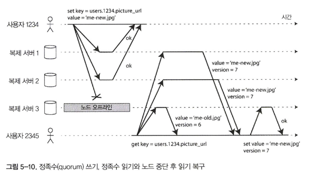

# 복제

- 데이터 **복제**가 필요한 여러 이유
1. 지리적으로 사용자와 가깝게 데이터를 유지해 지연 시간을 줄인다
2. 시스템의 일부에 장애가 발생해도 지속적으로 동작할 수 있게 해 가용성을 높인다
3. 읽기 질의를 제공하는 장비의 수를 확장해 읽기 처리량을 늘린다

- 복제에서 모든 어려움은 복제된 데이터의 **변경** 처리에 있다
- 노드 간 변경을 복제하기 위한 세 가지 인기 있는 알고리즘
1. 단일 리더(single-leader)
2. 다중 리더(multi-leader)
3. 리더 없는(leaderless)

## 리더와 팔로워

- 데이터베이스의 복사본을 저장하는 각 노드를 **복제 서버(replica)** 라 한다
- 데이터베이스의 모든 쓰기는 모든 복제 서버에서 처리돼야 한다. 이 문제를 위한 일반적인 해결책은    
**리더 기반 복제(leader-based replication)** = **능동(active)** / **수동(passive)** = **마스터(master) 슬레이브(slave)**
- 복제 서버 중 하나를 **리더(leader)** (**마스터**나 **프라이머리(primary)** 라고도 함)로 지정
- 다른 복제 서버는 **팔로워(follower)** (**읽기 복제 서버(read replica)**, **슬레이브**, **2차(secondary)핫 대기(hot standby)**)
- 리더가 로컬 저장소에 새로운 데이터를 기록할 때마다 데이터 변경을 **복제 로그(replication log)** 나 **변경 스트림(change stream)** 의 일부로 팔로워에게 전송
- 각 팔로워가 리더로부터 로그를 받으면 리더가 처리한 것과 동일한 순서로 모든 쓰기를 적용해 그에 맞게 데이터베이스의 로컬 복사본을 갱신
- 클라이언트가 데이터베이스로부터 읽기를 할 때는 리더 또는 임의 팔로워에게 질의 가능. 하지만 쓰기는 리더에게만 허용

### 동기식 대 비동기식 복제

- 복제 시스템의 중요한 세부 사항은 복제가 동기식으로 발생하는지 비동기식으로 발생하는지 여부

- 그림 5-2 의 예제에서 팔로워 1의 복제는 동기식. 리더는 팔로워 1이 쓰기를 수신했는지 확인해 줄 때까지 기다린다
- 팔로워 2의 복제는 비동기식. 리더는 메시지를 전송하지만 팔로워의 응답을 기다리지 않는다
- 동기식 복제의 장점은 팔로워가 리더와 일관성 있게 최신 데이터 복사본을 가지는 것을 보장
- 단점은 (팔로워가 죽거나 네트워크 문제나 다른 어떤 이유로 인해) 동기 팔로워가 응답하지 않는다면 쓰기 처리 X
- 리더는 모든 쓰기를 차단(block) 하고 동기 복제 서버가 다시 사용할 수 있을 때까지 대기
- **반동기식**
  - 현실적으로 데이터베이스에서 동기식 복제를 사용하려면 보통 팔로워 하나는 동기식으로 하고 그 밖에는 비동기식으로 하는 것을 의미
  - 적어도 두 노드(리더와 하나의 동기 팔로워)에 데이터의 최신 복사본이 있는 것을 보장
- 리더 기반 복제는 완전히 비동기식으로 구성
- 리더가 잘못되고 복구할 수 없으면 팔로워에 아직 복제되지 않은 모든 쓰기는 유실
- 완전 비동기식 설정은 모든 팔로워가 잘못되더라도 리더가 쓰기 처리를 계속 할 수 있는 장점
- 비동기식 복제는 내구성을 약화시키기 때문에 나쁜 트레이드오프 같지만 그럼에도 특히 많은 팔로워가 있거나 지리적으로 분산됐다면 비동기식 복제를 널리 사용

### 새로운 팔로워 설정

- 새로운 팔로워가 리더의 데이터 복제본을 정확히 가지고 있는지 어떻게 보장할까?
- 간단히 한 노드에서 다른 노드로 데이터 파일을 복사하는 것만으로는 대개 충분 X. 복사 결과가 유효하지 않을 수 있다
- 팔로워 설정은 대개 중단시간 없이 수행 가능
1. 전체 데이터베이스를 잠그지 않고 리더의 데이터베이스 스냅숏을 일정 시점에 가져온다
2. 스냅숏을 새로운 팔로워 노드에 복사
3. 팔로워는 리더에 연결해 스냅숏 이후 발생한 모든 데이터 변경을 요청. 이것은 스냅숏이 리더의 복제 로그의 정확한 위치와 연관돼야 한다
4. 팔로워가 스냅숏 이후 데이터 변경의 미처리분(backlog)을 모두 처리했을 때 따라잡았다고 말한다

### 노드 중단 처리

- 중단시간 없이 개별 노드를 재부팅할 수 있다는 점은 운영과 유지보수에 큰 장점
- 개별 노드의 장애에도 전체 시스템이 동작하게끔 유지하고 노드 중단의 영향을 최소화하는 것이 목표

**팔로워 장애: 따라잡기 복구**

- 각 팔로워는 리더로부터 수신한 데이터 변경 로그를 로컬 디스크에 보관
- 팔로워가 죽어 재시작하거나 리더와 팔로워 사이의 네트워크가 일시적으로 중단된다면 팔로워는 매우 쉽게 복구 가능
- 보관된 로그에서 결함이 발생하기 전에 처리한 마지막 트랜잭션을 알아내서 끊긴 데이터 변경 모두 요청 가능

**리더 장애: 장애 복구**

- 리더의 장애는 팔로워 중 하나를 새로운 리더로 승격해야 하고 클라이언트는 새로운 리더로 쓰기를 전송하기 위해 재설정이 필요, 다른 팔로워는 새로운 리더로부터 데이터 변경을 소비하기 시작해야한다, **장애 복구**
- 자동 장애 복구는 보통 다욤과 같은 단계로 구성
  1. 리더가 장애인지 판단한다
  2. 새로운 리더를 선택한다
      - 새로운 리더로 가장 적합한 후보는 보통 이전
    리더의 최신 데이터 변경사항을 가진 복제 서버
  3. 새로운 리더 사용을 위해 시스템을 재설정한다
      - 이전 리더가 돌아오면 여전히 자신이 리더라 믿을 수 있으며 다른 복제 서버들이 자신을 리더에서 물러나게 한 것을 알지 못한다
      - 시스템은 이전 리더가 팔로워가 되고 새로운 리더를 인식할 수 있게끔 해야 한다

- 장애 복구 과정은 잘못될 수 있는 것 투성
  1. 비동기식 복제를 사용한다면 새로운 리더는 이전 리더가 실패하기 전에 이전 리더의 쓰기를 일부 수신하지 못할 수 있다
  2. 쓰기를 폐기하는 방법은 데이터베이스 외부의 다른 저장소 시스템이 데이터베이스 내용에 맞춰 조정돼야 한다면 특히 위험
      - 깃허브에서 발생한 사고 중 하나인 MySQL의 자동 증가 카운터 기본키가 Redis 간 불일치
  3. 특정 결함 시나리오(8장 참고)에서 두 노드가 모두 자신이 리더라고 믿을 수 있다, **스플릿 브레인**
  4. 리더가 분명히 죽었다고 판단 가능한 적절한 타임아웃이 너무 길어도 짧아도 문제다

### 복제 로그 구현

- 리더 기반 복제는 내부적으로 어떻게 동작하는지 알아보자

**구문 기반 복제**

- 리더는 모든 쓰기 요청(**구문(statement)**) 을 기록하고 쓰기를 실행한 다음 구문 로그를 팔로워에게 전송
- 이 접근법이 합리적인 것 같지만 복제가 깨질 수 있는 다양한 사례
  1. 현재 날짜와 시간을 얻기 위한 NOW() 나 임의 숫자를 얻기 위한 RAND() 같은 비결정적 함수를 호출하는 모든 구문은 각 복제 서버마다 다른 값을 생성할 가능성
  2. 자동증가 칼럼을 사용하는 구문이나 데이터베이스에 있는 데이터에 의존한다면 각 복제 서버에서 정확히 같은 순서로 실행돼야 한다. 이 방식은 동시에 여러 트랜잭션이 수행되는 것을 제한
  3. 부수 효과를 가진 구문(예: 트리거, 스토어드 프로시저, 사용자 정의 함수)은 부수 효과가 완벽하게 결정적이지 않으면 각 복제 서버에서 다른 부수 효과가 발생

**쓰기 전 로그 배송**

- 일반적으로 모든 쓰기는 로그에 기록한다는 사실
  1. 로그 구조화 저장소 엔진의 경우 로그 자체가 저장소의 주요 부분. 로그 세그먼트는 작게 유지되고 백그라운드로 가비지 컬렉션
  2. 개별 디스크 블록에 덮어쓰는 B 트리의 경우 모든 변경은 쓰기 전 로그(Write-ahead log, WAL)에 쓰기 때문에 고장 이후 일관성 있는 상태로 색인을 복원 가능
- 리더는 디스크에 로그를 기록하는 일 외에도 팔로워에게 네트워크로 로그를 전송
- 팔로워가 이 로그를 처리하면 리더에서 있는 것과 정확히 동일한 데이터 구조의 복제본
- 가장 큰 단점은 로그가 제일 저수준의 데이터를 기술한다는 점
  - 데이터베이스가 저장소 형식을 다른 버전으로 변경한다면 대개 리더와 팔로워의 데이터베이스 소프트웨어 버전을 다르게 실행 X
- WAL 배송(shipping)과 같이 복제 프로토콜이 버전의 불일치를 허용하지 않는다면 업그레이드할 때 중단시간이 필요

**논리적(로우 기반) 로그 복제**

- 복제 로그를 저장소 엔진 내부와 분리하기 위한 대안 하나는 복제와 저장소 엔진을 위해 다른 로그 형식을 사용하는 것   
- 저장소 엔진의 (물리적) 데이터 표현과 구별하기 위해 **논리적 로그(logical log)** 라고 부른다 
- 관계형 데이터베이스용 논리적 로그는 대개 로우 단위로 데이터베이스 테이블에 쓰기를 기술한 레코드 열
  1. 삽입된 로우의 로그는 모든 칼럼의 새로운 값을 포함
  2. 삭제된 로우의 로그는 로우를 고유하게 식별하는 데 필요한 정보를 포함. 보통 이것은 기본키지만 테이블에 기본키가 없다면 모든 칼럼의 에전 값을 로깅
  3. 갱신된 로우의 로그는 로우를 고유하게 식별하는 데 필요한 정보와 모든 칼럼의 새로운 값(적어도 변경된 모든 칼럼의 새로운 값)을 포함
- 논리적 로그의 장점
  1. 논리적 로그를 저장소 엔진 내부와 분리했기 때문에 하위 호환성을 더 쉽게 유지
  2. 리더와 팔로워에서 다른 버전의 데이터베이스 소프트웨어나 심지어 다른 저장소 엔진을 실행 가능
  3. 논리적 로그 형식은 외부 애플리케이션이 파싱하기 더 쉽다
  4. 오프라인 분석이나 사용자 정의 색인과 캐시 구축을 위해 데이터 웨어하우스 같은 외부 시스템에 데이터베이스의 내용을 전송하고자 할 때 유용, **변경 데이터 캡처**

**트리거 기반 복제**

- 유연성이 필요할 때 많은 관계형 데이터베이스에서 사용할 수 있는 기능인 **트리거**나 **스토어드 프로시저**를 사용
- 트리거는 사용자 정의 애플리케이션 코드를 등록
  - 데이터 베이스 시스템에서 데이터가 변경되면(쓰기 트랜잭션) 자동으로 실행
  - 데이터 변경을 분리된 테이블에 로깅할 수 있는 기회. 이 테이블로부터 데이터 변경을 외부 프로세스가 읽을 수 있다

## 복제 지연 문제

- 대부분이 읽기 요청이고 쓰기가 아주 작은 비율로 구성된 작업부하(웹 상의 공통 패턴)라면 많은 팔로워를 만들어 팔로워간 읽기 요청을 분산하는 매력적인 옵션
- **읽기 확장(read-scaling)** 아키텍처에서는 간단히 팔로워를 더 추가함으로써 읽기 전용 요청을 처리하기 위한 용량 확장 가능
- 애플리케이션이 **비동기 팔로워**에서 데이터를 읽을 때 팔로워가 뒤처진다면 지난 정보를 볼 수도 있다
- 하지만 데이터베이스에 쓰기를 멈추고 잠시동안 기다리면 팔로워는 결국 따라잡게 되고 리더와 일치하게 된다, **최종적 일관성**

### 자신이 쓴 내용 읽기

- 사용자가 쓰기를 수행한 직후 데이터를 본다면 새로운 데이터는 아직 복제 서버에 반영되지 않았을 수 있다

- **쓰기 후 읽기 일관성** (**자신의 쓰기 읽기 일관성** 으로도 알려져 있음)이 필요
- 리더 기반 복제 시스템에서 쓰기 후 읽기 일관성 구현 기법
  1. 사용자가 수정한 내용을 읽을 때는 리더에서 읽는다. 그 밖에는 팔로워에서 읽는다
     - 이를 위해서는 실제로 질의하지 않고 무엇이 수정됐는지 알 수 있는 방법이 필요
  2. 애플리케이션 내 대부분의 내용을 사용자가 편집할 가능성이 있다면 이 접근 방식은 대부분 리더에서 읽기 때문에 비효율적이라 다른 기준 사용
     - 마지막 갱신 시각을 찾아서 마지막 갱신 후 1분 동안은 리더에서 모든 읽기를 수행
     - 팔로워에서 복제 지연을 모니터링해 리더보다 1분 이상 늦은 모든 팔로워에 대한 질의를 금지
  3. 클라이언트는 가장 최근 쓰기의 타임스탬프를 기억 가능. 시스템은 사용자 읽기를 위한 복제 서버가 최소한 해당 타임스탬프까지 갱신을 반영 가능
     - 복제 서버가 아직 최신 내용이 아닌 경우에는 다른 복제 서버가 읽기를 처리하거나 복제 서버가 따라잡을 때까지 질의를 대기
     - 타임스템프는 **논리적 타임스탬프** (로그 열 숫자처럼 쓰기의 순서를 지정함)거나 실제 시스템 시간일 수 있다
  4. 복제 서버가 여러 데이터센터에 분산(사용자에게 지리적인 근접성이나 가용성을 위해)됐다면 복잡도가 증가
     -  리더가 제공해야 하는 모든 요청은 리더가 포함된 데이터센터로 라우팅 돼야한다
- 동일한 사용자가 여러 디바이스로 접근할 때는 **디바이스 간** 쓰기 후 읽기 일관성 제공. 이때 몇가지 문제 추가적으로 고려
  1. 사용자의 마지막 갱신 타임스템프를 기억해야 하는 접근 방식은 더욱 어렵다. 이 메타데이터는 중앙집중식으로 관리
  2. 복제 서버가 여러 데이터센터 간에 분산돼 있다면 다른 디바이스의 연결이 동일한 데이터센터로 라우팅된다는 보장이 없다
     - 리더에서 읽어야 할 필요가 있는 접근법이라면 먼저 사용자 디바이스의 요청을 동일한 데이터센터로 라우팅

### 단조 읽기

- 사용자가 **시간이 거꾸로 흐르는** 현상을 목격할 수 있다는 것

- 단조 읽기는 강한 일관성보다는 덜한 보장이지만 최종적 일관성보다는 더 강한 보장
- 데이터를 읽을 때 이전 값을 볼 수 있다. 한 사용자가 여러 번에 걸쳐 여러 번 읽어도 시간이 되돌아가는 현상을 보지않는다는 의미
- 즉, 이전에 새로운 데이터를 읽은 후에는 예전 데이터를 읽지 않는다
- 단조 읽기를 달성하는 한 방법은 각 사용자의 읽기가 항상 동일한 복제 서버에서 수행되게끔 하는것

### 일관된 순서로 읽기

- 인과성의 위반 우려. 다음은 인과성 대화의 예시

- 케이크 부인이 한 말은 거의 지연없이 팔로워에게 전달됐지만 푼스 씨가 한 말은 아주 긴 복제 지연이 있었다. 관찰자는 이렇게 보게 된다

- 이런 종류의 이상 현상을 방지하려면 **일관된 순서로 읽기(Consistent Prefix Read)** 같은 또 다른 유형의 보장이 필요
- 파티셔닝된(샤딩된) 데이터베이스에서 발생하는 특징적인 문제
- 많은 분산 데이터베이스에서 서로 다른 파티션은 독립적으로 동작하므로 쓰기의 전역 순서는 없다
- 사용자가 데이터베이스에서 읽을 때 예전 상태의 일부와 새로운 상태의 일부를 함께 볼 수 있다

### 복제 지연을 위한 해결책

- 애플리케이션 개발자가 이런 미묘한 복제 문제를 걱정하지 않고 “올바른 작업 수행”을 위해 항상 데이터베이스를 신뢰할 수 있다면 훨씬 좋다, **트랜잭션**의 이유
- 트랜잭션은 애플리케이션이 더 단순해지기 위해 데이터베이스가 더 강력한 보장을 제공하는 방법

### 다중 리더 복제

- 리더 기반 복제의 주요한 단점은 어떤 이유로 리더에 연결할 수 없다면(예를 들어 클라이언트와 리더 간 네트워크 중단) 데이터베이스에 쓰기를 할 수 없다
- 쓰기 처리를 하는 각 노드는 데이터 변경을 다른 모든 노드에 전달해야 한다. 이 방식을 **다중 리더** (**마스터 마스터**나 **액티브/액티브 복제**)

### 다중 리더 복제의 사용 사례

- 단일 데이터센터 내에 다중 리더 설정을 사용하는 설정은 이로 인해 추가된 복잡도에 비해 이점이 크지 않기 때문에 부적절

**다중 데이터센터 운영**

- 일반적인 리더 기반복제 설정은 리더가 하나의 데이터센터에 있고 모든 쓰기는 해당 데이터센터를 거쳐야 한다

- 단일 리더 설정과 다중 리더 설정이 다중 데이터센터 배포에서 어떻게 이뤄지는지 비교
  1. 성능
      - 단일 리더 설정에서 모든 쓰기는 인터넷을 통해 리더가 있는 데이터센터로 이동해야 한다. 이것은 쓰기에 지연 시간을 상당히 늘리는 원인
      - 다중 리더 설정에서 모든 쓰기는 로컬 데이터센터에서 처리한 다음 비동기 방식으로 다른 데이터센터에 복제
      - 데이터센터 간 네트워크 지연은 사용자에게 숨겨진다. 즉, 사용자가 인지하는 성능은 더 좋다는 뜻
  2. 데이터센터 중단 내성
      - 단일 리더 설정에서는 리더가 있는 데이터센터가 고장나면 장애 복구를 위해 다른 데이터센터에서 한 팔로워를 리더로 승진
      - 다중 리더 설정에서는 각 데이터센터는 다른 데이터센터와 독립적으로 동작하고 고장난 데이터센터가 온라인으로 돌아왔을 때 복제를 따라잡는다.
  3. 네트워크 문제 내성
      - 데이터센터 간 트래픽은 보통 공개 인터넷을 통해 처리
      - 비동기 복제를 사용하는 다중 리더 설정에서는 네트워크 문제에 보다 잘 견딘다. 일시적인 네트워크 중단에도 쓰기 처리는 진행되기 때문
- 다중 리더 복제에는 분명 이점이 있지만 동일한 데이터를 다른 두 개의 데이터 센터에서 동시에 변경하는 쓰기 충돌 문제가 있다
- 자동 증가 키，트리거，무결성 제약 등은 문제가 될 소지가 많아 다중 리더 복제는 가능하면 피해야 하는 위험한 영역으로 간주되곤 한다

**오프라인 작업을 하는 클라이언트**

- 다중 리더 복제가 적절한 또 다른 상황은 인터넷 연결이 끊어진 동안 애플리케이션이 계속 동작해야 하는 경우
- 예를 들어 휴대전화, 노트북, 기타 디바이스의 캘린더 앱
- 디바이스가 현재 인터넷에 연결됐는지 여부와 관계없이 언제든지 회의를 볼 수 있어야 하고(읽기 요청) 언제라도 새로운 회의에 참가할 수 있어야 한다(쓰기 요청)
- 모든 디바이스에는 리더처럼 동작하는 로컬 데이터베이스가 있다(쓰기 요청을 받아야 함)
- 모든 디바이스 상에서 캘린더의 복제 서버 간 다중 리더 복제를 비동기 방식으로 수행하는 프로세스(동기화)
- 다중 리더 설정을 쉽게 하기 위한 도구가 있다. 예를 들어 카우치DB는 이런 동작 모드를 위해 설계

**협업 편집**
- 동시에 여러 사람이 문서를 편집할 수 있는 애플리케이션을 **실시간 협업 편집** 애플리케이션
- 편집 충돌이 없음을 보장하려면 애플리케이션은 사용자가 편집하기 전에 문서의 잠금을 얻어야 한다
- 다른 사용자가 같은 문서를 편집하려면 첫 번째 사용자의 변경이 커밋되고 잠금이 해제될 때까지 기다려야 한다
- 더 빠른 협업을 위해 변경 단위를 매우 작게(예를 들어 단일 키 입력) 해서 잠금을 피할 수 있다. 
- 이 접근 방식은 여러 사용자가 동시에 편집할 수 있지만 충돌 해소가 필요한 경우를 포함해 다중 리더 복제에서 발생하는 모든 문제를 야기한다

**쓰기 충돌 다루기**

**동기 대 비동기 충돌 감지**

- 단일 리더 데이터베이스에서 첫 번째 쓰기가 완료될 때까지 두 번째 쓰기(writer)를 차단해 기다리게 하거나 두 번째 쓰기 트랜잭션을 중단해 사용자가 쓰기를 재시도
- 다중 리더 설정에서는 두 쓰기는 모두 성공하며 충돌은 이후 특정 시점에서 비동기로만 감지
- 사용자에게 충돌을 해소하게끔 요청하면 너무 늦을 수도 있다
- 충돌 감지는 동기식으로 만들 수 있다. 즉，쓰기가 성공한 사실을 사용자에게 말하기전에 모든 복제 서버가 쓰기를 복제하기를 기다린다
- 이렇다면 동기식으로 충돌 감지를 하려면 단일 리더 복제만 사용해야 할 수도 있다

**충돌 회피**

- 충돌을 처리하는 제일 간단한 전략은 충돌을 피하는 것
- 특정 레코드의 모든 쓰기가 동일한 리더를 거치도록 애플리케이션이 보장한다면 충돌은 발생하지 않는다
- 애플리케이션에서 특정 사용자의 요청을 동일한 데이터센터로 항상 라우팅하고 데이터센터 내 리더를 사용해 읽기와 쓰기를 하게끔 보장 가능
- 다른 사용자는 서로 다른 “홈” 데이터센터(아마도 사용자와의 지리적 근접성을 기반으로 선택)를 가질 수 있지만 한 사용자의 관점에서 보면 구성은 기본적으로 단일 리더
- 때때로 한 데이터센터가 고장 나서 트래픽을 다른 데이터센터로 다시 라우팅해야 하거나 사용자가 다른 지역으로 이동해 현재는 다른 데이터센터가 가깝다면 레코드를 위해 지정된 리더를 변경하고 싶을 수도 있다   
  -> 충돌 회피 실패

**일관된 상태 수렴**

- 모든 복제 계획은 모 든 복제 서버가 최종적으로는 동일하다는 사실을 보장
- 데이터베이스는 **수렴(convergent)** 방식으로 충돌을 해소
- 수렴 충돌 해소를 달성하는 방법은 다양하다
  1. 각 쓰기에 고유 ID를 부여하고 가장 높은 ID(승자(winner)라고 함)를 가진 쓰기를 고른다. 다른 쓰기는 버린다. 타임스템프를 사용하는 경우를 **최종 쓰기 승리**
      - 이 접근 방식은 대중적이지만 데이터 유실 위험이 있다
  2. 각 복제 서버에 고유 ID를 부여하고 높은 숫자의 복제 서버에서 생긴 쓰기가 낮은 숫자의 복제 서버에서 생긴 쓰기보다 항상 우선적으로 적용
      - 이 접근 방식 또한 데이터 유실 가능성
  3. 어떻게든 값을 병합한다. 예를 들어 사전 순으로 정렬한 후 연결(그림 5-7에서 병합한 제목의 예를 들면 “B/C”가 된다)
  4. 명시적 데이터 구조에 충돌을 기록해 모든 정보를 보존한다. 나중에(사용자에게 메시지를 보여줌) 충돌을 해소하는 애플리케이션 코드를 작성

**사용자 정의 충돌 해소 로직**

- 대부분의 다중 리더 복제 도구는 애플리케이션 코드를 사용해 충돌 해소 로직을 작성
  1. 쓰기 수행 중
      - 복제된 변경 사항 로그에서 데이터베이스 시스템이 충돌을 감지하자마자 충돌 핸들러를 호출
      - 이 핸들러는 일반적으로 사용자에게 충돌 내용를 표시하지 않는다.
      - 백그라운드 프로세스에서 빠르게 실행
  2. 읽기 수행 중
      - 충돌을 감지하면 모든 충돌 쓰기를 저장
      - 다음 번 데이터를 읽을 때 이런 여러 버전의 데이터가 애플리케이션에 반환
      - 애플리케이션은 사©자에게 충돌 내용을 보여주거나 자동으로 충돌을 해소 가능
      - 충돌을 해소한 결과는 다시 데이터베이스에 기록한다. 예를 들어 카우치DB가 이런 방식으로 동작
- 자동 충돌 해소
  - 충돌 해소 규칙은 빠르게 복잡해질 수 있고 맞춤형 코드는 오류가 발생 가능
  - 아마존의 장바구니 충돌 해소 로직은 얼마 동안 추가된 상품을 보존하지만 삭제한 상품은 보존하지 않는다. 
  - 따라서 전에 상품을 이미 삭제했어도 가끔 구매자의 장바구니에서 다시 해당 상품이 보이기도 한다
  - 동시에 데이터를 수정할 때 발생하는 충돌을 자동으로 해소하는 일부 흥미로운 연구
    1. 충들 없는 복제 데이터타입
        - 셋(set), 맵 (map), 정렬 목록, 카운터 등을 위한 데이터 구조의 집합으로 동시에 여러 사용자가 편집할 수 있고 합리적인 방법으로 충돌을 자동 해소
    2. 병합 가능한 영속 데이터 구조
        - 깃(Git) 버전 제어 시스템과 유사하게 명시적으로 히스토리를 추척하고 삼중 병합 함수(three-way merge function)를 사용한다
        - 반면 CRDT는 이중병합(two-way merge)을 사용한다
    3. 운영 변환
        - 이더패드와 구글 독스같은 협업 편집 애플리케이션의 충돌 해소 알고리즘. 
        - 특히 텍스트 문서를 구성하는 문자 목록과 같은 정렬된 항목 목록의 동시 편집을 위해 설계

**층돌은 무엇인가?**

- 어떤 종류의 충돌은 감지하기 조금 더 어렵다
- 사용자 예약을 허용하기 전에 애플리케이션이 예약 가능한지 확인하더라도 두 예약이 각기 다른 리더에서 이뤄지면 충돌이 발생할 수 있다

**다중 리더 복제 토폴로지**

- **복제 토폴로지**는 쓰기를 한 노드에서 다른 노드로 전달하는 통신 경로를 설명
- 리더가 둘 이상이라면 다양한 토폴로지가 가능하다

- 가장 일반적인 토폴로지는 **전체 연결(all-to-all)** 이다. 이 토폴로지는 모든 리더가 각자의 쓰기를 다른 모든 리더에서 전송
- **원형 토폴로지(circular topology)** 는 각 노드가 하나의 노드로부터 쓰기를 받고，이 쓰기(자신의 쓰기도 추가함)를 다른 한 노드에 전달한다
- **별** 모양 토폴로지는 지정된 루트 노드 하나가 다른 모든 노드에 쓰기를 전달한다. 별 모양 토폴로지는 트리로 일반화할 수 있다
- 원형과 별 모양 토폴로지에사 쓰기는 모든 복제 서버에 도달하기 전에 여러 노드를 거쳐야 한다
- 무한 복제 루프를 방지하기 위해 각 노드에는 고유 식별자가 있고 복제 로그에서 각 쓰기는 거치는 모든 노드의 식별자가 태깅된다
- 노드가 데이터 변경 사항을 받았을 때 자신의 식별자가 태깅된 경우에는 노드가 이미 처리한 사실을 알기 때문에 데이터 변경 사항을 무시
- 원형과 별 모양 토폴로지의 문제점은 하나의 노드에 장애가 발생하면 장애가 다른 노드 간 복제 메시지 흐름에 방해를 준다는 것
- 메시지가 여러 경로를 따라 이동할 수 있으면 단일 장애점(single point of failure)을 피할 수 있기 때문에 (전체 연결 같이) 조금 더 책빽하게 연결한 토폴로지의 내결함성이 훨씬 더 좋다.
- 전체 연결 토폴로지도 일부 네트워크 연결이 다른 연결보다 빠르다면 일부 복제 메시지가 다른 메시지를 "추월"

- 이런 이벤트를 올바르게 정렬하기 위해 **버전 벡터(version vector)** 라고 하는 기법 사용 가능

### 리더 없는 복제

- 더 없는 복제는 아마존이 내부 **다이나모(Dynamo)** 시스템에서 사용한 후 다시 데이터베이스용 아키텍처로 유행
- 리악, 카산드라, 볼드모트는 다이나모에서 영감을 얻은 리더 없는 복제 모델의 오픈 소스 데이터스토어(datastore). 이런 종류의 데이터베이스를 **다이나모 스타일**이라 한다
- 클라이언트가 여러 복제 서버에 쓰기를 직접 전송하는 반면 코디네이터 노드(coordinator node)가 클라이언트를 대신해 이를 수행하기도 한다

**노드가 다운됐을 때 데이터베이스에 쓰기**

- 3번 노드가 다운된 동안 발생한 모든 쓰기는 해당 노드에서 누락
- 클라이언트가 해당 노드에서 데이터를 읽는다면 응답으로 **오래된(outdated)** 값을 얻을 수 있다
- 클라이언트가 데이터베이스에서 읽을 때 하나의 복제 서버로 요청을 보내지 않고 **읽기 요청을 병렬로 여러 노드에 전송**
- 이때 버전 숫자를 사용해 어떤 값이 최신 내용인지 결정

**읽기 복구와 안티 엔트로피**

- 사용 불가능한 노드가 온라인 상태가 된 후 누락된 쓰기를 어떻게 따라잡아야 할까
  1. 읽기 복구
      - 클라이언트가 여러 노드에서 병렬로 읽기를 수행하면 오래된 응답을 감지 가능
      - 클라이언트는 복제 서버 3의 값이 오래된 값이라는 사실을 알고 해당 복제 서버에 새로운 값을 다시 기록
      - 이 접근 방식은 값을 자주 읽는 상황에 적합
  2. 안티 엔트로피 처리
      - 일부 데이터스토어는 백그라운드 프로세스를 두고 복제 서버 간 데이터 차이를 지속적으로 찾아 누락된 데이터를 하나의 복제 서버에서 다른 서버로 복사
      - 리더 기반 복제에서의 복제 로그와 달리 이 **안티 엔트로피 처리**는 특성 순서로 쓰기를 복사하기 때문에 데이터가 복사되기까지 상당한 지연
- 안티 엔트로피 처리가 없으면 읽기 복구는 애플리케이션이 값을 읽는 경우에만 수행되기 때문에 거의 읽지 않는 값은 일부 복제본에서 누락돼 내구성이 떨어진다

**읽기와 쓰기를 위한 정족수**

- n개의 복제 서버가 있을 때 모든 쓰기는 w개의 노드에서 성공해야 쓰기가 확정되고 모든 읽기는 최소한 r개의 노드에 질의해야한다
- w + r > n이면 읽을 때 최신 값을 얻을 것으로 기대한다. 최소한 r개의 노드 중 하나에서 최신 값을 읽을수 있기 때문
- r과 w 를 따르는 읽기와 쓰기를 정족수 읽기와 쓰기
- 유효한 읽기와 쓰기를 위해 필요한 최소 투표수를 r과 w로 생각 할 수 있다
- 다이나모 스타일 데이터베이스에서 n, w, r 파라미터는 대개 설정 가능
- 일반적인 선택은 n을 홀수(보통 3이나 5)로 하고 w = r = (n + 1) / 2(반올림)로 설정
- 예를 들어 쓰기가 적고 읽기가 많은 작업부하는 w = n, r = 1로 설정하면 좋다
- 정족수 조건이 w + r > n이면 다음과 같이 사용 불가능한 노드를 용인
  1. w < n이면 노드 하나를 사용할 수 없어도 여전히 쓰기를 처리가능
  2. r < n이면 노드 하나를 사용할 수 없어도 여전히 읽기를 처리가능
  3. n = 3, w = 2, r = 2이면 사용 불가능한 노드 하나를 용인
  4. n = 5, w = 3, r = 3이면 사용 불가능한 노드 둘을 용인
  5. 일반적으로 읽기와 쓰기는 항상 모든 n개의 복제 서버에 병렬로 전송
      - 파라미터 w와 r은 얼마나 많은 노드를 기다릴지 결정한다. 
      - 즉 읽기나 쓰기가 성공했다고 간주하려면 n개의 노드 중 몇개의 노드에서 성공을 확인해야 하는지를 나타낸다

- 필요한 w나 r개 노드보다 사용 가능한 노드가 적다면 쓰기나 읽기는 에러를 반환

**정족수 일관성의 한계**

- n개의 복제 서버가 있고 w + r > n이 되게끔 w와 r을 선택한다면 일반적으로 모든 읽기는 키의 최신값을 반환할 것을 기대
- 보통 r과 w의 값으로 노드의 과반수(n/2 초과)를 선택
  - 이유는 n/2 노드 장애까지 허용해도 w + r > n이 보장되기 때문
  - 정족수가 다수일 필요는 없다. 읽기와쓰기 동작에서 사용하는 노드 셋 중 적어도 하나의 노드만 겹치면 된다
  - 다른 정족수 할당이 가능하기 때문에 분산 알고리즘 설계에서 어느 정도 유연성을 허용
- w와 r을 더 작은 수로 설정해 w + r <= n(즉 정족수 조건은 충족되지 않음)이 되게끔 설정할수도 있다. 
  - 이 경우에는 읽기와 쓰기를 계속 n개의 노드로 전송하지만 성공에 필요한 성공 응답의 수는 더 적다
- w + r > n 인 경우에도 오래된 값을 반환하는 에지 케이스 존재
  1. 느슨한 정족수를 사용한다면 w개의 쓰기는 r개의 읽기와 다른 노드에서 수행될 수 있으므로 r개의 노드와 w개의 노드가 겹치는 것을 보장하지 않는다
  2. 두 개의 쓰기가 동시에 발생하면 어떤 쓰기가 먼저 일어났는지 분명하지 않다. 이 경우 안전한 해결책은 동시 쓰기를 합치는 방법밖에 없다
  3. 쓰기가 읽기와 동시에 발생하면 쓰기는 일부 복제 서버에만 반영될 수 있다. 이 경우 읽기가 예전값 또는 최신 값을 반환하는지 여부가 분명하지 않다
  4. 쓰기가 일부 복제 서버에서는 성공했지만 다른 복제 서버에서 실패(예를 들어 일부 노드의 디스크가 가득 차서)해 전체에서 성공한 서버가 w 복제 서버보다 적다면 성공한 복제 서버에서는 롤백하지 않는다
      - 이는 쓰기가 실패한 것으로 보고되면 이어지는 읽기에 해당 쓰기 값이 반환될 수도 있고 아닐 수도 있다는 의미
  5. 새 값을 전달하는 노드가 고장나면 예전 값을 가진 다른 복제 서버에서 해당 데이터가 복원되고 새로운 값을 저장한 복제 서버 수가 w보다 낮아져 정족수 조건이 깨진다
  6. 모든 과정이 올바르게 동작해도 시점 문제로 에지 케이스가 있을 수 있다

**최신성 모니터링**

- 리더 기반복제에서 데이터베이스는 일반적으로 복제 지연에 대한 지표를 노출
- 리더의 현재 위치에서 팔로워의 현재 위치를 빼면 복제 지연랑을 측정
- 리더 없는 복제 시스템에서는 쓰기가 적용된 순서를 고정할 수 없어 모니터링이 조금 더 어렵다

**느슨한 정족수와 암시된 핸드오프**

- 지금까지 설명한 대로 정족수는 내결함성이 없다
- 네트워크 중단으로 다수의 데이터베이스 노드와 클라이언트는 쉽게 연결이 끊어질 수 있다
- 노드가 n개 이상인 대규모 클러스터에서 클라이언트는 네트워크 장애 상황에서 **일부** 데이터베이스 노드(특정 값을 위한 정족수 구성에 들어가지 않는 노드)에 연결될 가능성 존재
- 이 경우 데이터베이스 설계자는 트레이드오프에 직면
  1. w나 r 노드 정족수를 만족하지 않는 모든 요청에 오류를 반환하는 편이 더 좋을까?
  2. 아니면 일단 쓰기를 받아들이고 값이 보통 저장되는 n개 노드에 속하지는 않지만 연결할 수 있는 노드에 기록할까?
- 후자를 **느슨한 정족수**라 부른다
- 네트워크 장애 상황이 해제되면 한 노드가 다른 노드를 위해 일시적으로 수용한 모든 쓰기를 해당 "홈" 노드로 전송, **암시된 핸드오프**
- 느슨한 정족수는 쓰기 가용성을 높이는 데 특히 유용
- 느슨한 정족수는 실제로 전통적인 의미의 정족수가 아니다. 단지 지속성에 대한 보장으로 데이터가 w 노드 어딘가에는 저장된다는 뜻

**다중 데이터센터 운영**

- 리더 없는 복제도 동시 쓰기 충돌, 네트워크 중단, 지연 시간 급증을 허용하기 때문에 다중 데이터센터 운영에 적합
- 클라이언트의 각 쓰기는 데이터센터 상관없이 모든 복제 서버에 전송
- 클라이언트는 보통 로컬 데이터센터 안에서 정족수 노드의 확인 응답을 기다리기 때문에 데이터센터 간 연결의 지연과 중단에 영향을 받지 않는다
- 다른 데이터센터에 대한 높은 지연 시간의 쓰기는 설정에 어느 정도 유연성이 있지만 대개 비동기로 발생하게끔 설정

### 동시 쓰기 감지

- 다이나모 스타일 데이터베이스는 여러 클라이언트가 동시에 같은 키에 쓰는 것을 허용하기 때문에 엄격한 정족수를 사용하더라도 충돌이 발생
- 문제는 다양한 네트워크 지연과 부분적인 장애 때문에 이벤트가 다른 노드에 다른 순서로 도착할 수 있다는 것

### 최종 쓰기 승리(동시 쓰기 버리기)

- 최종적으로 값을 수렴하기 위한 접근 방식 하나는 각 복제본이 가진 “예전” 값을 버리고 가장 “최신” 값으로 덮어쓰는 방법
- 사실 어느 것이든 “먼저”라고 말하는 것은 맞지 않을 수 있다. 이벤트 순서가 정해지지 않았기 때문에 그냥 동시 쓰기라 해야 한다
- 쓰기에 타임스탬프를 붙여 가장 "최신"이라는 의미로 제일 큰 타임스탬프를 선택하고 예전 타임스탬프를 가진 쓰기는 무시, **최종 쓰기 승리(LWW)**
- LWW로 데이터베이스를 안전하게 사용하는 유일한 방법은 키를 한번만 쓰고 이후에는 불변 값으로 다루는 것

### "이전 발생” 관계와 동시성

- 작업 B가 작업 A에 대해서 알거나 A에 의존적이거나 어떤 방식으로든 A를 기반으로 한다면 작업 A는 작업 B의 **이전 발생(happens-before)**
- 사실 작업이 다른 작업보다 먼저 발생하지 않으면(즉 어느 작업도 다른 작업에 대해 알지 못한다면) 단순히 **동시 작업**

**동시성, 시각, 상대성**

- 두 작업이 “같은 시각에" 발생하면 두 작업이 동시에 호출된 것으로 보일 수 있다
- 하지만 사실 두 작업이 정말로 시간적으로 겹쳐졌는지 여부는 중요하지 않다
- 두 작업이 발생한 물리적인 시각보다 각 작업이 서로 알지 못하면 단순히 두 작업은 동시에 수행됐다 말한다
- 컴퓨터 시스템에서 원칙적으로는 빛의 속도가 한 작업이 다른 작업에 영향을 주는 것을 허용하지만 두 작업은 동시에 수행될 수 있다.   
  Ex) 네트워크 지연되거나 중단됐을 때

### 이전 발생 관계 파악하기

**밀가루 오타난듯**

- 클라이언트는 서버 데이터와 동일한 최신 상태로 유지하지 못한다. 항상 다른 작업이 동시에 수행됐기 때문
- 최종적으로는 예전 버전의 값을 덮어쓰기 때문에 손실된 쓰기는 없다
- 서버는 버전 번호를 보고 두 작업이 동시에 수행됐는지 여부를 결정할 수 있으므로 값 자체를 해석할 필요는 없다
- 알고리즘 동작
  1. 서버가 모든 키에 대한 버전 번호를 유지하고 키를 기록할 때마다 버전 번호를 증가시킨다. 기록한 값은 새로운 버전 번호를 가지고 저장
  2. 라이언트가 키를 읽을 때는 서버는 최신 버전뿐만 아니라 덮어쓰지 않은 모든 값을 반환한다. 클라이언트는 쓰기 전에 키를 읽어야 한다
  3. 클라이언트가 키를 기록할 때는 이전 읽기의 버전 번호를 포함해야 하고 이전 읽기에서 받은 모든 값을 함께 합쳐야 한다(쓰기 요청의 응답은 읽기 요청과 같을 수 있다. 쓰기 요청이 현재 모든 값을 반환하기 때문이다. 현재 모든 값은 장바구니 예제와 같이 여러 개의 쓰기를 연결한 형태일 수 있다).
  4. 서버가 특정 버전 번호를 가진 쓰기를 받을 때 해당 버전 이하 모든 값을 (새로운 값으로 합친다는 사실을 알고 있으므로) 덮어쓸 수 있다. 하지만 이보다 높은 버전 번호의 모든 값은 유지해야 한다. 이 값들은 유입된 쓰기와 동시에 발생했기 때문이다

### 동시에 쓴 값 병합

- 여러 작업이 동시에 발생하면 클라이언트는 동시에 쓴 값을 합쳐 정리해야 한다, 리악은 이런 동시 값을 **형제(sibling)**
- 장바구니 예제에서 형제를 병합하는 합리적인 접근 방식은 합집합을 취하는 것
- 장바구니에서 상품 추가 외에 제거도 할 수 있게 하려면 형제의 합집합으로는 올바른 결과를 얻을 수 없다
- 두 형제 장바구니를 합치고 그중 하나만 제거하면 형제의 합집합에 제거된 상품이 다시 나타난다
- 형제를 병합할 때 상품을 제거했음을 나타내기 위해 해당 버전 번호에 표시를 남겨둬야 한다. 이런 삭제 표시를 **툼스톤**

### 버전 벡터

- 의존성 파악을 위해 단일 버전 번호 사용은 다중 복제본의 동시 쓰기를 받아들일 때는 불충분
- 키당 버전 번호뿐만 아니라 **복제본당** 버전 번호도 사용
- 모든 복제본의 버전 번호 모음을 **버전 벡터(version vector)**
- 가장 흥미로운 방식은 리악에서 사용하는 **도티드 버전 벡터(dotted version vector)**
- 버전 벡터는 값을 읽을 때 데이터베이스 복제본에서 클라이언트로 보낸다. 그리고 이후에 값이 기록될 때 데이터베이스로 다시 전송
