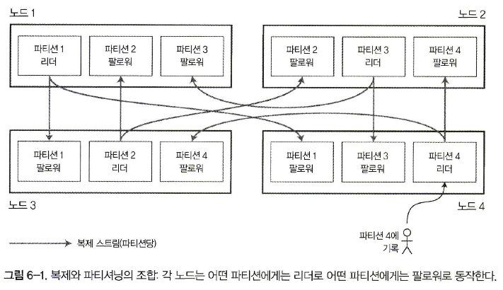
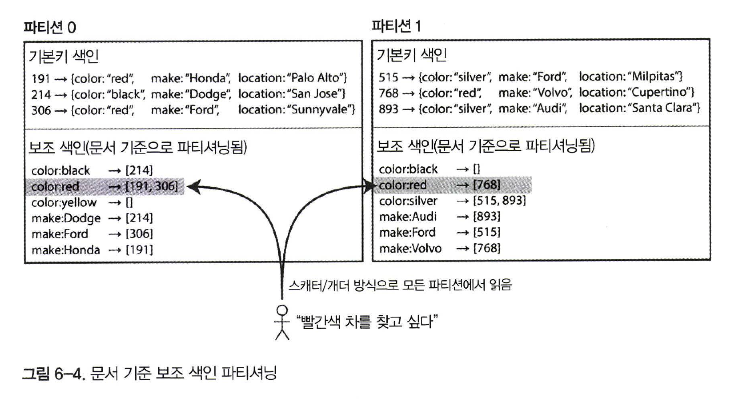
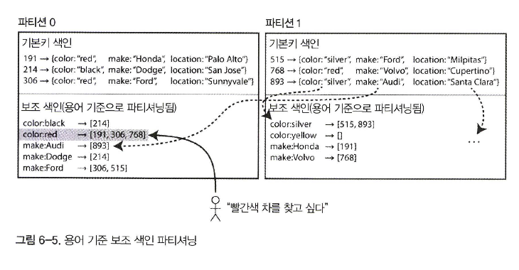

# 파티셔닝

- 데이터셋이 매우 크거나 질의 처리량이 매우 높다면 복제만으로는 부족하고 데이터를 **파티션**으로 쪼갤 필요, **샤딩**
- 데이터 파티셔닝을 원하는 주된 이유는 **확장성**
- 대용량 데이터셋이 여러 디스크에 분산될 수 있고 질의 부하는 여러 프로세서에 분산

## 파티셔닝과 복제

- 보통 복제와 파티셔닝을 함께 적용해 각 파티션의 복사본을 여러 노드에 저장
- 각 레코드는 정확히 한 파티션에 속하더라도 이를 여러 다른 노드에 저장해서 내결함성을 보장
- 한 노드에 여러 파티션을 저장 가능
- 각 파티션의 리더는 하나의 노드에 할당되고 팔로워들은 다른 노드에 할당

## 키-값 데이터 파티셔닝

- 파티셔닝의 목적은 데이터와 질의 부하를 노드 사이에 고르게 분산시키는 것
- 파티셔닝이 고르게 이뤄지지 않아 다른 파티션보다 데이터가 많거나 질의를 많이 받는 파티션 존재, **쏠렸다(skewed)**
- 불균형하게 부하가 높은 파티션을 **핫스팟**이라 한다
- 핫스팟을 회피하는 가장 단순한 방법은 레코드를 할당할 노드를 무작위로 선택하는 것

### 키 범위 기준 파티셔닝

- 파티셔닝하는 방법 중 하나는 종이 백과사전처럼 각 파티션에 연속된 범위(어떤 최솟값에서 최댓값까지)의 키를 할당하는 것
- 각 범위들 사이의 경계를 알면 어떤 키가 어느 파티션에 속하는지 쉽게 찾을 수 있다

- 키 범위 크기가 반드시 동일할 필요는 없다. 데이터가 고르게 분포하지 않을 수도 있기 때문
- 데이터를 고르게 분산시키려면 파티션 경계를 데이터에 맞춰 조정
- 키 범위 기준 파티셔닝은 특정한 접근 패턴이 핫스팟을 유발하는 단점 존재

### 키의 해시값 기준 파티셔닝

- 쏠림과 핫스팟의 위험 때문에 많은 분산 데이터스토어는 키의 파티션을 정하는 데 해시 함수를 사용
- 키에 적합한 해시 함수를 구했다면 각 파티션에 (키 범위 대신) 해시값 범위를 할당하고 해시값이 파티션의 범위에 속하는 모든 키를 그 파티션에 할당

**일관성 해싱**

- CDN(content delivery network) 같은 인터넷 규모의 캐시 시스템에서 부하를 균등하게 분산시키는 방법
- 여기서 말하는 **일관성**은 복제 일관성(5장 참고)이나 ACID 일관성(7장 참고)과는 관련이 없으며 특별한 재균형화 방법을 의미
- **일관성 해싱**이라는 단어 대신 **해시 파티셔닝** 사용하는 것이 낫다

 

- 파티셔닝에 키의 해시값을 사용해서 파티셔닝하면 키 범위 파티셔닝의 범위 질의를 효율적으로 실행할 수 있는 능력을 잃어 버린다
- 카산드라에서 테이블을 선언할때 여러 칼럼을 포함하는 **복합 기본키**를 지정

### 쏠린 작업부하와 핫스팟 완화

- 현대 데이터 시스템은 대부분 크게 쏠린 작업부하를 자동으로 보정하지 못하므로 애플리케이션에서 쏠림을 완화해야 한다
- 각 키의 시작이나 끝에 임의의 10진수 두 개만 붙이더라도 한 키에 대한 쓰기 작업이 100개의 다른 키로 균등하게 분산되고 그 키들은 다른 파티 션으로 분산될 수 있다
- 이 기법은 오버헤드 때문에 요청이 몰리는 소수의 키에만 적용하는 게 타당

### 파티셔닝과 보조 색인

- 보조 색인은 보통 레코드를 유일하게 식별하는 용도가 아니라 특정한 값이 발생한 항목을 검색하는 수단
- 보조 색인이 있는 데이터베이스를 파티셔닝하는 데 널리 쓰이는 두 가지 방법
  1. 문서 기반 파티셔닝
  2. 용어 기반 파티셔닝

**문서 기준 보조 색인 파티셔닝**

- 이런 색인 방법을 사용하면 각 파티션이 완전히 독립적으로 동작
- 데이터베이스에 문서 추가, 삭제，갱신 등의 쓰기 작업을 실행할 때는 쓰려고 하는 문서 ID를 포함하는 파티션만 다루면 된다, **전역 색인**, **지역 색인**
- 하지만 예제처럼 빨간색 자동차를 찾고 싶다면 모든 파티션으로 질의를 보내서 얻은 결과를 모두 모아야 한다
- 파티셔닝된 데이터베이스에 이런 식으로 질의를 보내는 방법, **스캐더/개더(scatter/gather)**

- 각 파티션이 자신만의 보조 색인(지역 색인)을 갖게 하는 대신，모든 파티션의 데이터를 담당하는 **전역 색인**을 만들 수도 있다
