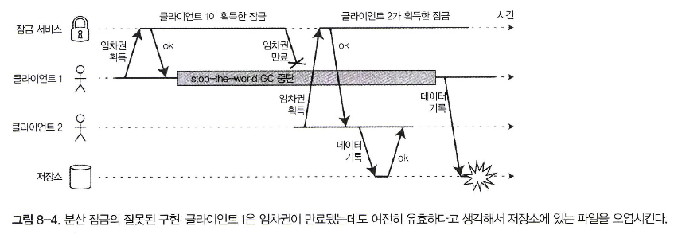
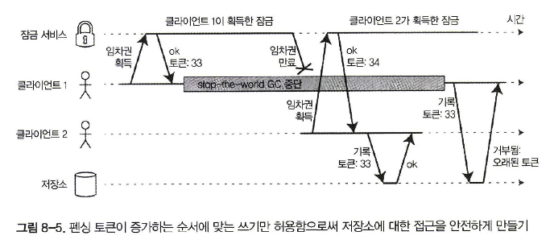

## 프로세스 중단

- 안전하게 쓰기를 받아들일 수 있는 지는 리더가 다른 노드들로부터 **임차권(lease)** 을 얻는 것
- 문제점
  1. 동기화된 시계에 의존
  2. 코드가 아주 빨리 실행돼서 10초의 버퍼는 요청을 처리하는 도중 임차권이 만료되지 않도록 보장하는 데 필요한 것 이상
- 프로그램 실행 중에 예상치 못한 중단이면 임차권 소유 노드 코드는 이 루프의 다음 반복 회차까지 임차권이 만료됐음을 알아채지 못한다
- **스틸타임**: 가상 장비의 경우 다른 가상 장비에서 소비된 CPU 시간
- **스레싱 현상**: 운영체제가 페이지를 메모리 안팎으로 스와핑하느라 대부분의 시간을 쓰고 실제 작업은 거의 못하게 되는 현상

## 응답 시간 보장

- **엄격한 실시간 시스템(hard real-time)**: 데드라인을 만족시키지 못하면 전체 시스템의 장애를 유발
  - ex) 항공기，로켓，로봇, 자동차
- **실시간 운영체제(real-time operating system, RTOS)**: 프로세스가 명시된 간격의 CPU 시간을 할당받을 수 있게 보장되도록 스케줄링

**가비지 컬렉션의 영향을 제한하기**

- 아이디어 하나는 GC 중단을 노드가 잠시 동안 계획적으로 중단되는 것으로 간주
- 노드가 가비지 컬렉션을 하는 동안 클라이언트로부터의 요청을 다른 노드들이 처리하게 하는 것

## 지식，진실，그리고 거짓말

### 진실은 다수결로 결정된다

- 노드가 상황에 대한 자신의 판단을 반드시 믿을 수 있는 것은 아니다
- 여러 분산 알고리즘은 **정족수(quorum)**, 즉 노드들 사이의 투표에 의존

**리더와 잠금**

- 어떤 노드가 이전에 리더였더라도 시간이 흐른 사이에 다른 노드들이 그 노드가 죽었다고 선언하면 그 노드는 강등되고 다른 리더가 이미 선출됐을 지도 모른다
- 노드의 과반수가 어떤 노드가 죽었다고 선언했음에도 그 노드가 선택된 자인 것처럼 계속 행동한다면 신중하게 설계되지 않은 시스템에서는 문제를 유발



**펜싱 토큰**



- **펜싱 토큰**: 잠금이 승인될 때마다 증가하는(예를 들어 잠금 서비스가 증가시키는) 숫자
- 저장소 서버는 자신이 더 큰 토큰 번호를 가진 쓰기를 이미 처리했음을 기억하므로 이전 토큰으로 온 요청을 거부

## 비잔틴 결함

- 분산 시스템 문제는 노드가 “거짓말”(임의의 결함이 있거나 오염된 응답을 보냄)을 할지도 모른다는 위험이 있다면 훨씬 더 어려워진다
- **비잔틴 결함(Byzantine fault)**: 어떤 노드가 실제로는 받지 않은 특정 메시지를 받았다고 주장하는 그러한 동작
- **비잔틴 장군 문제(Byzantine Generals Problem)**: 신뢰할 수 없는 환경에서 합의에 도달하는 문제
- **비잔틴 내결함성을 지닌다(Byzantine fault-tolerant)**: 일부 노드가 오작동하고 프로토지 콜을 준수하지 않거나 악의적인 공격자가 네트워크를 방해하더라도 계속 올바르게 동작하는 시스템
- 대부분의 서버 측 데이터 시스템에서 비잔틴 내결함성 솔루션을 배치하는 것은 비용이 커서 비실용적

## 약한 형태의 거짓말

- 약한 형태의 “거짓말”(예를 들어 하드웨어 문제, 소프트웨어 버그, 잘못된 설정 때문에 유효하지 않은 메시지)로부터 보호해주는 메커니즘을 소프트웨어에 추가하는게 가치가 있을 수도 있다

  1. 네트워크 패킷 오염 케이스 때문에 애플리케이션 프로토콜 단에서 체크섬
  2. 사용자 입력 살균
  3. NTP 클라이언트 여러 서버 주소 설정

## 시스템 모델과 현실

- 알고리즘 작성 때문에 시스템에서 발생할 것으로 예상되는 결함의 종류를 어떻게든 정형화 필요
- **시스템 모델**: 알고리즘이 가정하는 것을 기술한 추상화
- 타이밍 가정으로 3가지 시스템 모델
  
  1. 동기식 모델
  2. 부분 동기식 모델
  3. 비동기식 모델

- 3가지 노드용 시스템 모델

  1. 죽으면 중단하는(crash-stop》결함
  2. 죽으면 복구하는(crash-recovery) 결함
  3. 비잔틴(임의적인) 결함

### 알고리즘의 정확성

- 알고리즘이 **정확하다(correct)** 는게 어떤 의미인지 정의하기 위해 알고리즘의 **속성(property)** 을 기술 가능

```shell
# 펜싱 토큰 예시

유일성(안정성)
- 펜싱 토큰 요청이 같은 값을 반환하지 않는다.

단조 일련번호(안정성)
- 요청 x가 토큰 t(x)를, 요청 y가 토큰 t(y)를 반환했고 y가 시작하기 전에 x가 완료됐다면 t(x) < t(y)를 만족

가용성(활동성)
- 펜싱 토큰을 요청하고 죽지 않은 노드는 결국에는 응답을 받는다.
```

- 알고리즘은 시스템 모델에서 발생하리라고 가정한 모든 상황에서 그 속성들을 항상 만족시키면 해당 시스템 모델에서 정확

### 안전성과 활동성

- 상황을 분명히 하기 위해 두가지 다른 종류의 속성，안전성(safety)과 활동성(liveness)을 구별할 필요
  1. 안전성: 나쁜 일은 일어나지 않는다
  2. 활동성: 좋은 일은 결국 일어난다
- 안전성과 활동성의 실제 정의는 정확하고 수학적
  1. 안전성
     - 속성이 위반되면 그 속성이 깨진 특정 시점을 가리킬 수 있다(예를 들어 유일성 속성이 위반되면 중복된 펜싱 토큰을 반환한 특정 연산을 식별할 수 있다). 
     - 안전성 속성이 위반된 후에는 그 위반을 취소할 수 없다. 이미 손상된 상태다.
  2. 활동성
     - 어떤 시점을 정하지 못할 수 있다(예를 들어 노드가 요청을 보냈지만 아직 응답을 받지못했을 수도 있다) 
     - 하지만 항상 미래에 그 속성을 만족시킬 수 있다는(다시 말해 응답을 받음으로써) 희망

### 시스템 모델을 현실 세계에 대응시키기

- 추상 시스템 모델은 현실 시스템의 복잡함에서 우리가 추론할 수 있는 관리 가능한 결함의 집합을 뽑아내서，문제를 이해하고 체계적으로 해결하려고 노력할 수 있게 하는데 엄청난 도움
- 어떤 시스템 모델에서 그것들의 속성이 항상 성립한다고 보여줌으로써 알고리즘이 올바르다고 증명 가능
