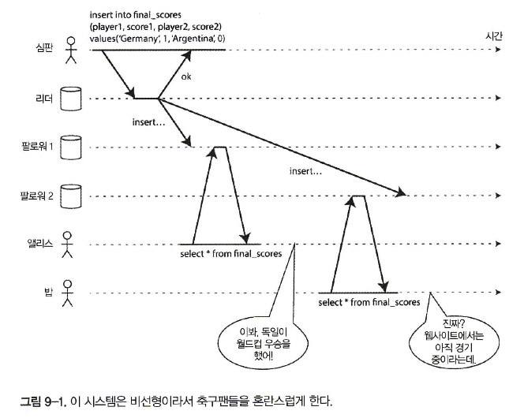
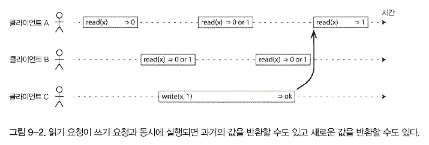
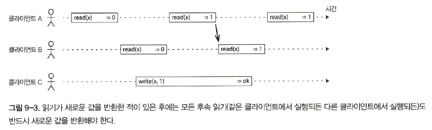
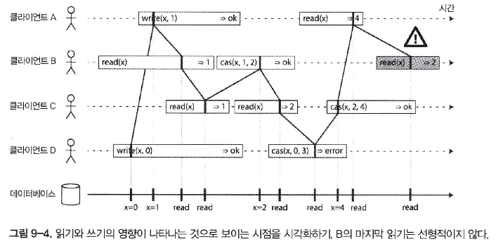
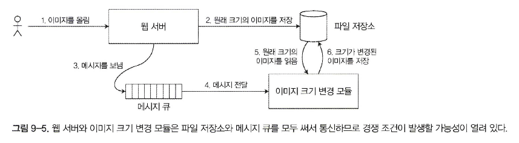
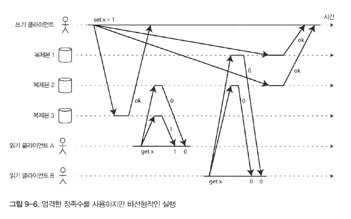
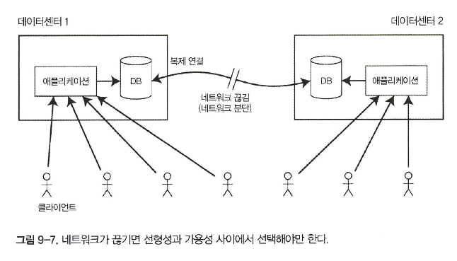

# 일관성과 합의

- 내결함성을 지닌 시스템을 구축하는 가장 좋은 방법은 유용한 보장을 해주는 범용 추상화를 찾아 이를 구현하고 애플리케이션에서 이 보장에 의존하게 하는 것
- 분산 시스템에 가장 중요한 추상화 중 하나는 **합의**, 즉 모든 노드가 어떤 것에 동의하게 만드는 것
- **스플릿 브레인(split brain)**: 두 노드가 자신이 리더라고 생각하는 상황

## 일관성 보장

- 제 데이터베이스는 대부분 최소한 **최종적 일관성**을 제공
- 하지만 매우 약한 보장이다. 언제 복제본이 수렴될지에 대해서는 아무것도 얘기하지 않는다. **수렴**될 때까지 읽기는 뭔가를 반환할 수도, 아무것도 반환하지 않을 수도 있다

## 선형성

- 선형성 시스템에서는 클라이언트가 쓰기를 성공적으로 완료하자마자 그 데이터베이스를 읽는 모든 클라이언트는 방금 쓰여진 값을 볼 수 있어야 한다, **최신성 보장(recency guarantee)**



### 시스템에 선형성을 부여하는 것은 무엇인가?

- 시스템에 데이터 복사본이 하나뿐인 것처럼 보이게 만드는 것



- 시스템을 선형적으로 만들려면 그림 9-3에 나온 것처럼 또 다른 제약 조건을 추가



- B의 읽기는 확실히 A의 읽기 뒤에 실행되므로 C가 실행한 쓰기가 아직 진행 중이라도 역시 1을 반환해야 한다



- cas(x， Vold, Vnew => r은 클라이언트가 원자적 compare-and-set연산을 요청했다는 뜻이다.
- 레지스터 x의 현재 값이 Vold와 같으면 원자적으로 Vnew로 설정돼야 한다.
- X != Vold 라면 이 연산은 레지스터를 그대로 두고 오류를 반환해야 한다. r은 데이터베이스의 응답(ok or error)

```shell
선형성 대 직렬성

직렬성
직렬성은 모든 트랜잭션이 여러 객체(로우, 문서, 레코드)를 읽고 쓸 수 있는 상황에서의 트랜잭션들의 격리 속성이다
직렬성은 트랜잭션들이 (각 트랜잭션이 다음 트랜잭션이 시작하기 전에 완료되는) 어떤 순서에 따라 실행되는 것처럼 동작하도록 보장해준다. 
그 순서가 트랜잭션들이 실제로 실행되는 순서와 달라도 상관없다

선형성
선형성은 레지스터(개별 객체)에 실행되는 읽기와 쓰기에 대한 최신성 보장이다. 
선형성은 연산을 트랜잭션으로 묶지 않아서 충돌 구체화같은 부가적인 수단을 사용하지 않으면 쓰기 스큐 같은 문제를 막지 못한다

데이터베이스는 직렬성과 선형성을 모두 제공할 수도 있으며 이런 조합은 '엄격한 직렬성'이나 '강한 단일 복사본 직렬성'이라고 한다
```

### 선형성에 기대기

- 선형성이 중요한 요구사항이 되는 영역이 몇가지 존재

**잠금과 리더 선출**

- 단일 리더 복제를 사용하는 시스템은 리더가 여러개(스플릿 브레인)가 아니라 진짜로 하나만 존재하도록 보장해야 한다. 
- 리더를 선출하는 한가지 방법은 잠금을 사용하는 것

**제약 조건과 유일성 보장**

- 유일성 제약 조건은 데이터베이스에서 흔하다
- 데이터가 기록될 때 이 제약 조건을 강제하고 싶다면 선형성이 필요
- 사용자가 서비스에 가입할 때 그들이 선택한 사용자명에 “잠금”을 획득하는 것으로 생각할 수 있다

**채널 간 타이밍 의존성**



- 파일 저장 서비스가 선형적이면 이 시스템은 잘 동작한다. 선형적이지 않다면 경쟁 조건의 위험
- 웹 서버와 크기 변경 모듈 사이에 두 가지 다른 통신 채널, 파일 저장소와 메시지 큐가 있기 때문에 경쟁 조건 발생

## 선형성 시스템 구현하기

- 시스템이 내결함성을 지니도록 만드는 가장 흔한 방법은 복제를 사용하는 것

  1. 단일 리더 복제(선형적이 될 가능성이 있음)
  2. 합의 알고리즘(선형적)
  3. 다중 리더 복제(비선형적)
  4. 리더 없는 복제(아마도 비선형적)

### 선형성과 정족수



- 정족수 조건이 만족(w + r >n)됨에도 이 실행은 선형적 X
- 다이나모 스타일 복제를 하는 리더 없는 시스템은 선형성을 제공하지 않는다고 보는 게 가장 안전

### 선형성의 비용 



- 다중 리더 데이터베이스를 사용하면 각 데이터센터는 계속 정상 동작 가능
- 단일 리더 복제를 사용하면 리더가 데이터센터 중 하나에 있어야만 한다
- 네트워크가 끊기면 팔로워 데이터센터로 접속한 클라이언트들은 리더로 연결할 수 없으므로 데이터베이스에 아무것도 쓸 수 없고 선형성 읽기도 전혀 할 수 없다

### CAP 정리

- 선형성이 필요 없는 애플리케이션은 네트워크 문제에 더 강인, **CAP 정리**

**선형성과 네트워크 지연**

- 선형성은 유용한 보장이지만 현실에서 실제로 선형적인 시스템은 놀랄 만큼 드물다
- 선형성을 제거한 이유는 내결함성이 아니라 **성능**

