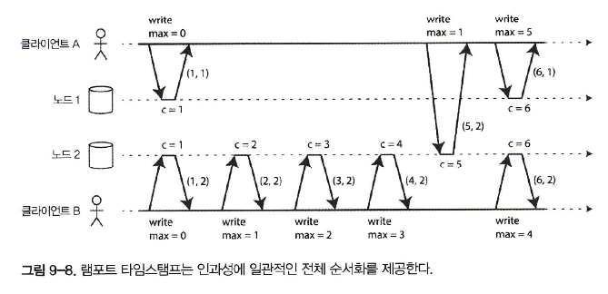
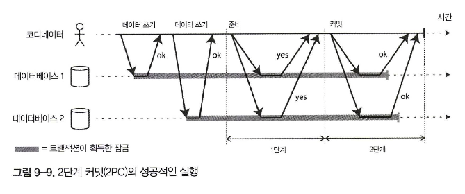
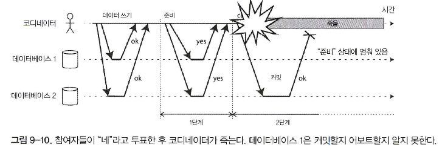

# 일관성과 합의

- 내결함성을 지닌 시스템을 구축하는 가장 좋은 방법은 유용한 보장을 해주는 범용 추상화를 찾아 이를 구현하고 애플리케이션에서 이 보장에 의존하게 하는 것
- 분산 시스템에 가장 중요한 추상화 중 하나는 **합의**, 즉 모든 노드가 어떤 것에 동의하게 만드는 것
- **스플릿 브레인(split brain)**: 두 노드가 자신이 리더라고 생각하는 상황

## 일관성 보장

- 제 데이터베이스는 대부분 최소한 **최종적 일관성**을 제공
- 하지만 매우 약한 보장이다. 언제 복제본이 수렴될지에 대해서는 아무것도 얘기하지 않는다. **수렴**될 때까지 읽기는 뭔가를 반환할 수도, 아무것도 반환하지 않을 수도 있다

## 선형성

- 선형성 시스템에서는 클라이언트가 쓰기를 성공적으로 완료하자마자 그 데이터베이스를 읽는 모든 클라이언트는 방금 쓰여진 값을 볼 수 있어야 한다, **최신성 보장(recency guarantee)**


### 시스템에 선형성을 부여하는 것은 무엇인가?

- 시스템에 데이터 복사본이 하나뿐인 것처럼 보이게 만드는 것


- 시스템을 선형적으로 만들려면 그림 9-3에 나온 것처럼 또 다른 제약 조건을 추가


- B의 읽기는 확실히 A의 읽기 뒤에 실행되므로 C가 실행한 쓰기가 아직 진행 중이라도 역시 1을 반환해야 한다


- cas(x， Vold, Vnew => r은 클라이언트가 원자적 compare-and-set연산을 요청했다는 뜻이다.
- 레지스터 x의 현재 값이 Vold와 같으면 원자적으로 Vnew로 설정돼야 한다.
- X != Vold 라면 이 연산은 레지스터를 그대로 두고 오류를 반환해야 한다. r은 데이터베이스의 응답(ok or error)

```shell
선형성 대 직렬성

직렬성
직렬성은 모든 트랜잭션이 여러 객체(로우, 문서, 레코드)를 읽고 쓸 수 있는 상황에서의 트랜잭션들의 격리 속성이다
직렬성은 트랜잭션들이 (각 트랜잭션이 다음 트랜잭션이 시작하기 전에 완료되는) 어떤 순서에 따라 실행되는 것처럼 동작하도록 보장해준다. 
그 순서가 트랜잭션들이 실제로 실행되는 순서와 달라도 상관없다

선형성
선형성은 레지스터(개별 객체)에 실행되는 읽기와 쓰기에 대한 최신성 보장이다. 
선형성은 연산을 트랜잭션으로 묶지 않아서 충돌 구체화같은 부가적인 수단을 사용하지 않으면 쓰기 스큐 같은 문제를 막지 못한다

데이터베이스는 직렬성과 선형성을 모두 제공할 수도 있으며 이런 조합은 '엄격한 직렬성'이나 '강한 단일 복사본 직렬성'이라고 한다
```

### 선형성에 기대기

- 선형성이 중요한 요구사항이 되는 영역이 몇가지 존재

**잠금과 리더 선출**

- 단일 리더 복제를 사용하는 시스템은 리더가 여러개(스플릿 브레인)가 아니라 진짜로 하나만 존재하도록 보장해야 한다. 
- 리더를 선출하는 한가지 방법은 잠금을 사용하는 것

**제약 조건과 유일성 보장**

- 유일성 제약 조건은 데이터베이스에서 흔하다
- 데이터가 기록될 때 이 제약 조건을 강제하고 싶다면 선형성이 필요
- 사용자가 서비스에 가입할 때 그들이 선택한 사용자명에 “잠금”을 획득하는 것으로 생각할 수 있다

**채널 간 타이밍 의존성**


- 파일 저장 서비스가 선형적이면 이 시스템은 잘 동작한다. 선형적이지 않다면 경쟁 조건의 위험
- 웹 서버와 크기 변경 모듈 사이에 두 가지 다른 통신 채널, 파일 저장소와 메시지 큐가 있기 때문에 경쟁 조건 발생

## 선형성 시스템 구현하기

- 시스템이 내결함성을 지니도록 만드는 가장 흔한 방법은 복제를 사용하는 것

  1. 단일 리더 복제(선형적이 될 가능성이 있음)
  2. 합의 알고리즘(선형적)
  3. 다중 리더 복제(비선형적)
  4. 리더 없는 복제(아마도 비선형적)

### 선형성과 정족수


- 정족수 조건이 만족(w + r >n)됨에도 이 실행은 선형적 X
- 다이나모 스타일 복제를 하는 리더 없는 시스템은 선형성을 제공하지 않는다고 보는 게 가장 안전

### 선형성의 비용 


- 다중 리더 데이터베이스를 사용하면 각 데이터센터는 계속 정상 동작 가능
- 단일 리더 복제를 사용하면 리더가 데이터센터 중 하나에 있어야만 한다
- 네트워크가 끊기면 팔로워 데이터센터로 접속한 클라이언트들은 리더로 연결할 수 없으므로 데이터베이스에 아무것도 쓸 수 없고 선형성 읽기도 전혀 할 수 없다

### CAP 정리

- 선형성이 필요 없는 애플리케이션은 네트워크 문제에 더 강인, **CAP 정리**

**선형성과 네트워크 지연**

- 선형성은 유용한 보장이지만 현실에서 실제로 선형적인 시스템은 놀랄 만큼 드물다
- 선형성을 제거한 이유는 내결함성이 아니라 **성능**

## 순서화 보장

- 순서화는 이 책에서 되풀이된 주제이며 이는 순서화가 중요한 근본적 아이디어일 수도 있다는 것을 시사
- 순서화, 선형성，합의 사이에는 깊은 연결 관계

### 순서화와 인과성

- 순서화가 **인과성**을 보존하는 데 도움을 준다
- 시스템이 인과성에 의해 부과된 순서를 지키면 그 시스템은 **인과적으로 일관적(causally consistent)** 이라고 한다

### 인과적 순서가 전체 순서는 아니다

- **전체 순서(total order)** 는 어떤 두 요소를 비교할 수 있게 하므로 두 요소가 있으면 항상 어떤 것이 더 크고 어떤 것이 더 작은지 말할 수 있다

**선형성**

```shell
선형성 시스템에서는 연산의 전체 순서를 정할 수 있다. 
시스템이 데이터 복사본이 하나만 있는 것처럼 동작하고 모든 연산이 원자적이면 어떤 두 연산에 대해 항상 둘 중 하나가 먼저 실행됐다고 말할 수 있다는 뜻
```

**인과성**

```shell
두 연산 중 어떤 것도 다른 것보다 먼저 실행되지 않았다면 두 연산이 동시적
두 이벤트에 인과적인 관계가 있으면 이들은 순서가 있지만 하나가 다른 것보다 먼저 실행됐다) 이들이 동시에 실행되면 비교할 수 없다
인과성이 전체 순서가 아닌 **부분 순서**를 정의한다는 뜻
```

### 선형성은 인과적 일관성보다 강하다

- 선형성은 인과성을 **내포한다**
- 어떤 시스템이든지 선형적이라면 인과성도 올바르게 유지
- 많은 경우에 선형성이 필요한 것처럼 보이는 시스템에 사실 진짜로 필요한 것은 인과적 일관성이며 이는 더 효율적으로 구현 가능

### 인과적 의존성 담기

- 인과성을 유지하기 위해 어떤 연산이 어떤 다른 연산보다 **먼저 실행됐는지** 알아야한다

### 일련번호 순서화

- **일련번호**나 **타임스탬프**를 써서 이벤트의 순서를 정할 수 있다
- 일련번호나 타임스탬프는 크기가 작고(크기가 몇 바이트밖에 안 된다) **전체 순서**를 제공

### 비인과적 일련번호 생성기

- 자신만의 독립적인 일련번호 집합(짝수, 홀수), 일 기준 시계에서 얻은 타임스탬프, 일련번호 블록 등을 미리 할당할 수 있지만 **인과성에 일관적 X**

**램포트 타임스탬프**

- 램포트 타임스탬프는 그냥 **(카운터, 노드 ID)** 의 쌍
- 두 노드는 때때로 카운터 값이 같을 수 있지만 타임스탬프에 노드 ID를 포함시켜서 각 타임스탬프는 유일



- 두 타임스탬프가 있으면 카운터가 큰 것이 타임스탬프가 크다. 
- 카운터 값이 같으면 노드 ID가 큰 것이 타임스탬프가 크다

### 타임스탬프 순서화로는 충분하지 않다

- 이 방법은 사후에 성공하는 쪽을 결정하는 데는 효과적
- 그러나 노드가 사용자로부터 사용자명 생성 요청을 막 받고 그 요청이 성공해야 하는지 실패해야 하는지 당장 결정해야 할 때는 이 방법으로는 부족
- 그때 노드는 다른 노드가 동시에 동일한 사용자명으로 계정 생성을 처리하고 있는지와 다른 노드가 그 연산에 어떤 타임스탬프를 배정할지 알지 못한다.
- 다른 어떤 노드도 동시에 더 낮은 타임스탬프를 가지고 동일한 사용자명으로 계정 생성을 처리하는 중이 아니라고 확신하려면 다른 모든 노드가 무엇을 하고 있는지 확인
- 사용자명에 대한 유일성 제약 조건 같은 것을 구현하려면 연산의 전체 순서가 있는 것으로는 충분치 않다. 언제 그 순서가 확정되는지도 알아야 한다

### 전체 순서 브로드캐스트

- 전체 순서 브로드 캐 스 트 는 보통 노드 사이에 메시지를 교환하는 프로토콜로 기술
  1. 신뢰성 있는 전달(reliable delivery)
      - 어떤 메시지도 손실되지 않는다. 메시지가 한 노드에 전달되면 모든 노드에도 전달된다.
  2. 전체 순서가 정해진 전달(totally ordered delivery)
      - 메시지는 모든 노드에 같은 순서로 전달된다.
- 전체 순서 브로드캐스트를 구현하는 올바른 알고리즘은 노드나 네트워크에 결함이 있더 라도 신뢰성과 순서화 속성이 항상 만족되도록 보장

### 전체 순서 브로드캐스트 사용하기

- 모든 메시지가 데이터베이스에 쓰기를 나타내고 모든 복제 서버가 같은 쓰기 연산을 같은 순서로 처리하면 복제 서버들은 서로 일관성 있는 상태를 유지
- 전체 순서 브로드캐스트의 중요한 측면은 메시지가 전달되는 시점에 그 순서가 고정된다는 것
- 전체 순서 브로드캐스트를 보는 또 다른 관점은 (복제 로그，트랜잭션 로그나 쓰기 전 로그에서의) **로그**를 만드는 방법 중 하나라는 것

**전체 순서 브로드캐스트를 사용해 선형성 저장소 구현하기**

- 전체 순서 브로드캐스트는 비동기식이다. 메시지는 고정된 순서로 신뢰성 있게 전달되도록 보장되지만 언제 메시지가 전달될지는 보장되지 않는다
- 전체 순서 브로드캐스트를 추가 전용 로그로 사용해 선형성 compare- and-set 연산을 다음과 같이 구현 가능
  1. 메시자를 로그에 추가해서 점유하기 원하는 사용자명을 시험적으로 가리킨다
  2. 로그를 읽고 추가한 메시지가 되돌아오기를 기다린다
  3. 원하는 사용자명을 점유하려고 하는 메시지가 있는지 확인한다. 원하는 사용자명에 해당하는 첫 번째 메시지가 자신의 메시지라면 성공한 것

### 선형성 저장소를 사용해 전체 순서 브로드캐스트 구현하기

- 가장 쉬운 방법은 정수를 저장하고 원자적 increment- and-get 연산이 지원되는 선형성 레지스터가 있다고 가정하는 것
- 전체 순서 브로드캐스트를 통해 보내고 싶은 모든 메시지에 대해 선형성 정수로 increment-and-get 연산을 수행하고 레지스터에서 얻은 값을 일련번호로 메시지에 붙인다
- 램포트 타임스탬프와는 달리 선형성 레지스터를 증가시켜서 얻은 숫자들은 틈이 없는 순열을 형성
- 어떤 노드가 메시지 4를 전달하고 일련번호가 6 인 메시지를 받았다면 메시지 6을 전달하기 전에 메시지 5를 기다려야 한다는 것을 알 수 있다

## 분산 트랜잭션과 합의

- 비공식적으로 합의의 목적은 단지 **여러 노드들이 뭔가에 동의하게 만드는 것**
- 노드가 동의하는 것이 중요한 상황
  1. 리더 선출
  2. 원자적 커밋

## 원자적 커밋과 2단계 커밋(2PC)

- 트랜잭션의 결과는 **커밋 성공**이나 **어보트**다
- 원자성은 실패한 트랜잭션이 절반만 완료된 결과나 절반만 갱신된 상태로 데이터베이스를 어지럽히는 것을 막아준다
- 이것은 다중 객체 트랜잭션과 보조 색인을 유지하는 데이터베이스에서 특히 중요

### 단일 노드에서 분산 원자적 커밋으로

- 단일 노드에서 트랜잭션 커밋은 데이터가 디스크에 지속성 있게 쓰여지는 **순서**에 결정적으로 의존
- 트랜잭션이 커밋되거나 어보트되는 지를 결정하는 핵심적인 시점은 디스크가 커밋 레코드 쓰기를 마치는 시점
- 다중 노드 환경에서는 위와같은 것이 지켜지기 힘들다
- 어떤 노드가 트랜잭션을 커밋하지만 다른 노드는 어보트한다면 노드들이 서로 일관성이 없어진다

### 2단계 커밋 소개

- 여러 노드에 걸친 원자적 트랜잭션 커밋을 달성하는，즉 모든 노드가 커밋되거나 모든 노드가 어보트되도록 보장하는 알고리즘



- 새로운 컴포넌트인 코디네이터(coordinator, 트랜잭션 관리자라고도 한다)를 사용
- 애플리케이션이 커밋할 준비가 되면 코디네이터가 1단계를 시작한다. 각 노드에 **준비** 요청을 보내서 커밋할 수 있는 지 물어본다
  - 모든 참여자가 커밋할 준비가 됐다는 뜻으로 “네"로 응답하면 코디네이터는 2단계에서 **커밋** 요청을 보내고 커밋이 실제로 일어난다.
  - 참여자 중 누구라도 “아니오”로 응답하면 코디네이터는 2단계에서 모든 노드에 **어보트** 요청을 보낸다.

### 약속에 관한 시스템

1. 애플리케이션은 분산 트랜잭션을 시작하기를 원할 때 코디네이터에게 트랜잭션 ID를 요청한다. 이 트랜잭션 ID는 전역적으로 유일하다
2. 애플리케이션은 각 참여자에서 단일 노드 트랜잭션을 시작하고 단일 노드 트랜잭션에 전역적으로 유일한 트랜잭션 ID를 붙인다.   
   모든 읽기와 쓰기는 이런 단일 노드 트랜잭션 중 하나에서 실행된다.   
   이 단계에서 뭔가 잘못되면(예를 들어 노드가 죽거나 요청이 타임아웃되면) 코디네이터나 참여자 중 누군가가 어보트할 수 있다
3. 애플리케이션이 커밋할 준비가 되면 코디네이터는 모든 참여자에게 전역 트랜잭션 ID 로 태깅된 준비 요청을 보낸다.    
   이런 요청 중 실패하거나 타임아웃된 것이 있으면 코디네이터는 모든 참여자에게 그 트랜잭션 ID 로 어보트 요청을 보낸다.   
4. 참여자가 준비 요청을 받으면 모든 상황에서 분명히 트랜잭션을 커밋할 수 있는지 확인한다.   
   여기에는 모든 트랜잭션 데이터를 디스크에 쓰는 것과 충돌이나 제약 조건 위반을 확인하는 게 포함된다.   
   코디네이터에게 “네”라고 응답함으로써 노드는 요청이 있으면 트랜잭션을 오류 없이 커밋할 것이라고 약속한다. 달리 말하면 참여자들은 트랜잭션을 어보트할 권리를 포기하지만 실제로 커밋하지는 않는다.   
5. 코디네이터가 모든 준비 요청에 대해 응답할 것을 받았을 때 트랜잭션을 커밋인지 어보트할 것인지 최종적 결정을 한다(모든 참여자가 "네”에 투표했을 때만 커밋한다). 
   코디네이터는 추후 죽는 경우에 어떻게 결정했는지 알 수 있도록 그 결정을 디스크에 있는 트랜잭션 로그에 기록해야 한다. **이를 커밋 포인트**라고 한다.   
6. 코디네이터의 결정이 디스크에 쓰여지면 모든 참여자에게 커밋이나 어보트 요청이 전송된다. 이 요청이 실패하거나 타임아웃이 되면 코디네이터는 성공할 때까지 영원히 재시도해야 한다.    
   더 이상 돌아올 곳은 없다. 그 결정이 커밋이었다면 재시도를 몇 번 하든지 상관없이 그 결정을 강제해야 한다.    
   도중에 한 참여자가 죽었다면 트랜잭션은 그 참여자가 복구될 때 커밋된다. 참여자가 “네”라고 투표했으므로 복구될 때 커밋을 거부할 수 없다.

- 코디네이터가 한 번 결정하면 그 결정은 변경할 수 없다

### 코디네이터 장애

- 준비 요청 중 어떤 게 실패하거나 타임아웃이 되면 코디네이터는 트랜잭션을 어보트한다
- 커밋이나 어보트 요청이 실패하면 코디네이터는 무한히 재시도
- 참여자가 준비 요청을 받고 “네”에 투표했다면 코디네이터가 죽거나 이 시점에 네트워크에 장애가 나면 참여자는 기다릴 수밖에 없다, 참여자의 트랜잭션을 **의심스럽다(in doubt)** 또는 **불확실하다(uncertain)**



- 2PC가 완료할 수 있는 유일한 방법은 코디네이터가 복구되기를 기다리는 것뿐이다. 
- 이것이 코디네이터가 참여자들에게 커밋이나 어보트 요청을 보내기 전에 디스크에 있는 트랜잭션 로그에 자신의 커밋이나 어보트 결정을 써야 하는 이유
- 코디네이터가 복구될 때 트랜잭션 로그를 읽어서 모든 의심스러운 트랜잭션들의 상태를 결정한다

### 3단계 커밋

- 3PC는 지연에 제한이 있는 네트워크와 응답 시간에 제한이 있는 노드를 가정
- 논블로킹 원자적 커밋(3PC)은 **완벽한 장애 감지기(perfect failure detector)**, 즉 노드가 죽었는지 아닌지 구별할수 있는 신뢰성 있는 메커니즘이 필요

### 현실의 분산 트랜잭션

- 두 가지 매우 다른 종류의 분산 트랜잭션이 흔히 혼용
  1. 데이터베이스 내부 분산 트랜잭션
  2. 이종 분산 트랜잭션

### 정확히 한 번 메시지 처리

- 메시지 전달이나 데이터베이스 트랜잭션 중 하나가 실패하면 둘 다 어보트되고 메시지 브로커는 나중에 메시지를 안전하게 다시 전달 가능
- 이런 이종 분산 트랜잭션은 트랜잭션의 영향을 받는 모든 시스템이 동일한 원자적 커밋 프로토콜을 사용할 수 있을 때만 가능

### XA 트랜잭션

- **X/Open XA(eXtended Architecture의 약자)** 는 이종 기술에 걸친 2단계 커밋을 구현하는 표준
- 네트워크 프로토콜이 아니다. 트랜잭션 코디네이터와 연결되는 인터페이스를 제공하는 CAPI일 뿐
- 애플리케이션이 네트워크 드라이버나 클라이언트 라이브러리를 사용해 참여자 데이터베이스나 메시징 서비스와 통신한다고 가정
- 드라이버가 XA를 지원한다는 것은 연산이 분산 트랜잭션의 일부가 돼야 하는지 알아내기 위해 XA API를 호출한다는 것을 뜻

### 의심스러운 상태에 있는 동안 잠금을 유지하는 문제

- 데이터베이스는 트랜잭션이 커밋하거나 어보트할 때까지 이런 잠금을 해제할 수 없다
- 2단계 커밋을 사용할 때 트랜잭션은 의심스러운 상태에 있는 동안 내내 잠금을 잡고 있어야 한다
- 이런 잠금이 유지되는 동안 다른 어떤 트랜잭션도 그 로우를 변경할 수 없다
- 의심스러운 트랜잭션이 해소될 때까지 애플리케이션의 많은 부분을 사용할 수 없게 되는 원인

### 코디네이터 장애에서 복구하기

- 코디네이터가 죽은 후 재시작하면 로그로부터 그 상태를 깨끗하게 복구하고 의심스러운 트랜잭션을 해소해야 한다
- 현실에서는 **고아가 된(orphaned)** 의심스러운 트랜잭션, 즉 코디네이터가 어떤 이유 때문인지 그 결과를 결정할 수 없는 트랜잭션이 생길 수 있다
- 유일한 방법은 관리자가 수동으로 트랜잭션을 커밋하거나 롤백할지 결정하는 것 뿐
- 여러 XA 구현에는 참여자가 코디네이터로부터 확정적 결정을 얻지 않고 의심스러운 트랜잭션을 어보트하거나 커밋할지를 일방적으로 결정할 수 있도록 하는 경험적 결정(heuristic decision) 이라고 부르는 **비상 탈출구** 존재
- 여기서 경험적은 2단계 커밋의 약속 체계를 위반하기 때문에 **아마도 원자성을 깰 수 있다**를 완곡하게 표현한 것

### 분산 트랜잭션의 제약

- 트랜잭션 코디네이터 자체가 (트랜잭션 결과를 저장할 수 있는) 일종의 데이터베이스여야 한다는 점이고 따라서 다른 중요한 데이터베이스와 동일하게 신경 써서 접근해야 한다

### 내결함성을 지닌 합의

- 합의 문제는 보통 다음과 같이 형식화된다. 하나 또는 그 이상의 노드들이 값을 **제안**할 수 있고 합의 알고리즘이 그 값 중 하나를 **결정**한다
- 합의 알고리즘은 다음 속성을 만족해야 한다
  1. 균일한 동의: 어떤 두 노드도 다르게 결정하지 않는다.
  2. 무결성: 어떤 노드도 두 번 결정하지 않는다.
  3. 유효성: 한 노드가 값 v를 결정한다면 v는 어떤 노드에서 제안된 것이다.
  4. 종료: 죽지 않은 모든 노드는 결국 어떤 값을 결정한다.
- 어떤 합의 알고리즘이라도 종료를 보장하려면 최소한 노드의 과반수가 올바르게 동작해야한다
- 종료 속성은 죽거나 연결할 수 없는 노드 대수가 절반 미만이라는 가정에 종속적

### 합의 알고리즘과 전체 순서 브로드캐스트

- 내결함성을 지닌 합의 알고리즘 중 가장 널리 알려진 것은 뷰스탬프 복제, 팍소스, 라프트, 잽
- 그것들은 값의 **순차열(sequence)** 에 대해 결정해서 이번 장 앞부분에서 설명한 **전체 순서 브로드캐스트** 알고리즘을 만든다
- 전체 순서 브로드캐스트를 하려면 모든 노드에게 메시지가 정확히 한 번, 같은 순서로 전달돼야 한다는 점을 기억
- 전체 순서 브로드캐스트는 반복된 횟수의 합의와 동일하다(각 합의 결정이 하나의 메시지전달에 해당한다)
  - 합의의 동의 속성 때문에 모든 노드는 같은 메시지를 같은 순서로 전달하도록 결정한다.
  - 무결성 속성 때문에 메시지는 중복되지 않는다.
  - 유효성 속성 때문에 메시지는 오염되지 않고 난데없이 조작되지 않는다.
  - 종료 속성 때문에 메시지는 손실되지 않는다.
