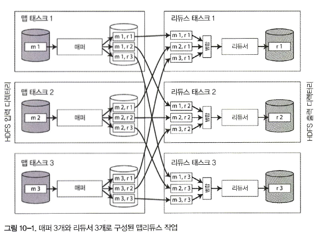

# 일괄 처리

- 시스템을 세 가지 유형으로 구분

1. 서비스(온라인 시스템)
2. 일괄 처리 시스템(오프라인 시스템)
3. 스트림 처리 시스템(준실시간 시스템)

- 일괄 처리는 신뢰할 수 있고 확장 가능하며 유지보수하기 쉬운 애플리케이션을 구축하는 데 매우 중요한 구성요소

## 유닉스 도구로 일괄 처리하기

```shell
216.58.210.78 - - [27/Feb/2015：17：55：11 +0000)] "GET /css/typography.css HTTP/1.1" 200 3377 
"http：//martin.kleppmann.com/" "Mozilla/5.0 (Macintosh； Intel Mac OS X10_9_5) AppleWebKit/537.36 
(KHTML, like Gecko) Chrome/40.0.2214.115 Safari/537.36"

$remote_addr - $remote_user [$time_local] "$request" $status $body_bytes_sent "$http_referer" "$http_user__agent
```

### 단순 로그 분석

```shell
cat /var/log/nginx/access.log | 1번
awk '{print $7}'              | 2번
sort                          | 3번
uniq -c                       | 4번
sort - r -n                   | 5번
head -n 5                       6번

1. 로그를 읽는다.
2. 줄마다 공백으로 분리해서 요청 URL에 해당하는 7번째 필드만 출력한다. 예제상 요청 URL은 /css/typography.css가 된다.
3. 요청 URL을 알파벳 순으로 정렬한다. 특정 URL이 n번 요청되면 정렬 후에는 이 URL이 연속해서 사번 반복된다.
4. uniq 명령은 인접한 두 줄이 같은지 확인해서 중복을 제거한다. -c 중복 횟수를 함께 출력하는 옵션이다. 즉, 중복 없는 URL을 기준으로 각각 몇 번씩 요청이 있었는지를 확인한다.
5. -n 옵션을 사용해 매 줄 첫 번째로 나타나는 숫자, 즉 URL의 요청 수를 기준으로 다시 정렬한다. -r 옵션을 함께 사용해 내림차순으로 정렬한다.
6. 마지막으로 head 명령을 사용해 앞에서부터 5줄만(-n 5) 출력한다.
```

- 수 기가바이트의 로 그 파일을 수 초 내 로 처리할 수 있고，필요에 따라 분석 방법을 수정하기도 쉽다

### 연쇄 명령 대 맞춤형 프로그램

- 유닉스 연쇄 명령 대신 같은 작업을 하는 간단한 프로그램을 작성할 수도 있다

### 정렬 대 인메모리 집계

- 루비 스크립트는 URL 해시 테이블을 메모리에 유지
- 유닉스 파이프라인 예제에는 이런 해시 테이블이 없다. 대신 정렬된 목록에서 같은 URL이 반복해서 나타난다
- 작업 세트가 충분히 작다면 인메모리 해시 테이블도 잘 작동한다
- 허용 메모리보다 작업 세트가 크다면 정렬 접근법을 사용하는 것이 좋다

### 유닉스 철학

- 유니스 철학

1. 각 프로그램이 한가지 일만 하도록 작성하라. 새 작업을 하려면 기존 프로그램을 고쳐 새로운 “기능”을 추가해 프로그램을 복잡하게 만들기보다는 새로운 프로그램을 작성하라.
2. 모든 프로그램의 출력은 아직 알려지지 않은 다른 프로그램의 입력으로 쓰일 수 있다고 생각하라. 불필요한 정보로 출력이 너저분해서는 안 된다.    
   입력 형식으로 엄격하게 열을 맞춘다거나 이진 형태를 사용하지 마라. 대화형 입력을 고집하지 마라.
3. 소프트웨어를 빠르게 써볼 수 있게 설계하고 구축하라. 심지어 운영체제도 마찬가지다. 수 주 안에 끝내는 것이 이상적이다. 거슬리는 부분은 과감히 버리고 새로 구축하라.
4. 프로그래밍 작업을 줄이려면 미숙한 도움보단 도구를 사용하라. 도구를 빌드하기 위해 한참 둘러가야 하고 게다가 사용 후 바로 버린다고 할지라도 도구를 써라.

- sort는 한 가지 일을 잘 해내는 프로그램의 훌륭한 예

### 동일 인터페이스

- 어떤 프로그램의 출력을 다른 프로그램의 입력으로 쓰고자 한다면 이들 프로그램은 같은 데이터 형식을 사용해야 한다. 즉 호환 가능한 인터페이스를 써야 한다
- 유닉스에서의 인터페이스는 파일
- 전부는 아니지만 관례상 많은 유닉스 프로그램은 이렇게 연속된 바이트를 아스키 텍스트로 취급한다. 로그 분석 예제에서 바로 이 점을 활용
- **동일한 데이터 모델**인 데이터베이스 간에도 한쪽에서 다른 쪽으로 데이터를 옮기는 게 쉽지 않다

### 로직과 연결의 분리

- 유닉스 도구의 다른 특징으로 표준 입력(stdin)과 표준 출력(stdout)을 사용한다는 점
- 셸사용자는 유닉스 접근법으로 원하는 대로 입력과 출력을 연결 가능
- 프로그램은 입력이 어디서부터 들어오는지 출력이 어디로 나가는지 신경 쓰거나 알 필요조차 없다   
  -> **느슨한 결합(loose coupling)**, **지연 바인딩(late binding)**, **제어 반전(inversion of control)**
- stdin과 stdout을 사용할 때 몇가지 제약사항

1. 프로그램이 여러 개의 입력을 받거나 여러 개의 출력이 필요할 때는 불가능하지는 않지만 까다롭다
2. 프로그램의 출력을 파이프를 이용해 네트워크와 연결하지는 못한다

### 투명성과 실험

- 유닉스 도구가 성공적인 이유 중 하나는 진행 사항을 파악하기가 상당히 쉽기 때문

1. 유닉스 명령에 들어가는 입력 파일은 일반적으로 불변으로 처리된다. 이것은 다양한 명령행 옵션을 사용해가며 원하는 만큼 명령을 수행하더라도 입력 파일에는 손상을 주지 않는다는 뜻이다.
2. 어느 시점이든 파이프라인을 중단하고 출력을 파이프를 통해 less로 보내 원하는 형태의 출력이 나오는지 확인할 수 있다. 이런 검사 기능은 디버깅할 때 매우 유용하다.
3. 특정 파이프라인 단계의 출력을 파일에 쓰고 그 파일을 다음 단계의 입력으로 사용할 수 있다. 이렇게 하면 전체 파이프라인을 다시 시작하지 않고 다음 단계부터 재시작할 수 있다

## 맵리듀스와 분산 파일 시스템

- 맵리듀스는 유닉스 도구와 비슷한 면이 있지만 수천 대의 장비로 분산해서 실행이 가능하다는 점에서 차이가 있다
- 유닉스 도구는 stdin과 stdout을 입력과 출력으로 사용하는데 맵리듀스 작업은 분산 파일 시스템 상의 파일을 입력과 출력으로 사용
- HDFS는 **비공유** 원칙(2부 소개 참고)을 기반으로 하는데 **NAS(Network Attached Storage)** 와 **SAN(Storage Area Network)** 아키텍처에서 사용하는 공유 디스크 방식과는 반대
- HDFS는 각 장비에서 실행되는 데몬 프로세스로 구성된다. 데몬 프로세스는 다른 노드가 해당 장비에 저장된 파일에 접근 가능하게끔 네트워크 서비스를 제공
- **네임노드(NameNode)** 라고 부르는 중앙 서버는 특정 파일 블록이 어떤 장비에 저장됐는지 추적
- 장비가 죽거나 디스크가 실패하는 경우에 대비하기 위해 파일 블록은 여러 장비에 복제
- 리드 솔로몬 코드(Reed-Solomon code) 같은 **삭제 코딩(erasure coding)** 방식을 사용해 데이터 전체를 복제하는 것보다 적은 저장소 부담으로 손실된 데이터를 복구하는 방식
- HDFS를 이용한 데이터 저장과 접근 비용은 범용 하드웨어와 오픈소스 소프트웨어를 사용하기 때문에 동급 용량의 전용 저장소 장치를 사용하는 비용보다 훨씬 저렴

### 맵리듀스 작업 실행하기

- 맵리듀스의 데이터 처리 패턴은 로그 분석 예제와 상당히 비슷

```shell
1. 입력 파일을 읽는다. 레코드로 쪼갠다. 웹 서버 로그 예제에서 로그의 각 줄이 레코드가 된다. 즉 레코드 분리자로 \n을 사용한다.
2. 각 입력 레코드마다 매퍼 함수를 호출해 키와 값을 추출한다. 예제에서는 매퍼 함수는 awk '{print $7}'인데 URL($7)을 키로 추출하고 값은 빈 값으로 한다.
3. 키를 기준으로 키一값 쌍을 모두 정렬한다. 이 과정은 로그 예제에서 첫 번째 sort 명령에 해당한다.
4. 정렬된 키-값 쌍 전체를 대상으로 리듀스 함수를 호출한다. 같은 키가 여러 번 등장했다면 정렬 과정에서 해당 키-값 쌍은 서로 인접한다. 
   그래서 같은 키를 가지는 값들을 따로 메모리 상에 상태를 따로 유지하지 않고도 쉽게 결합할 수 있다. 리듀서는 예제에서 uniq -c 명령에 해당한다. 이 명령은 키가 같으면서 인접한 레코드의 수를 센다.
   
   
- 2단계(맵)와 4단계(리듀스)는 사용자가 직접 작성한 데이터 처리 코드다. 
- 1단계는 파일을 나누어 레코드를 만드는 데 입력 형식 파서를 쓴다. 
- 3단계는 정렬 단계로 맵리듀스에 내재하는 단계라서 직접 작성할 필요가 없는데 매퍼의 출력은 리듀스로 들어가기 전에 이미 정렬됐기 때문
```

- 맵리듀스 작업을 생성하려면 다음과 같이 동작하는 매퍼와 리듀서라는 두 가지 콜백 함수를 구현해야 한다

1. 매퍼(Mapper)
  - 매퍼는 모든 입력 레코드마다 한 번씩만 호출된다.
  - 매퍼는 입력 레코드로부터 키와 값을 추출하는 작업이다.
  - 각 입력으로부터 생성하는 키-값 쌍은 빈 쌍을 포함해 원하는 만큼 생성 가능하다.
  - 매퍼는 입력 레코드로부터 다음 레코드까지 상태를 유지하지 않기 때문에 각 레코드를 독립적으로 처리
2. 리듀서 (Reducer)
  - 맵리듀스 프레임워크는 매퍼가 생산한 키-값 쌍을 받아 같은 키를 가진 레코드를 모으고 해당 값의 집합을 반복해 리듀서 함수를 호출한다.
  - 리듀서는 출력 레코드를 생산한다. 출력 레코드의 한 예로 동일한 URL이 출현한 횟수가 있다.

### 맵리듀스의 분산 실행

- 유닉스 명령어 파이프라인과의 가장 큰 차이점은 맵리듀스가 병렬로 수행하는 코드를 직접 작성하지 않고도 여러 장비에서 동시에 처리가 가능하다는 점
- 작업 입력으로 HDFS상의 디렉터리를 사용하는 것이 일반적이고 입력 디렉터리 내 각 파일 또는 파일 블록을 독립된 맵 태스크에서 처리할 독립 파티션으로 간주
- 각 매퍼 입력 파일의 복제본이 있는 장비에 RAM과 CPU에 여유가 충분하다면 맵리듀스 스케줄러가 입력 파일이 있는 장비에서 작업을 수행   
  -> **데이터 가까이에서 연산하기**
- 리듀서를 기준으로 파티셔닝하고 정렬한 뒤 매퍼로부터 데이터 파티션을 복사하는 과정을 **셔플(suffle)**



### 맵리듀스 워크플로

- 맵리듀스 작업을 연결해 **워크플로(workflow)** 로 구성하는 방식은 꽤 일반적
- 연결된 맵리듀스 작업은 각 명령의 출력을 임시 파일에 쓰고 다음 명령이 그 임시 파일로부터 입력을 읽는 방식에 더 가깝다
- 스케줄러에는 많은 일괄 처리 작업의 집합을 유지보수할 때 유용한 관리 기능 존재

### 리듀스 사이드 조인과 그룹화

- 연관된 레코드 양쪽(참조하는 레코드와 참조되는 레코드) 모두에 접근해야 하는 코드가 있다면 조인은 필수
- 맵리듀스에는 적어도 일반적으로 이야기하는 색인 개념이 없다
- 파일 집합이 입력으로 주어진 맵리듀스 작업이 있다면 맵리듀스 작업은 입력 파일 전체 내용을 읽는다   
  -> **전체 테이블 스캔(full table scan)**
- 분석 질의는 대량의 레코드를 대상으로 집계 연산을 하는 것이 일반적이다. 이런 경우 입력 전체를 스캔하는 건 상당히 합리적
- 일괄 처리 맥락에서 조인은 데이터셋 내 모든 연관 관계를 다룬다는 뜻이다. 예를 들면 특정 사용자의 데이터만을 찾는 것이 아니라 모든 사용자 데이터를 동시에 처리

## 맵리듀스를 넘어

- 맵리듀스는 학습하기가 매우 유용한 도구로서 분산 파일 시스템 상에서 상당히 단순 명료하게 추상화된 모델
- 여기서 말하는 **단순함**은 사용하기 쉽다는 의미가 이-니라 무엇을 하고 있는지 이해하기 쉽다는 뜻

### 중간 상태 구체화

- 대개 한 작업의 출력은 같은 팀 내에서 유지보수하는 다른 특정 작업의 입력으로만 시용
- 분산 파일 시스템 상에 있는 파일들은 단순히 한 작업에서 다른 작업으로 데이터를 옮기는 수단, 즉 **중간 상태(Intermediate state)**
- 중간 상태를 파일로 기록하는 과정을 **구체화(materialization)**
- 맵리듀스 접근법은 유닉스 파이프에 비해 여러 단점

  1. 모든 선행 작업 태스크가 종료될 때까지 기다리면 워크플로 전체 수행 시간은 느려진다
  2. 매퍼는 종종 중복되기도 한다
  3. 분산 파일 시스템에서 중간 상태를 저장하는 것은 중간 상태 파일들이 여러 장비에 걸쳐 복제됐다는 의미로서 이런 임시 데이터에게는 과잉조치

### 데이터플로 엔진

- 여러 처리 단계를 통해 데이터 흐름을 명시적으로 모델링, **데이터플로 엔진(dataflow engine)**
- 유연한 방법으로 함수들을 조합 가능. **연산자**
- 맵리듀스 모델과 비교했을 때 몇 가지 장점
  1. 정렬과 같은 값비싼 작업은 실제로 필요할 때만 수행
  2. 필요없는 맵 태스크는 없다. 매퍼가 수행한 작업은 종종 선행 리듀스 연산자로 통합될 수 있기 때문
  3. 워크플로에 모든 조인과 데이터 의존 관계를 명시적으로 선언하기 때문에 스케줄러가 어느 데이터가 어디에 필요한지에 대한 개요를 가져서 지역성 최적화가 가능
  4. 연산자 간 중간 상태는 대개 메모리나 로컬 디스크에 기록하는 것으로 충분한데 HDFS에 중간 상태를 기록할 때보다 I/O가 훨씬 적게 든다
  5. 연산자들은 입력이 준비되는 즉시 실행을 시작
  6. 새로운 연산자를 실행할 때 이미 존재하는 자바 가상 머신(JVM)을 재활용할 수 있어 각 태스크마다 새로운 JVM을 구동하는 맵리듀스에 비해 시작 부담이 적다
- 맵리듀스 워크플로와 동일한 연산을 데이터플로 엔진을 사용해 구현 가능

### 내결함성

- 장비가 죽어서 장비에 있던 중간 상태까지 잃게 되면 아직 유효한 데이터로부터 계산을 다시 해서 복구
- 데이터를 재연산할 때 중요한 점은 해당 연산이 **결정적**인지 아닌지 파악하는 것
- 동일한 입력 데이터가 주어졌을 때 연산자들이 항상 같은 출력을 생산할까?
- 연산자를 재시작해서 재연산된 데이터가 잃어버린 원본 데이터와 같지 않다면 다운스트림 연산자가 이전 데이터와 새로운 데이터 간의 모순을 해결하기는 너무 어렵다
- 연산자가 비결정적인 경우 해결책은 다운스트림 연산자도 죽이고 신규 데이터를 기준으로 다시 수행하는 방법이 일반적
- 중간 데이터가 원천 데이터보다 훨씬 작거나 연산이 CPU 중심적이라면 재연산보다 중간 데이터를 파일로 구체화하는 방식이 더 효과적

### 구체화에 대한 논의

- 연산자의 출력을 다른 연산자로 점진적으로 전달하고 입력을 처리하기 전에 입력이 완료될때까지 기다리지 않는다
- 작업을 완료하면 출력을 다른 사용자가 찾아 사용할 수 있게 지속성 있는 어떤 곳으로 보내야 한다
- 맵리듀스보다 개선된 점은 사용자가 직접 모든 중간 상태를 파일시스템에 기록하는 수고를 덜어준다는 점

## 그래프와 중복 처리


