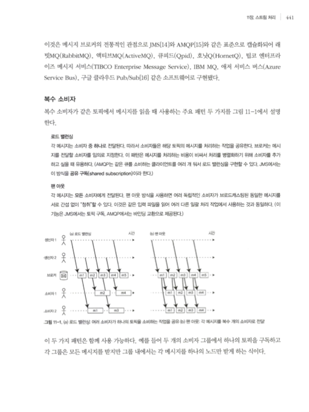
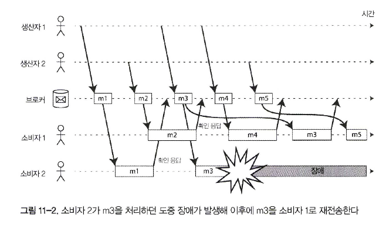
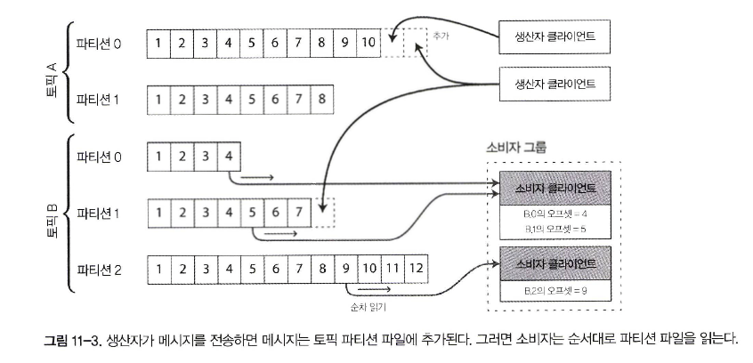

- 매 초가 끝나는 시점에 1초 분량의 데이터를 처리하거나, 고정된 시간 조각이라는 개념을 완전히 버리고 단순히 이벤트가 발생할 때마다 처리해야 한다, **스트림 처리**
- 데이터 관리 메커니즘으로 **이벤트 스트림**을 설명. 이벤트 스트림은 지난 장에서 다뤘던 일괄 처리 데이터와는 반대로 한정되지 않고 점진적으로 처리

# 이벤트 스트림 전송

- 이벤트는 4장에서 설명한 것처럼 텍스트 문자열이나 JSON 또는 이진 형태 등으로 부호화
- **생산자(producer)** 가 이벤트를 한 번 만들면(**발행자(publisher)** 나 **발송자(sender)** 라고도 한다.) 해당 이벤트를 복수의 **소비자**(**consumer**, **구독자(subscriber)** 또는 **수신자(recipient)**)가 처리
- 지연 시간이 낮으면서 지속해서 처리하는 방식을 지향할 때 데이터스토어를 이런 용도에 맞게 설계하지 않았다면 폴링 방식은 비용이 크다
- 오히려 새로운 이벤트가 나타날 때마다 소비자에게 알리는 편이 더 낫다
- 데이터베이스는 전통적으로 알림 메커니즘을 강력하게 지원하지 않는다. 관계 형 데이터베이스에는 보통 **트리거(trigger)** 기능

# 메시징 시스템

- 새로운 이벤트에 대해 소비자에게 알려주려고 쓰이는 일반적인 방법은 **메시징 시스템(messaging system)** 을 사용하는 것
- 메시징 시스템을 구축하는 가장 간단한 방법은 생산자와 소비자 사이에 유닉스 파이프나 TCP 연결과 같은 직접 통신 채널을 사용하는 방법
- **발행/구독(publish/ subscribe)** 모델에서는 여러 시스템들이 다양한 접근법을 사용
  1. 생산자가 소비자가 메시자를 처리하는 속도보다 빠르게 메시지를 전송한다면 어떻게 될까?   
    시스템은 메시지를 버리거나 큐에 메시지를 버퍼링하거나 **배압 (backpressure, 흐름 제어 (flow control)** 라고도 한다. 생산자가 메시지를 더 보내지 못하게 막는다}을 적용
  2. 노드가 죽거나 일시적으로 오프라인이 된다면 어떻게 될까? 손실되는 메시지가 있을까?   
     데이터베이스를 사용할 때처럼 지속성을 갖추려면 디스크에 기록하거나 복제본 생성을 하거나 둘 모두를 해야 한다

## 생산자에서 소비자로 메시지를 직접 전달하기

- 많은 메시지 시스템은 중간 노드를 통하지 않고 생산자와 소비자를 네트워크로 직접 통신
  - UDP 멀티캐스트는 낮은 지연이 필수인 주식 시장과 같은 금융 산업에서 널리 사용된다
  - ZeroMQ 같은 브로커가 필요없는 메시징 라이브러리와 나노메시지가 이와 유사한 접근법을 사용하는데 TCP 또는 IP 멀티캐스트 상에서 발행/구독 메시징을 구현
  - StatsD과 BruBeck은 네트워크 상의 모든 장비로부터 지표를 수집하고 모니터링하는 데 UDP 메시징을 사용
  - 소비자가 네트워크에 서비스를 노출하면 생산자는 직접 HTTP나 RPC 요청(134쪽 “서비스를 통한 데이터플로: REST와 RPC” 참고)을 직접 보낼 수 있다

- 소비자가 오프라인이라면 메시지를 전달하지 못하는 상태에 있는 동안 전송된 메시지는 잃어버릴 수 있다
- 메시지 전송을 생산자가 재시도하게끔 하지만 생산자 장비가 죽어버리면 재시도하려고 했던 메시지 버퍼를 잃어버릴 수 있기 때문에 문제 존재

### 메시지 브로커

- 직접 메시징 시스템의 대안으로 널리 사용되는 방법은 **메시지 브로커** (**메시지** 큐라고도 한다)를 통해 메시지를 보내는 것
- 생산자는 브로커로 메시지를 전송하고 소비자는 브로커에서 메시지를 읽어 전송받는다
- 소비 속도가 느린 소비자가 있으면 일반적으로 브로커는 큐가 제한 없이 계속 늘어나게 한다(메시지를 버리거나 배압을 사용하는 것과는 반대로)
- **큐 대기**를 하면 소비자는 일반적으로 비동기로 동작

### 메시지 브로커와 데이터베이스의 비교

- 데이터베이스는 명시적으로 데이터가 삭제될 때까지 데이터를 보관한다. 반면 메시지 브로커 대부분은 소비자에게 데이터 배달이 성공할 경우 자동으로 메시지를 삭제한다
- 메시지 브로커는 대부분 메시지를 빨리 지우기 때문에 작업 집합이 상당히 작다고 가정한다. 즉 큐 크기가 작다. 소비자가 느려 메시지 브로커가 많은 메시지를 버퍼링해야 한다면 처리량 저하
- 데이터베이스는 보조 색인을 지원하고 데이터 검색을 위한 다양한 방법을 지원하는 반면 메시지 브로커는 특정 패턴과 부합하는 토픽의 부분 집합을 구독하는 방식을 지원
- 데이터베이스에 질의할 때 그 결과는 일반적으로 질의 시점의 데이터 스냅숏을 기준으로 한다. 데이터 변화를 폴링 안하면 알 길이 없다. 반대로 메시지 브로커는 임의 질의를 지원하지 않지만 데이터가 변하면(즉 전달할 새로운 메시지가 생겼을 때) 클라이언트에게 알려준다

### 복수 소비자

- 로드 밸런싱
  - 각 메시지는 소비자 중 하나로 전달된다. 따라서 소비자들은 해당 토픽의 메시지를 처리하는 작업을 공유한다. 브로커는 메시지를 전달할 소비자를 임의로 지정
  - 이 패턴은 메시지를 처리하는 비용이 비싸서 처리를 병렬화하기 위해 소비자를 추가하고 싶을 때 유용

- 팬 아웃
  - 각 메시지는 모든 소비자에게 전달된다. 팬 아웃 방식을 사용하면 여러 독립적인 소비자가 브로드캐스팅된 동일한 메시지를 서로 간섭 없이 "청취" 가능

### 확인 응답과 재전송

- 메시지를 잃어버리지 않기 위해 메시지 브로커는 **확인 응답**을 사용
- 브로커가 확인 응답을 받기 전에 클라이언트로의 연결이 닫히거나 타임아웃되면 브로커는 메시지가 처리되지 않았다고 가정하고 다른 소비자에게 다시 전송

- 메시지 순서를 유지하려 노력할지라도 부하 균형 분산과 메시지 재전송을 조합하면 필연적으로 메시지 순서가 변경

## 파티셔닝된 로그

- 메시지 브로커가 메시지를 디스크에 지속성 있게 기록하더라도 메시지가 소비자에게 전달된 후 즉시 삭제
- 일반적으로 데이터베이스나 파일에 저장하는 모든 데이터는 적어도 누군가 명시적으로 다시 삭제할 때까지는 영구적으로 보관된다고 간주
- 이런 개념의 차이는 파생 데이터를 생성하는 방식에 큰 영향을 미친다
- 데이터베이스의 지속성 있는 저장 방법과 메시징 시스템의 지연 시간이 짧은 알림 기능을 조합할 수는 없을까? 이것이 **로그 기반 메시지 브로커(log-based message broker)** 의 기본 아이디어

### 로그를 사용한 메시지 저장소

- 디스크 하나를 쓸 때보다 처리량을 높이기 위해 확장하는 방법으로 로그를 **파티셔닝**(6장과 같은 의미의 파티션이다)하는 방법
- 각 파티션 내에서 브로커는 모든 메시지에 **오프셋**이라고 부르는, 단조 증가하는 순번을 부여한다

- 이런 메시지 브로커는 모든 메시지를 디스크에 저장하지만 여러 장비에 메시지를 파티셔닝해 초당 수백만 개의 메시지를 처리할 수 있고 메시지를 복제함으로써 장애에 대비 가능
