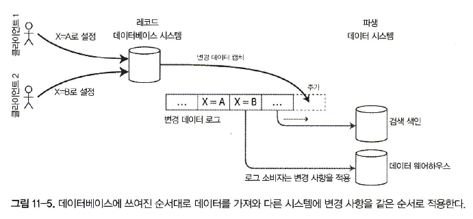
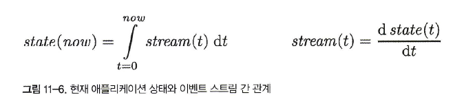

- 매 초가 끝나는 시점에 1초 분량의 데이터를 처리하거나, 고정된 시간 조각이라는 개념을 완전히 버리고 단순히 이벤트가 발생할 때마다 처리해야 한다, **스트림 처리**
- 데이터 관리 메커니즘으로 **이벤트 스트림**을 설명. 이벤트 스트림은 지난 장에서 다뤘던 일괄 처리 데이터와는 반대로 한정되지 않고 점진적으로 처리

# 이벤트 스트림 전송

- 이벤트는 4장에서 설명한 것처럼 텍스트 문자열이나 JSON 또는 이진 형태 등으로 부호화
- **생산자(producer)** 가 이벤트를 한 번 만들면(**발행자(publisher)** 나 **발송자(sender)** 라고도 한다.) 해당 이벤트를 복수의 **소비자**(**consumer**, **구독자(subscriber)** 또는 **수신자(recipient)**)가 처리
- 지연 시간이 낮으면서 지속해서 처리하는 방식을 지향할 때 데이터스토어를 이런 용도에 맞게 설계하지 않았다면 폴링 방식은 비용이 크다
- 오히려 새로운 이벤트가 나타날 때마다 소비자에게 알리는 편이 더 낫다
- 데이터베이스는 전통적으로 알림 메커니즘을 강력하게 지원하지 않는다. 관계 형 데이터베이스에는 보통 **트리거(trigger)** 기능

# 메시징 시스템

- 새로운 이벤트에 대해 소비자에게 알려주려고 쓰이는 일반적인 방법은 **메시징 시스템(messaging system)** 을 사용하는 것
- 메시징 시스템을 구축하는 가장 간단한 방법은 생산자와 소비자 사이에 유닉스 파이프나 TCP 연결과 같은 직접 통신 채널을 사용하는 방법
- **발행/구독(publish/ subscribe)** 모델에서는 여러 시스템들이 다양한 접근법을 사용
  1. 생산자가 소비자가 메시자를 처리하는 속도보다 빠르게 메시지를 전송한다면 어떻게 될까?   
    시스템은 메시지를 버리거나 큐에 메시지를 버퍼링하거나 **배압 (backpressure, 흐름 제어 (flow control)** 라고도 한다. 생산자가 메시지를 더 보내지 못하게 막는다}을 적용
  2. 노드가 죽거나 일시적으로 오프라인이 된다면 어떻게 될까? 손실되는 메시지가 있을까?   
     데이터베이스를 사용할 때처럼 지속성을 갖추려면 디스크에 기록하거나 복제본 생성을 하거나 둘 모두를 해야 한다

## 생산자에서 소비자로 메시지를 직접 전달하기

- 많은 메시지 시스템은 중간 노드를 통하지 않고 생산자와 소비자를 네트워크로 직접 통신
  - UDP 멀티캐스트는 낮은 지연이 필수인 주식 시장과 같은 금융 산업에서 널리 사용된다
  - ZeroMQ 같은 브로커가 필요없는 메시징 라이브러리와 나노메시지가 이와 유사한 접근법을 사용하는데 TCP 또는 IP 멀티캐스트 상에서 발행/구독 메시징을 구현
  - StatsD과 BruBeck은 네트워크 상의 모든 장비로부터 지표를 수집하고 모니터링하는 데 UDP 메시징을 사용
  - 소비자가 네트워크에 서비스를 노출하면 생산자는 직접 HTTP나 RPC 요청(134쪽 “서비스를 통한 데이터플로: REST와 RPC” 참고)을 직접 보낼 수 있다

- 소비자가 오프라인이라면 메시지를 전달하지 못하는 상태에 있는 동안 전송된 메시지는 잃어버릴 수 있다
- 메시지 전송을 생산자가 재시도하게끔 하지만 생산자 장비가 죽어버리면 재시도하려고 했던 메시지 버퍼를 잃어버릴 수 있기 때문에 문제 존재

### 메시지 브로커

- 직접 메시징 시스템의 대안으로 널리 사용되는 방법은 **메시지 브로커** (**메시지** 큐라고도 한다)를 통해 메시지를 보내는 것
- 생산자는 브로커로 메시지를 전송하고 소비자는 브로커에서 메시지를 읽어 전송받는다
- 소비 속도가 느린 소비자가 있으면 일반적으로 브로커는 큐가 제한 없이 계속 늘어나게 한다(메시지를 버리거나 배압을 사용하는 것과는 반대로)
- **큐 대기**를 하면 소비자는 일반적으로 비동기로 동작

### 메시지 브로커와 데이터베이스의 비교

- 데이터베이스는 명시적으로 데이터가 삭제될 때까지 데이터를 보관한다. 반면 메시지 브로커 대부분은 소비자에게 데이터 배달이 성공할 경우 자동으로 메시지를 삭제한다
- 메시지 브로커는 대부분 메시지를 빨리 지우기 때문에 작업 집합이 상당히 작다고 가정한다. 즉 큐 크기가 작다. 소비자가 느려 메시지 브로커가 많은 메시지를 버퍼링해야 한다면 처리량 저하
- 데이터베이스는 보조 색인을 지원하고 데이터 검색을 위한 다양한 방법을 지원하는 반면 메시지 브로커는 특정 패턴과 부합하는 토픽의 부분 집합을 구독하는 방식을 지원
- 데이터베이스에 질의할 때 그 결과는 일반적으로 질의 시점의 데이터 스냅숏을 기준으로 한다. 데이터 변화를 폴링 안하면 알 길이 없다. 반대로 메시지 브로커는 임의 질의를 지원하지 않지만 데이터가 변하면(즉 전달할 새로운 메시지가 생겼을 때) 클라이언트에게 알려준다

### 복수 소비자

- 로드 밸런싱
  - 각 메시지는 소비자 중 하나로 전달된다. 따라서 소비자들은 해당 토픽의 메시지를 처리하는 작업을 공유한다. 브로커는 메시지를 전달할 소비자를 임의로 지정
  - 이 패턴은 메시지를 처리하는 비용이 비싸서 처리를 병렬화하기 위해 소비자를 추가하고 싶을 때 유용

- 팬 아웃
  - 각 메시지는 모든 소비자에게 전달된다. 팬 아웃 방식을 사용하면 여러 독립적인 소비자가 브로드캐스팅된 동일한 메시지를 서로 간섭 없이 "청취" 가능

### 확인 응답과 재전송

- 메시지를 잃어버리지 않기 위해 메시지 브로커는 **확인 응답**을 사용
- 브로커가 확인 응답을 받기 전에 클라이언트로의 연결이 닫히거나 타임아웃되면 브로커는 메시지가 처리되지 않았다고 가정하고 다른 소비자에게 다시 전송

- 메시지 순서를 유지하려 노력할지라도 부하 균형 분산과 메시지 재전송을 조합하면 필연적으로 메시지 순서가 변경

## 파티셔닝된 로그

- 메시지 브로커가 메시지를 디스크에 지속성 있게 기록하더라도 메시지가 소비자에게 전달된 후 즉시 삭제
- 일반적으로 데이터베이스나 파일에 저장하는 모든 데이터는 적어도 누군가 명시적으로 다시 삭제할 때까지는 영구적으로 보관된다고 간주
- 이런 개념의 차이는 파생 데이터를 생성하는 방식에 큰 영향을 미친다
- 데이터베이스의 지속성 있는 저장 방법과 메시징 시스템의 지연 시간이 짧은 알림 기능을 조합할 수는 없을까? 이것이 **로그 기반 메시지 브로커(log-based message broker)** 의 기본 아이디어

### 로그를 사용한 메시지 저장소

- 디스크 하나를 쓸 때보다 처리량을 높이기 위해 확장하는 방법으로 로그를 **파티셔닝**(6장과 같은 의미의 파티션이다)하는 방법
- 각 파티션 내에서 브로커는 모든 메시지에 **오프셋**이라고 부르는, 단조 증가하는 순번을 부여한다

- 이런 메시지 브로커는 모든 메시지를 디스크에 저장하지만 여러 장비에 메시지를 파티셔닝해 초당 수백만 개의 메시지를 처리할 수 있고 메시지를 복제함으로써 장애에 대비 가능

## 변경 데이터 캡처

- **변경 데이터 캡처(change data capture, CDC)** 에 관심이 높아지고 있다. 변경 데이터 캡처는 데이터베이스에 기록하는 모든 데이터의 변화를 관찰해 다른 시스템으로 데이터를 복제할 수 있는 형태로 추출하는 과정

## 변경 데이터 캡처의 구현

- 검색 색인과 데이터 웨어하우스에 저장된 데이터는 레코드 시스템에 저장된 데이터의 또 다른 뷰일 뿐이므로 로그 소비자를 **파생 데이터 시스템**
- 로그 기반 메시지 브로커는 원본 데이터베이스에서 변경 이벤트를 전송하기에 적합
- 경 데이터 캡처를 구현하는 데 데이터베이스 트리거를 사용하기도 하지만 비효율적

## 초기 스냅숏

- 전문 색인을 새로 구축할 때를 예로 들면 전체 데이터베이스 복사본이 필요
- 전체 로그 히스토리가 없다면 일관성 있는 스냅솟을 사용

## 로그 컴팩션

- 저장 엔진은 주기적으로 같은 키의 로그 레코드를 찾아 중복을 제거하고 각 키에 대해 가장 최근에 갱신된 내용만 유지
- 특별한 널 값(**툼스톤(tombstone))** 으로 갱신하는 것은 키의 삭제를 의미하고 로그 컴팩션을 수행할 때 실제로 값을 제거
- 로그 기반 메시지 브로커와 변경 데이터 캡처의 맥락에서도 마찬가지
- CDC 시스템에서 모든 변경에 기본키가 포함되게 하고 키의 모든 갱신이 해당 키의 이전 값을 교체한다면 특정 키에 대해 최신 쓰기만 유지하면 충분
- 검색 색인과 같은 파생 데이터 시스템을 재구축할 때마다 새 소비자는 컴팩션된 로그 토픽의 오프셋 0부터 시작해서 순차적으로 데이터베이스의 모든 키를 스캔하면 된다
- 로그에 데이터베이스에 있는 모든 키의 최신 값이 존재하는 것이 보장

## 변경 스트림용 API 지원

- 최근 데이터베이스들은 기능 개선이나 리버스 엔지니어링을 통해 CDC 지원을 하기보다 점진적으로 변경 스트림을 기본 인터페이스로서 지원하기 시작

## 이벤트소싱

- 이벤트 소싱은 변경 데이터 캡처와 유사하게 애플리케이션 상태 변화를 모두 변경 이벤트 로그로 저장
- 변경 데이터 캡처와 가장 큰 차이점은 이 아이디어를 적용하는 추상화 레벨이 다르다는 점
  - 변경 데이터 캡처에서 애플리케이션은 데이터베이스를 변경 가능한 방식으로 사용해 레코드를 자유롭게 갱신하고 삭제. 변경 로그는 데이터베이스에서 저수준으로 추출
  - 이벤트 소싱에서 애플리케이션 로직은 이벤트 로그에 기록된 불변 이벤트를 기반으로 명시적으로 구축. 이벤트 저장은 단지 추가만 가능하고 갱신이나 삭제는 권장하지 않거나 금지. 애플리케이션 수준에서 발생한 일을 반영하게끔 설계
- 애플리케이션 관점에서 사용자의 행동을 불변 이벤트로 기록하는 방식은 변경 가능한 데이터베이스 상에서 사용자의 행동에 따른 효과를 기록하는 방식보다 훨씬 유의미
- 새로운 기능을 추가하더라도 이벤트 소싱 접근법을 사용하면 새로 발생한 부수 효과를 기존 이벤트에서 쉽게 분리 가능

### 이벤트 로그에서 현재 상태 파생하기

- 변경 데이터 캡처와 마찬가지로 이벤트 로그를 재현하면 현재 시스템 상태를 재구성하지만 다르게 처리
  - 레코드 갱신용 CDC 이벤트는 일반적으로 레코드의 가장 새로운 버전을 보유한다. 그래서 기본키의 현재 값은 전적으로 기본키의 가장 최신 이벤트로 결정되고 같은 키의 이전 이벤트는 로그 컴팩션을 통해 버린다.
  - 뒤에 발생한 이벤트가 앞선 이벤트를 덮어쓰지 않는다. 그래서 마지막 상태를 재구축하기 위해서는 이벤트의 전체 히스토리가 필요하다. 이런 방식에서는 로그 컴팩션이 불가능

### 명령과 이벤트

- 이벤트 소싱 철학은 **이벤트**와 **명령(command)** 을 구분하는 데 주의한다 
- 사용자 요청이 처음 도착했을 때 이 요청은 명령
- 이벤트는 생성 시점에 **사실(fact)**

## 상태와 스트림 그리고 불변성

- 불변성 원리가 이벤트 소싱과 변경 데이터 캡처를 매우 강력하게 만든다
- 모든 변경 로그(changelog) 는 시간이 지남에 따라 바뀌는 상태
- 애플리케이션 상태를 시간에 따른 이벤트 스트림을 적분해서 구할 수 있고 변경 스트림은 시간으로 상태를 미분해서 구할 수 있다

### 불변 이벤트의 장점

- 우연히 버그가 있는 코드를 배포해서 데이터베이스에 잘못된 데이터를 기록했을 때 코드가 데이터를 덮어썼다면 복구하기가 매우 어렵다
- 추가만 하는 불변 이벤트 로그를 썼다면 문제 상황의 진단과 복구가 훨씬 쉽다

### 동일한 이벤트 로그로 여러 가지 뷰 만들기

- 불변 이벤트 로그에서 가변 상태를 분리하면 동일한 이벤트 로그로 다른 여러 읽기 전용 뷰를 만들 수 있다
- 데이터를 쓰는 형식과 읽는 형식을 분리해 다양한 읽기 뷰를 허용한다면 상당한 유연성, **명령과 질의 책임의 분리(CQRS)**
- 데이터를 쓰기 최적화된 이벤트 로그에서 읽기 최적화된 애플리케이션 상태로 전환 가능하면 정규화와 비정규화에 관한 논쟁은 의미가 거의 없다
- 읽기 최적화된 뷰는 데이터를 비정규화하는 것이 전적으로 합리적
- 변환 프로세스가 뷰와 이벤트 로그 사이의 일관성을 유지하는 메커니즘을 제공하기 때문

### 동시성 제어

- 이벤트 소싱과 변경 데이터 캡처의 가장 큰 단점은 이벤트 로그의 소비가 대개 비동기로 이뤄진다는 점
- 해결책 하나는 읽기 뷰의 갱신과 로그에 이벤트를 추가하는 작업을 동기식으로 수행하는 방법
- 이벤트 로그로 현재 상태를 만들면 동시성 제어 측면이 단순
- 이벤트 소싱을 사용하면 사용자 동작에 대한 설명을 자체적으로 포함하는 이벤트를 설계 가능

### 불변성의 한계

- 성능적인 이유 외에도 데이터가 모두 불변성임에도 관리상의 이유로 데이터를 삭제할 필요가 있는 상황일 수 있다
- 개인정보 같은 케이스는 이전 데이터를 삭제해야 한다는 또 다른 이벤트를 로그에 추가한다고 해결 X

## 스트림 처리

- 스트림을 처리하는 방법에는 크게 세 가지
  1. 이벤트에서 데이터를 꺼내 데이터베이스나 캐사 검색 색인 또는 유사한 저장소 시스템에 기록하고 다른 클라이언트가 이 시스템에 해당 데이터를 질의
  2. 이벤트를 사용자에 직접 보낸다
  3. 하나 이상의 입력 스트림을 처리해 하나 이상의 출력 스트림을 생산

- 스트림을 처리하는 코드 조각을 연산자(operator) 나 작업(job)

### 스트림 처리의 사용

- 스트림 처리는 특정 상황이 발생하면 조직에 경고를 해주는 모니터링 목적으로 오랜 기간 사용

### 복잡한 이벤트 처리

- **복잡한 이벤트 처리(complex event processing, CEP)** 는 특정 이벤트 패턴을 검색해야 하는 애플리케이션에 특히 적합
- 질의는 오랜 기간 저장되고 입력 스트림으로부터 들어오는 이벤트는 지속적으로 질의를 지나 흘러가면서 이벤트 패턴에 매칭되는 질의를 찾는다

### 스트림 분석

- 스트림 처리를 사용하는 다른 영 역으로 스트림 **분석 (analytics)**
- 일반적으로 분석은 연속한 특정 이벤트 패턴을 찾는 것보다 대량의 이벤트를 집계하고 통계적 지표를 뽑는 것을 더 우선
  - 특정 유형의 이벤트 빈도 측정(시간당 얼마나 자주 발생하는지)
  - 특정 기간에 걸친 값의 이동 평균(rolling average) 계산
  - 이전 시간 간격과 현재 통계값의 비교(추세를 감지하거나 지난 주 대비 비정상적으로 높거나 낮은 지표에 대해 경고)
- 일반적으로 이런 통계는 고정된 시간 간격 기준으로 계산. 집계 시간 간격을 **윈도우(window)** 라 한다

### 구체화 뷰 유지하기

- 데이터베이스 변경에 대한 스트림은 캐시，검색, 색인，데이터 웨어하우스 같은 파생 데이터 시스템이 원본 데이터베이스의 최신 내용을 따라잡게 하는 데 쓸 수 있다. **구체화 뷰**
- 이벤트 소싱에서 애플리케이션 상태는 이벤트 로그를 적용함으로써 유지
- 구체화 뷰를 만들려면 잠재적으로 임의의 시간 범위에 발생한 모든 이벤트가 필요

### 스트림 상에서 검색하기

- 복수 이벤트로 구성된 패턴을 찾는 CEP 외에도 전문 검색 질의와 같은 복잡한 기준을 기반으로 개별 이벤트를 검색해야 하는 경우
- 전통적인 검색 엔진은 먼저 문서를 색인하고 색인을 통해 질의를 실행한다. 반대로 스트림 검색은 처리 순서가 뒤집힌다. 질의를 먼저 저장

### 메시지 전달과 RPC

- 액터 모델 등에서 쓰이는 서비스 간 통신 메커니즘으로 사용 가능. 
- 이런 시스템은 메시지와 이벤트에 기반을 두지만 일반적으로 이것들을 스트림 처리자로 생각하지는 않는다
  1. 액터 프레임워크는 주로 동시성을 관리하고 통신 모듈을 분산 실행하는 메커니즘. 반면 스트림 처리는 기본적으로 데이터 관리 기법
  2. 액터 간 통신은 주로 단기적이고 일대일이다. 반면 이벤트 로그는 지속성이 있고 다중 구독이 가능
  3. 액터는 임의의 방식으로 통신할 수 있다(순환 요청/응답 패턴도 포함). 그러나 스트림 처리자는 대개 비순환 파이프라인에 설정. 이런 파이프라인에서 모든 스트림은 특정 작업의 출력이며 잘 정의된 입력 스트림 집합에서 파생
