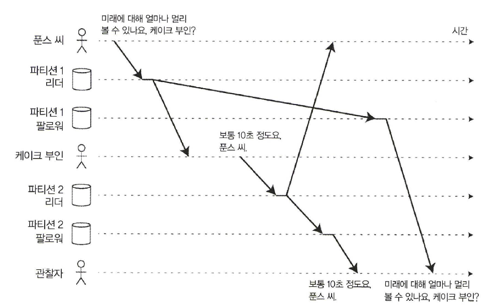

# 동기식, 비동기식 복제에 관한 설명 중 틀린 것은?
1. 동기식 복제의 장점은 팔로워가 리더와 일관성 있게 최신 데이터 복사본을 가지는 것을 보장한다
2. 동기식 복제의 단점은 (팔로워가 죽거나 네트워크 문제나 다른 어떤 이유로 인해) 동기 팔로워가 응답하지 않는다면 쓰기가 처리될 수 없다는 것이다
3. 완전 비동기식 설정은 모든 팔로워가 잘못되더라도 리더가 쓰기 처리를 계속 할 수 있는 장점이 있다
4. 현실적으로 데이터베이스에서 동기식 복제를 사용하려면 보통 팔로워 하나는 동기식으로 하고 그 밖에는 비동기식으로 하는 것을 의미한다. 이를 반비동기식이라 한다

# 다음은 '일관된 순서 읽기' 이상 문제의 그림이다. 보통 어떤 환경에서 발생하는 특징적인 문제인가?

1. 통합 데이터베이스
2. 클라이언트-서버 웹구조
3. 파티셔닝된(샤딩된) 데이터베이스
4. 클라우드 웹 API
