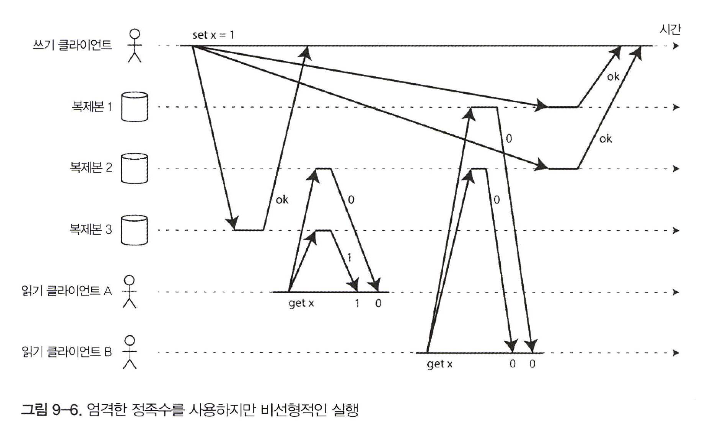

# 문제 1

```
책 '채널 간 타이밍 의존성' 부분에서 파일 저장 서비스가 선형적이면 이 시스템은 잘 동작한다고 한다. 
선형적이지 않다면 경쟁 조건의 위험이 있는 이유는 무엇인가? '파일 저장소'와 '메시지 큐'를 예시를 들어 설명하시오
```

# 문제 2

```
직관적으로 다이나모 스타일 모델에서 엄격한 정족수를 사용한 읽기 쓰기는 선형적인 것처럼 보인다
그러나 그림 9-6에 나온 예처럼 네트워크 지연의 변동이 심하면 경쟁 조건이 생길 수 있다
이에 대해 정족수 조건(w + r > n)과 관련지어 설명하시오
```


